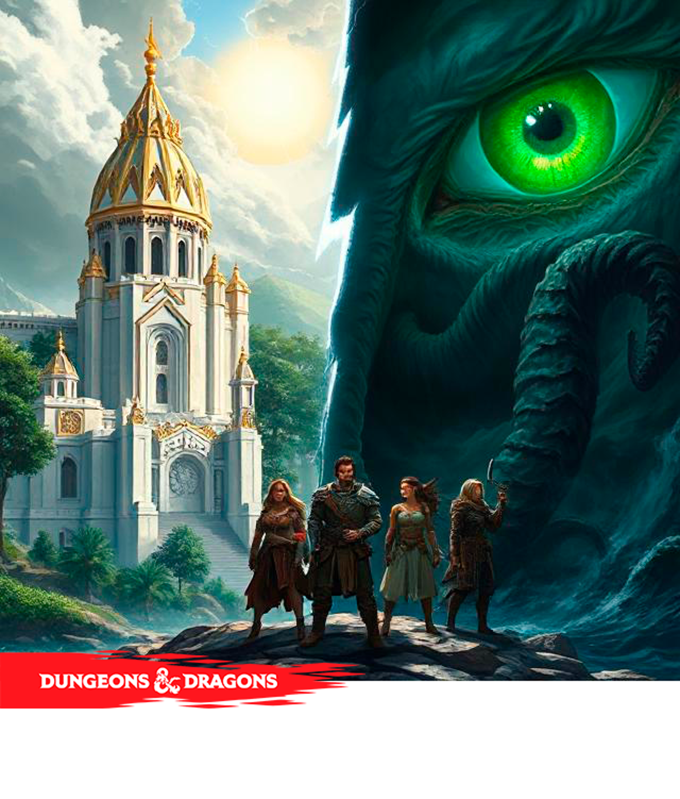
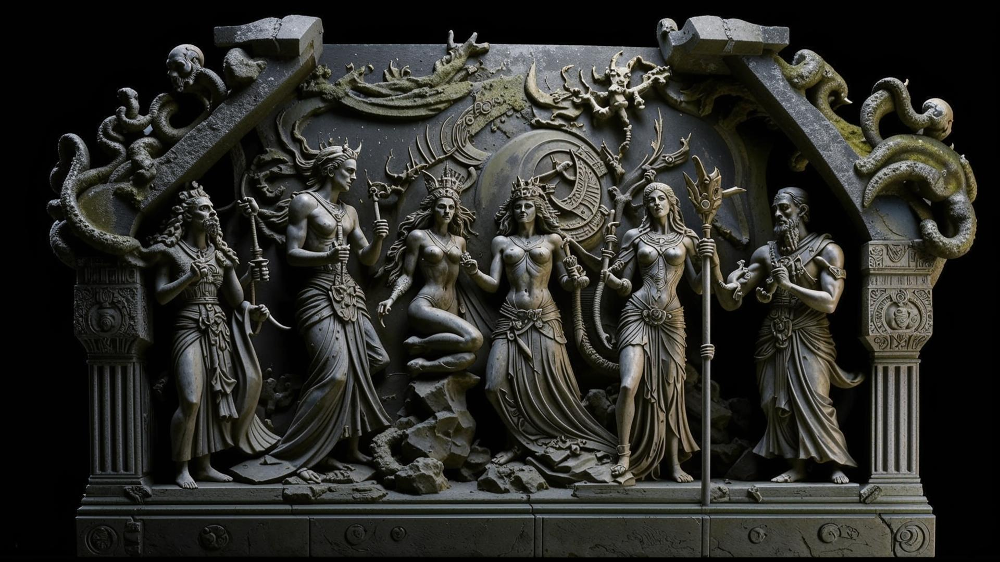
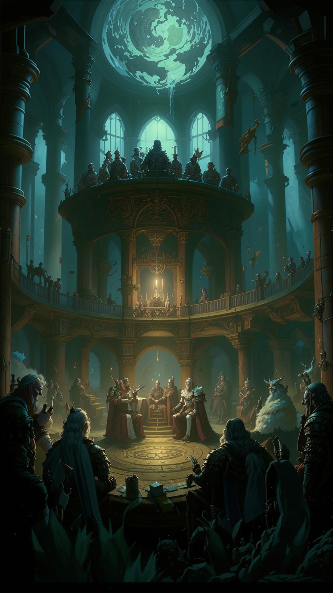
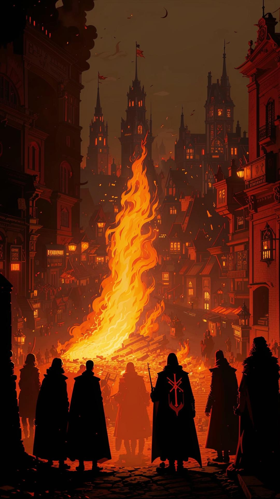
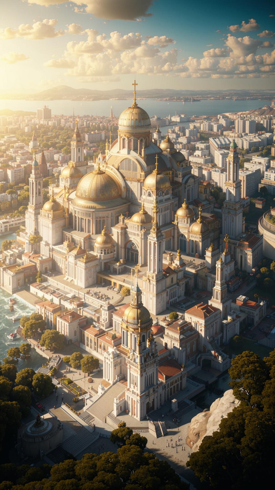

{width=1192px height=1400px}

## Глава 1. Предания о Этерии

<note type="lab">

Этерия -- континент, оправляющийся от Великой Расколотой Войны, которая столетие назад разорвала единую империю на враждующие княжества. Магия здесь повсеместна, но опасна, граница между миром смертных и пугающими просторами Бездны тонка. Власть оспаривается через политические интриги, древние культы и прямое вмешательство богов и древних существ.

</note>

### Создание мира

---

#### Эпоха Первородного Хаоса (Безвременье)

Существовал лишь слепой, идиотический Безликий Узор, бьющийся в конвульсиях вне времени и пространства. Его сны рождали и поглощали миры. Это был чистый, неупорядоченный потенциал.

---

#### Эпоха Пробуждения (Приход Небожителей)

Из хаоса, силой чистой воли к порядку, возникли Небожители. Первым был Этериус, рассекший молнией тьму и провозгласивший Законы Бытия. За ним явились его братья, сестры и дети: Сильвана, Морван, Вулкан, София и Танатос. Они увидели мир Этерия -- дикий, буйный и прекрасный, но разрываемый на части снами Древних.

---

#### Эпоха Формирования (Война Богов)

Небожители принялись за работу, придавая миру форму. Морван наполнил чаши океанов, Сильвана вдохнула жизнь в леса и степи, Вулкан выковал горные цепи. Однако Бездонные -- Тот, Кто Спит Ниже, Шепчущая Плоть и Владычица Извивов -- воспротивились этому. Они желали видеть мир вечным кошмаром, садом из плоти и безумия.

Началась Великая Война Богов, длившаяся эоны. Этериус и его пантеон смогли изгнать Бездонных на самые окраины творения, в измерение, известное как Бездна. Однако полностью уничтожить их они не смогли, ибо те были порождением самого первородного хаоса. Танатос создал Подземный Мир (Эребус), чтобы души смертных не становились добычей Бездонных.

---

#### Эпоха Древних (Приход смертных)

Мир был готов. Сильвана и София вместе создали первые формы жизни: эльфов, как хранителей природы, и людей, как носителей духа и амбиций. Другие расы появились позже: дуэргары, как дети гор и пламени, признавшие Вулкана, генаси -- потомки смертных, тронутых силой стихий или самой Бездны.

---

#### Эпоха Сердечного Камня (Основание Империи)

Смертные процветали. Легендарный герой Аурелиус, полубог-сын Этериуса, согласно легенде, получил от отца Сердечный Камень -- артефакт невероятной силы, излучающий чистый порядок. Он объединил разрозненные народы и основал Великую Империю Этерию (\~2000 лет назад), назвав ее в честь своего божественного родича. Столицей стал Солнцеград, построенный вокруг Сердечного Камня. Наступил золотой век.

---

## Исторические справки

Используется летосчисление От Основания Империи (О.И.). Сейчас в мире примерно 1020 год О.И.

<table header="row">
<colgroup><col width="109"/><col width="192"/><col width="489"/></colgroup>
<tr>
<td>

**Год (О.И.)**

</td>
<td>

**Событие**

</td>
<td>

**Описание**

</td>
</tr>
<tr>
<td>

0

</td>
<td>

Основание Империи Аурелиусом.

</td>
<td>

Аурелиус объединяет племена людей и эльфов под своим знаменем с помощью силы Сердечного Камня. Начало золотого века.

</td>
</tr>
<tr>
<td>

1-400

</td>
<td>

Золотой Век Империи.

</td>
<td>

Империя расширяется, строятся великие города, дороги, развивается магия под покровительством Гильдии Арканов. Культы Бездонных изгнаны в подполье.

</td>
</tr>
<tr>
<td>

\~500

</td>
<td>

Восстание Дуэргаров.

</td>
<td>

Дуэргары Пепельных Земель, не желавшие подчиняться людям, поднимают мятеж. После долгой и кровопролитной войны они добиваются широкой автономии внутри Империи.

</td>
</tr>
<tr>
<td>

742

</td>
<td>

Великая Морская Утроба.

</td>
<td>

Могучий жрец Морвана, Каландар, усмиряет чудовищный шторм у берегов континента, открывая эру великих морских путешествий и торговли. Основание Волнистой Гавани.

</td>
</tr>
<tr>
<td>

800-850

</td>
<td>

Эпоха Упадка.

</td>
<td>

Потомки Аурелиуса становятся слабыми и развращенными правителями. Имперская власть ослабевает, региональные бароны и герцоги набирают силу. Сердечный Камень, как говорят летописи, стал излучать меньше света.

</td>
</tr>
<tr>
<td>

901-920

</td>
<td>

Великая Расколотая Война.

</td>
<td>

Серия гражданских войн, восстаний и заговоров, спровоцированных региональными лидерами и тайными культами. Кульминацией стала Битва при Пепельных Полях (918 г.), где последний император и его наследники погибли, а Сердечный Камень был расколот на семь фрагментов.

</td>
</tr>
<tr>
<td>

920

</td>
<td>

Образование Конклава Семи Княжеств.

</td>
<td>

Самые могущественные военачальники и лорды, завладевшие фрагментами Камня, собрались на совет в Солнцеграде. Чтобы избежать полного уничтожения, они подписали Договор Разделения, официально распустив Империю и создав совет независимых княжеств. Каждый князь получил свой осколок Камня как символ власти.

</td>
</tr>
<tr>
<td>

920-1000

</td>
<td>

Век Хрупкого Мира.

</td>
<td>

Княжества живут в состоянии холодной войны, постоянных политических интриг и пограничных стычек. Фрагменты Камня даруют их владельцам силу и легитимность, но их объединение -- главный страх и главная цель каждого правителя.

</td>
</tr>
<tr>
<td>

\~990-наст. время

</td>
<td>

Возрождение Культов.

</td>
<td>

По всему Конклаву отмечается тревожный рост активности культов Бездонных. Сыны Безмолвного Шепота и Пожиратели Тайн становятся все смелее. Ходят слухи, что это не случайно, а связано с ослаблением силы Сердечного Камня и растущим влиянием Бездны.

</td>
</tr>
<tr>
<td>

1015

</td>
<td>

Избрание Архиканцлера Люциана.

</td>
<td>

Князь Ауреи, Люциан вал'Мор, хитрый дипломат, избран Архиканцлером Конклава. Он ярый сторонник мира любой ценой.

</td>
</tr>
<tr>
<td>

1020 (Сейчас)

</td>
<td>

Настоящее время.

</td>
<td>

Мир находится на грани новой большой войны. Амбиции князей, интриги культов и растущая угроза из Бездны создают идеальный шторм. Герои нужны как никогда.

</td>
</tr>
</table>

<note>

Важная деталь: Фрагменты Сердечного Камня -- не просто символы. Они наделяют своего владельца мудростью, долголетием и магической силой (например, способностью изгонять нежить и аберраций). Но ходят темные слухи, что каждый осколок также потихоньку сводит своего хозяина с ума манией величия и паранойей, и что чем больше фрагментов собрано вместе, тем сильнее они привлекают взгляд Бездонных из-за пределов реальности.

</note>

---

## Пантеон Богов: Небожители и Бездонные

Боги делятся на две группы: Небожители и Бездонные. Простые люди молятся и тем, и другим, в зависимости от нужды и страха.

### Небожители

---

#### Этериус

Верховный бог-громовержец, покровитель власти, закона, порядка и справедливости. Сфера: Бури, Закон, Короли. Символ: Золотой молнии на лазурном щите. Его церковь -- главная в большинстве княжеств, поддерживает светскую власть.

---

#### Сильвана

Богиня дикой природы, охоты, луны и жизненного цикла. Сфера: Природа, Охота, Луна, Жизненные циклы. Символ: Серебряный лук и полумесяц. Почитается друидами, рейнджерами и жителями окраин.

---

#### Морван

Бог морей, рек, штормов и мореплавания. Сфера: Вода, Штормы, Торговля. Символ: Трезубец, обвитый морским змеем. Его храмы стоят в каждом порту.

---

#### Вулкан

Бог кузнечного дела, ремесла, огня и изобретений. Сфера: Огонь, Ремесло, Изобретение. Символ: Наковальня с молотом. Покровитель ремесленников и инженеров.

---

#### София

Богиня мудрости, стратегии, знания и искусства. Сфера: Знание, Война (стратегия), Искусство. Символ: Открытый свиток и сова. Покровительница магов, ученых и стратегов.

---

#### Танатос

Бог смерти, судьи душ, подземного мира. НЕ злой. Он обеспечивает естественный порядок перехода в загробную жизнь. Сфера: Смерть, Суд, Наследие. Символ: Весы в тени закрытых врат. Его жрецы следят за погребальными обрядами.

---

### Бездонные

#### Тот, Кто Спит Ниже

Древний Бог Бездны, безумия и тайн глубин. Его сны влияют на разум слабых. Сфера: Безумие, Тайны, Глубины. Символ: Стилизованный спиральный глаз. Его культы запрещены повсеместно.

---

#### Шепчущая Плоть

Древняя сущность, знающая все, что было и будет. Олицетворяет табуальное знание, извращенную магию и паразитическую природу. Сфера: Тайное знание, Извращение, Порча. Символ: Сплетение щупалец и глаз. Культисты ищут запретные знания.

---

#### Безликий Узор

Слепая идиотическая сила хаоса, существующая за пределами мироздания. Сфера: Первородный Хаос, Пустота. Символ: Пустой круг с трещинами. Ему не молятся, его случайные проявления стирают реальность.

---

#### Владычица Извивов

Великий Предок, могущественный принц-демон глубин, покровительствует сахуагинам и мутировавшим тварям. Сфера: Мутация, Глубины, Сила. Символ: Акула с щупальцами. Его почитают монстры и изгои.

---

## Глава 2. Государственное устройство и правление

Этерия -- Конклав Семи Княжеств. Формально главой считается Архиканцлер, избираемый на совет князей раз в 5 лет, но его власть номинальна. Реальная власть у князей.

Структура правления:

-  Князь/Княгиня: Верховный правитель княжества. Власть наследственная.

-  Совет баронов: Крупные землевладельцы, советующие князю.

-  Герцоги/Графы: Управляют крупными городами или областями от имени князя.

-  Шериф/Капитан стражи: Глава правопорядка в городе.

-  Гильдии: Торговые, магические, ремесленные гильдии имеют огромное влияние на городскую политику.

### Княжества и ключевые города

#### Княжество Аурея (Столичное)

*Столица: **Солнцеград***. Огромный город-крепость на холмах, центр культа Этериуса. Архитектура монументальная: белый мрамор, золотые купола, величественные дворцы и самый большой в мире Собор Золотого Молота.

*Города*: ***Белый Мост*** (крупнейший торговый хаб на перекрестке дорог), ***Кузня Вулкана*** (город оружейников и инженеров).

*Правление*: Жесткая феодальная иерархия во главе с князем. Сильная королевская стража и всесильная церковная инквизиция, следящая за чистотой веры.

*Законы*: Суровые, основанные на догматах церкви Этериуса. Магия строго регулируется Гильдией Магов. Культы Бездонных караются смертью.

*Культура:* Имперские амбиции, почитание закона, порядка и традиций. Главный бог -- Этериус.

---

#### Княжество Вердания (Лесное)

*Столица: **Оакхолм***. Город, вплетенный в гигантские деревья Великого Леса. Дома на платформах, мосты-переходы между ветвями, центр почитания богини Сильваны.

*Города*: ***Тенистая Гавань*** (речной порт на границе леса), Долина Камня (поселение шахтеров у подножия гор).

*Правление*: Совет старейшин, в который входят друиды Круга Изумрудной Росы и главы охотничьих кланов. ***Княгиня Моргана*** -- первая среди равных, выразительница их воли.

*Законы*: Законы природы выше законов людей. Охота строго регулируется. Запрещено рубить священные рощи. Наказания -- изгнание в глушь или служение природе.

*Культура*: Гармония с природой, почитание предков и духов леса. Главная богиня -- Сильвана.

---

#### Княжество Морская Утроба (Прибрежное)

*Столица*: ***Волнистая Гавань***. Крупнейший порт Этерии, город каналов и мостов. Верфи, рынки, склады контрабанды и роскошные особняки торговых баронов.

*Города*: ***Соленая Коса*** (рыбацкий поселок), ***Маяк Старой Кости*** (приграничная крепость и маяк).

*Правление*: Власть де-юре у герцога, де-факто -- у Совета Торговых Гильдий, которым заправляет ***Капитан Алисса «Удавка» Рей***.

*Законы*: Морское право. Контракты и выгода -- главный закон. Коррупция и пиратство -- обыденность.

*Культура*: Морские традиции, предпринимательский дух, смешение рас и культур. Главный бог -- Морван.

---

#### Княжество Пепельные Земли (Горное/Вулканическое)

*Столица*: ***Глубинная Кузня***. Подземный город-кузница вулканической расы дуэргаров. Гигантские залы, освещенные цветами магмы, грохот молотов и запах серы.

*Города*: ***Угольный Утес*** (поселение на поверхности), ***Огненная Пропасть*** (шахты у активного вулкана).

*Правление*: Жесткая теократия Жрецов Вулкана во главе с **Верховным Жрецом Дурном**. Их слово -- закон.

*Законы*: Ценятся сила, выносливость и мастерство. Долги отрабатываются пожизненным рабством у кланов.

*Культура*: Культ силы, огня и металла. Ценятся ремесло и добыча ресурсов. Главный бог -- Вулкан.

---

#### Княжество Хаймрок (Северное Горное)

*Столица:* ***Фростхольд***. Неприступная крепость, высеченная в горе. Славится своими мастерами-оружейниками, ледяными садами и ветряными мельницами.

*Города*: ***Сноуфолл*** (горнолыжный курорт\*\*\*), Айрон-Депозит\*\*\* (шахтерский городок).

*Правление*: Совет старейшин горных кланов (ярлов). **Ярл Ульфрик Скай-Айс** представляет княжество в Конклаве.

*Культура*: Суровые и закрытые люди, ценящие силу и традиции. Почитают Этериуса и Вулкана.

---

#### Княжество Риверленд (Речное/Торговое)

*Столица*: ***Сильвер-Кросс***. Город на перекрестке двух великих рек, крупнейший рынок континента.

*Города*: ***Голден-Форд*** (таможенный пост), ***Рид-Таун*** (город алхимиков и контрабандистов).

*Правление*: Торговый Принц (титул покупается на аукционе). Фактический правитель -- **лорд Артур Вэнс**.

*Культура*: Культ денег и торговли. Почитают Морвана и Софию.

---

#### Княжество Сангвиния (Равнинное/Аграрное)

*Столица*: ***Вейлгард***. Главный сельскохозяйственный регион, бескрайние поля и виноградники.

*Города*: ***Харвест-Холм*** (зерновой склад), ***Бладвин-Эстейт*** (поместье вампирской династии).

*Правление*: Формально -- марионеточный князь-человек. Фактически -- вампирский род Сангрейвов (**граф Владмир**).

*Культура*: Жесткое крепостничество. Почитают Этериуса (порядок) и Танатоса (смерть).

---

## Глава 3. Власть имеющие

### Правители Княжеств Этерии

| ИМЯ И ТИТУЛ                                                       | КНЯЖЕСТВО       | ВНЕШНОСТЬ И ХАРАКТЕР                                                                                                    | МОТИВЫ И ЦЕЛИ                                                                                           | СЕКРЕТЫ И СЛАБОСТИ                                                                                        |
|-------------------------------------------------------------------|-----------------|-------------------------------------------------------------------------------------------------------------------------|---------------------------------------------------------------------------------------------------------|-----------------------------------------------------------------------------------------------------------|
| **ЛЮЦИАН ВАЛ'МОР, КНЯЗЬ АУРЕИ И АРХИКАНЦЛЕР КОНКЛАВА**            | Аурея           | Пожилой, утомленный мужчина с острым взглядом. Искусный дипломат, циник, но с остатками идеализма.                      | Сохранить хрупкий мир любой ценой. Видит большую картину, но готов на сомнительные компромиссы.         | Тайно финансирует Орден Алого Рассвета для борьбы с культами. Его наследник слаб и не готов к власти.     |
| **МОРГАНА "КОГОТЬ ВОРОНА", КНЯГИНЯ ВЕРДАНИИ**                     | Вердания        | Молодая, атлетичная, с дикими черными волосами и зелеными глазами. Харизматичная, ярая, непредсказуемая.                | Объединить Этерию силой под своим началом. Верит, что только сильная рука может спасти мир от хаоса.    | Ее прозвище -- не просто метафора. Она -- друид-оборотень, способная принимать форму ворона.              |
| **АЛИССА "УДАВКА" РЕЙ, ФАКТИЧЕСКАЯ ПРАВИТЕЛЬНИЦА МОРСКОЙ УТРОБЫ** | Морская Утроба  | Невероятно красивая, с идеальной укладкой и дорогими одеждами. Холодная, расчетливая, безжалостная прагматик.           | Контролировать все торговые пути и нажить состояние. Власть -- лишь инструмент для обогащения.          | Заключила сделку с Владычицей Извивов (Дагоном). Ее телохранители -- не люди, а сахуагины-мутанты.        |
| **ДУРН КАМНЕКУЛА, ВЕРХОВНЫЙ ЖРЕЦ ВУЛКАНА**                        | Пепельные Земли | Старый, могучего телосложения дуэргар с обожженной кожей и глазами, как раскаленные угли. Фанатично предан своему богу. | Вернуть своему народу былое могущество и независимость. Презирает "поверхностных".                      | Был обманут Архимагом Торном обещаниями силы. Его гордость ослепила его и поставила народ под удар.       |
| **УЛЬФРИК СКАЙ-АЙС, ЯРЛ ХАЙМРОКА**                                | Хаймрок         | Гигантского роста мужчина с косой и густой рыжей бородой. Грубый, честный, прямолинейный, верен своему слову.           | Защитить независимость и традиции своего народа. Обеспечить сбыт оружия и металла на выгодных условиях. | Его клан не самый сильный. Его власть держится на хрупком союзе, который может рухнуть в любой момент.    |
| **ЛОРД АРТУР ВЭНС, "ТОРГОВЫЙ ПРИНЦ" РИВЕРЛЕНДА**                  | Риверленд       | Полноватый, хорошо одетый мужчина с безобидной улыбкой. Пронырливый, льстивый, мастер двойной игры.                     | Остаться у власти и увеличить состояние. Продавать ресурсы всем сторонам конфликта, пока те воюют.      | Он -- тайный информатор Культа Шепчущей Плоти, продавая им секреты конкурентов за запретное знание.       |
| **ГРАФ ВЛАДМИР САНГРЕЙВ, ИСТИННЫЙ ПРАВИТЕЛЬ САНГВИНИИ**           | Сангвиния       | Неестественно бледный, аристократичный мужчина в черном, с пронзительным взглядом. Спокоен, вежлив, смертельно опасен.  | Сохранить свою вечную жизнь и власть. Расширить влияние своей вампирской династии на другие княжества.  | Он не просто вампир, а древний упырь, чья сила зависит от древнего артефакта, спрятанного в его поместье. |

---

### Ключевые политические группировки правителей:

Ястребы (сторонники войны и экспансии):

***Моргана***: Главный зачинщик. Видит силу в объединении.

***Дурн***: Может быть persuaded обещаниями земли и ресурсов.

Голуби (сторонники мира и статус-кво):

***Люциан***: Главный миротворец, но его позиция шаткая.

***Ульфрик***: Его интересует защита своих земель, а не завоевания.

Дикие карты (непредсказуемые эгоисты):

***Алисса***: Продастся любой стороне, которая предложит больше.

***Артур***: Будет саботировать обе стороны, чтобы нажиться на войне.

***Владмир***: Имеет свой многовековой план и рассматривает всех как пешек или пищу.

---

### Разрешенные/Полуразрешенные

#### Орден Алого Рассвета

Рыцари-охотники на нежить и демонов, официально признанные церковью Этериуса. Сильны в Аурее.

---

#### Гильдия Арканов

Регулирует магическую деятельность, готовит магов. Стремятся к политическому влиянию. Нейтральны.

---

#### Лига Бесконечного Змея

Торговая гильдия, чьи караваны связывают все княжества. Имеют свои армии, спонсируют пиратов. Девиз: "Деньги правят миром".

---

#### Круг Изумрудной Росы

Друиды и рейнджеры Вердании, защитники природы от скверны и чрезмерной экспансии цивилизации.

---

### Запретные культы

#### Сыны Безмолвного Шепота

Культисты Того, Кто Спит Ниже. Вербуют людей в портовых городах, проводят ритуалы, чтобы пробудить Древнего. Их знак -- татуировка спирали за ухом.

---

#### Пожиратели Тайн

Последователи Шепчущей Плоти. Ищут запретные гримуары и артефакты, практикуют некромантию и ритуалы искажения плоти. Часто маскируются под ученых.

---

#### Бледное Братство

Культ убийц и шпионов, поклоняющихся Танатосу не как богу порядка, а как богу чистой смерти и небытия. Их нанимают для устранения целей. О них ходят легенды, но их существование не доказано.

**"Безликий":** Легендарный глава Бледного Братства. Никто не знает, кто он, человек ли он вообще. Его имя используют, чтобы пугать детей.

---

---

## Глава 4. Религия и Закон

### Надзор за Магией и Инквизиция

#### Священный Орден Алого Рассвета (Орден Инквизиторов Этериуса)

Глава: Верховный Инквизитор Каррик (фанатик, личный назначенец Верховного Жреца Элиаса).

Сфера влияния: Вся Этерия, но наиболее сильны в Аурее, Хаймроке и Сангвинии.

Структура: Жесткая иерархия. Инквизиторы (высший ранг, имеют право выносить приговоры), Следопыты (рыцари-охотники, силовой отдел), Писцы (следствие, архивы, детекция магии).

Полномочия: Чрезвычайно широки. Имеют право обыскивать любые владения, арестовывать подозреваемых в темной магии и ереси без суда, проводить допросы с применением магии (заклинание "Зона правды") и пыток. Приговор -- обычно сожжение на костре или пожизненное заточение в магическом нульфикаторе.

Внешний вид: Алые плащи поверх стальных доспехов с символом золотой молнии на груди.

Финансирование: Церковная десятина и конфискованное у еретиков имущество.

---

#### Багровая Стража (Спецслужба Сангвинии)

Глава: Леди Изабель (доверенный вампир Графа Владмира).

Сфера влияния: Княжество Сангвиния.

Структура: Сеть шпионов и агентов. Состоит из людей и низших вампиров-оборотней (ночные охотники).

Полномочия: Тайный надзор за населением, подавление восстаний, охота на самопровозглашенных охотников на вампиров и независимых магов. Действуют скрытно, похищают и "исчезают" неугодных.

Внешний вид: Никакой униформы. Богатые одежды для шпионов в высшем обществе, темные кожаные доспехи для "ночных охотников".

Финансирование: Казна княжества.

---

#### Глаза Морвана (Морская Инквизиция)

Глава: Адмирал-Священник Талос (суровый старый моряк, истинный believer).

Сфера влияния: Морская Утроба, торговые пути.

Структура: Базируется на кораблях. Капелланы (проводят обряды, detect magic), Морские Дозорные (boarding parties, силовой отдел).

Полномочия: Досмотр судов в портах и в открытом море на предмет контрабанды магических артефактов, книг или культистов. Подчиняются не князю, а церкви Морвана. Имеют право затопить корабль, если экипаж заражен скверной.

Внешний вид: Морская форма с нашивкой в виде трезубца.

Финансирование: Церковь Морвана и таможенные пошлины.

---

### Армия и Стража

<table header="row">
<colgroup><col width="143"/><col width="195"/><col width="195"/><col width="252"/></colgroup>
<tr>
<td>

**КНЯЖЕСТВО**

</td>
<td>

**АРМИЯ**

</td>
<td>

**ГОРОДСКАЯ СТРАЖА**

</td>
<td>

**ОСОБЫЕ ПОДРАЗДЕЛЕНИЯ**

</td>
</tr>
<tr>
<td>

**АУРЕЯ**

</td>
<td>

Легионы Солнцеграда. Дисциплинированная, тяжелая пехота и кавалерия. Лучшая экипировка.

</td>
<td>

Золотые Плащи. Многочисленная, хорошо оплачиваемая, коррумпирована.

</td>
<td>

Серебряные Копья. Элитный отряд, личная гвардия князя.

</td>
</tr>
<tr>
<td>

**ВЕРДАНИЯ**

</td>
<td>

Лесные Ополченцы. Легкая пехота, лучники, следопыты. Нет тяжелых доспехов.

</td>
<td>

Хранители Крон. Стража Оакхолма, владеет искусством лазания и стрельбы с деревьев.

</td>
<td>

Друиды Круга. Не soldiers, но могущественная сила поддержки (fog wall, entangle, animal summons).

</td>
</tr>
<tr>
<td>

**МОРСКАЯ УТРОБА**

</td>
<td>

Флот. Основная сила. Быстрые корабли, абордажные команды, метательные машины.

</td>
<td>

Гаванские Бригады. Разрозненные отряды, подкупленные гильдиями. Порядок условный.

</td>
<td>

Глубинные Рейдеры. Элитные диверсанты-ныряльщики.

</td>
</tr>
<tr>
<td>

**ПЕПЕЛЬНЫЕ ЗЕМЛИ**

</td>
<td>

Клановые Ополчения. Тяжелая пехота дуэргаров с уникальным черным железным доспехом.

</td>
<td>

Жрецы-Надзиратели. Следят за порядком в тоннелях.

</td>
<td>

Мастера Огня. Жрецы Вулкана, использующие magma magic в бою.

</td>
</tr>
<tr>
<td>

**ХАЙМРОК**

</td>
<td>

Клановые Берсерки. Лучшая пехота Этерии. Воины в доспехах из синей стали.

</td>
<td>

Ветряные Стражи. Используют высоту и арбалеты для защиты Фростхольда.

</td>
<td>

Инженеры-Подрывники. Мастера осадных орудий и обвала тоннелей.

</td>
</tr>
<tr>
<td>

**РИВЕРЛЕНД**

</td>
<td>

Наемные Компании. Армии нет, нанимают солдат удачи для защиты границ.

</td>
<td>

Квартальоны Сильвер-Кросса. Лучше экипированы, чем стража других городов.

</td>
<td>

Гильдия Контрактников. Юристы и переговорщики, которые решают конфликты деньгами, а не мечом.

</td>
</tr>
<tr>
<td>

**САНГВИНИЯ**

</td>
<td>

Армия Смерти. Костяк -- наемники, офицеры -- вампиры и их слуги-ревенанты.

</td>
<td>

Поместные Ополченцы. Крепостные, forced into service. Низкий боевой дух.

</td>
<td>

Ночной Дозор. Элита Багровой Стражи, вампиры-убийцы.

</td>
</tr>
</table>

---

### Налоговая и Данническая Система

**Аурея**: Высокие налоги на землю и имущество. Дань собирается деньгами и зерном. Оправдывается содержанием самой сильной армии и "защитой общих интересов".

---

**Вердания**: Умеренная десятина (натуральный продукт: пушнина, дичь, целебные травы). Главный ресурс -- припасы для армии и магические компоненты.

---

**Морская Утроба**: Таможенные пошлины -- основной доход. Налоги с гильдий и портовых сборов. Платит дань Аурее деньгами за "военную защиту" торговых путей.

---

**Пепельные Земли**: Налог продукцией (оружие, доспехи, металл). Дань платится не деньгами, а поставками оружия для легионов Ауреи.

---

**Хаймрок**: Налог металлом (руда, готовая сталь). Дань платит Аурее и Риверленду металлом в обмен на продовольствие и товары.

---

**Риверленд**: Торговые налоги (НДС с каждой сделки). Не платит дань, но вынужден платить "транзитные сборы" Морской Утробе за проход кораблей и Аурее за безопасность дорог.

---

**Сангвиния**: Высокая продовольственная дань (зерно, вино, скот). Основной доход знати. Платит Аурее продовольствием в обмен на "автономию" и защиту от внешних угроз (реальных или мнимых).

## Глава 5. Города

### Княжество Аурея (Столичное)

Правитель: Князь Люциан вал'Мор

#### Солнцеград (Столица)

Описание: Величественный город на холмах, центр власти и религии. Беломраморные здания, золотые купола, широкие проспекты и строгая стража.

Барон: Лорд Кассиан (глава городской стражи, верный пес Люциана, суровый и неподкупный).

Лавки:

-  «Свиток и Ключ»: Магическая лавка (Старый Тельбран).

-  «Доспехи Светозарных»: Дорогое оружие и доспехи для знати.

-  Имперский рынок: Торговля всем под присмотром гильдий.

НПС:

-  Капитан Маркус: Глава городской стражи, прагматик.

-  Бард «Серебряный Язык»: Информатор и шпион.

-  Мастер Элрик: Опальный архитектор.

---

#### Белый Мост (Торговый хаб)

Описание: Крупный торговый город на слиянии двух рек. Постоянное движение купцов, телег и речных барж. Шумный и пыльный.

Барон: Баронесса Элоиза Торнтон (бывшая купчиха, которая купила титул. Хитрая, жаждущая признания аристократами).

Лавки:

-  «Товары с четырёх углов»: Самая большая торговая фактория в регионе.

-  Конюшни «Быстрый ход»: Аренда лошадей и повозок.

НПС:

-  Смотритель доков: Коррумпированный чиновник, берущий взятки за лучшие места у причала.

---

#### Кузня Вулкана (Город оружейников)

Описание: Индустриальный город у подножия гор. Воздух наполнен дымом и звоном молотов. Здесь живут лучшие инженеры и оружейники Ауреи.

Барон: Главный Инженер Гуннар (технократ, поклонник Вулкана. Ценит эффективность выше всего).

Лавки:

-  Гильдия Инженеров: Продаёт сложные механизмы, часы, осадные орудия.

-  «Сталь и Пар»: Оружейная, специализируется на осадном оружии.

НПС:

-  Главный Смотритель Плотины: Отвечает за работу сложной системы шлюзов и водяных мельниц, питающих город.

---

### Княжество Вердания (Лесное)

Правитель: Княгиня Моргана Коготь Ворона

#### Оакхолм (Столица)

Описание: Город, вплетённый в кроны гигантских деревьев. Дома на платформах, мосты-переходы, воздушные сады. Центр почитания Сильваны.

Барон: Хранитель Корней Илдан (старейший друид, советник Морганы. Спокоен и мудр, как древнее дерево).

Лавки:

-  «Лесная Сокровищница»: Травы, зелья, магические компоненты и изделия из дерева.

-  «Лук и Стрела»: Оружие лучников и следопытов.

НПС:

-  Ариэль: Молодая друид-идеалистка.

-  Главный следопыт: Координатор патрулей, знает каждую тропу.

---

#### Тенистая Гавань (Речной порт)

Описание: Поселение на сваях у тёмной реки. Главные ворота для торговли с внешним миром. Полон сплавщиков леса и купцов.

Барон: Лорд Элвин (бывший контрабандист, получивший титул за услуги Моргане. До сих пор ведёт тёмные дела).

Лавки:

-  «Причальная лавка»: Продаёт всё необходимое для путешествий по реке.

-  Лесопилка: Покупка и продажа древесины.

НПС:

-  Старый перевозчик: Знает все речные течения и способы незаметно проскользнуть мимо стражи.

---

#### Долина Камня (Шахтерский поселок)

Описание: Поселение в каньоне, окружённое карьерами и входом в шахты. Суровый быт, всё подчинено добыче руды и камня.

Барон: Шахтмейстер Боргун (грубый и практичный карлик, нанятый Морганой).

Лавки:

-  Склад припасов: Инструменты, взрывчатка, свечи.

-  Таверна «Глубокий запас»: Место отдыха шахтёров.

НПС:

-  Старатель: Ищет не руду, а древние окаменелости и артефакты в глубинах шахт.

---

### Княжество Морская Утроба (Прибрежное)

Правитель: Капитан Алисса "Удавка" Рей (де-факто)

#### Волнистая Гавань (Столица)

Описание: Огромный портовый город каналов и мостов. Постоянный шум рынков, скрип корабельных мачт и крики чаек. Центр торговли и пиратства.

Барон: «Герцог» Манфред (марионеточный правитель, поставленный Лигой. Пьяница и слабак).

Лавки:

-  «Сны и Сплетни»: Лавка алхимика (Мадам Эзра).

-  Рынок «Рыбья голова»: Торгуют всем, от рыбы до краденого.

-  Верфи: Ремонт и покупка кораблей.

НПС:

Лия «Быстрый Клинок»: Информатор и карманница.

-  Портный мастер: Шьёт одежду для знати и маскировочные плащи для контрабандистов.

---

#### Соленая Коса (Рыбацкий поселок)

Описание: Поселение на длинной песчаной косе. Дома из выброшенных штормом кораблей. Жители суеверны и нелюдимы.

Барон: Старейшина Нед (старый рыбак, которого уважают за удачливость).

Лавки:

-  Сеть и Удача: Снасти для рыбалки, ремонт сетей.

-  Коптильня: Покупка свежей и копчёной рыбы.

НПС:

-  Смотритель маяка: Живёт в изоляции, claims что видит огни призрачных кораблей.

---

#### Маяк Старой Кости (Приграничная крепость)

Описание: Мрачная крепость-маяк на скалистом мысу. База королевской стражи и таможни. Постоянные туманы и шторма.

Комендант: Капитан Рейнольдс (суровый ветеран, честен до мозга костей, ненавидит контрабандистов).

Лавки:

-  Крепостная кузница: Ремонт оружия и доспехов стражи.

-  Склад провизии: Только для служащих крепости.

НПС:

-  Старший арбалетчик: Хвастун, который на самом деле меткий стрелок.

---

### Княжество Пепельные Земли (Горное/Вулканическое)

Правитель: Верховный Жрец Вулкана Дурн

#### Глубинная Кузня (Столица)

Описание: Подземный город-кузница в вулканической пещере. Огненные реки, гигантские механизмы, грохот молотов. Столица дуэргаров.

Правитель квартала: Надсмотрщик Гразз (жестокий дуэргар, следящий за рабами и выполнением норм).

Лавки:

-  Арсенал Железного Холма: Лучшее оружие и доспехи за пределами Хаймрока.

-  Лавка Работорговца: Покупка и продажа рабов.

НПС:

-  Гарна: Дуэргарка-новатор, инженер.

-  Мастер-плавильщик: Контролирует потоки лавы к главной кузнице.

---

#### Угольный Утес (Поселение на поверхности)

Описание: Грязный шахтёрский посёлок у подножия горы. Всё покрыто угольной пылью. Населён рабами и надзирателями.

Надзиратель: Брут (бывший гладиатор, немой, общается жестами, крайне жестокий).

Лавки:

-  Склад чёрного золота: Учёт и хранение угля.

-  Лавка запчастей: Инструменты и детали для ремонта шахтного оборудования.

НПС:

-  Старый шахтёр: Знает о подземных туннелях, ведущих в обход охраны.

---

#### Огненная Пропасть (Шахты у вулкана)

Описание: Лагерь у кратера активного вулкана. Добыча уникальных руд. Экстремально опасное место, куда ссылают провинившихся рабов.

Надзиратель: Жрец Игнис (фанатик Вулкана, верит, что работа здесь очищает душу).

Лавки:

-  Отсутствуют. Все припасы доставляются сверху.

НПС:

-  Безумный пророк: Раб, который утверждает, что слышит голос вулкана.

---

### Княжество Хаймрок (Северное Горное)

Правитель: Ярл Ульфрик Скай-Айс

#### Фростхольд (Столица)

Описание: Неприступная крепость, высеченная в сердце самой высокой горы цепи Имбар. Многоуровневый город с ледяными садами, ветряными мельницами и гигантскими залами кланов. Воздух чист и холоден.

Херсир (Военный вождь): Сигурд Щитослом (ветеран многих битв, правая рука Ульфрика, честен и прямолинеен).

Лавки:

-  «Сталь и Честь»: Оружейная Торгрима. Лучшие доспехи и оружие из синей стали.

-  «Гнездо Грифона»: Постоялый двор и торговая фактория (Хельга).

-  Лавка горняка: Кирки, инструменты, взрывчатые вещества.

НПС:

-  Скальд Бьярни: Летописец и певец, хранитель саг и истории кланов.

-  Мастер-кузнец Торгрим: Угрюмый, но величайший оружейник княжества.

---

#### Сноуфолл (Горнолыжный курорт и торговый пост)

Описание: Поселение на горном перевале. Здесь останавливаются караваны, следующие через горы. Славится своими тёплыми горячими источниками и трассами для катания на лыжах.

Ярл (местный правитель): Магнус Снежный Медведь (гостеприимный, но жадный торговец, чей клан контролирует перевал).

Лавки:

-  «Тёплое пристанище»: Торговый пост, где можно купить припасы, арендовать помещение для склада.

-  Таверна «У горячего источника»: Место отдыха путешественников.

НПС:

-  Гилдейстер Карван: Представитель Лиги Бесконечного Змея, который пытается установить монополию на торговлю через перевал.

---

#### Айрон-Депозит (Шахтерский городок)

Описание: Посёлок, clinging to the side of a mountain, окружающий вход в богатейшую шахту с уникальной «синей сталью». Постоянный шум отбойных молотков и грохот вагонеток.

Шахтмейстер: Хельга Каменная Костяшка (суровая карлиха, не терпящая дураков и считающая шахту своим личным детищем).

Лавки:

-  Гильдия шахтёров: Продаёт и ремонтирует инструменты, выдаёт плату.

-  Склад руды: Здесь принимают и сортируют добычу.

НПС:

-  Старый пробойщик: Знает о тайной жиле, которую скрывает от гильдии, чтобы добывать руду для себя.

---

### Княжество Риверленд (Речное/Торговое)

Правитель: Торговый Принц Артур Вэнс

#### Сильвер-Кросс (Столица)

Описание: Город на огромном естественном перекрёстке двух великих рек. Десятки мостов, плавучие рынки, дворцы торговых гильдий и трущобы. Деньги правят всем.

Глава Гильдии: Леди Ванесса Койн (холодная и расчётливая глава гильдии банкиров, настоящая власть в тени Принца).

Лавки:

-  «Золотой стандарт»: Банк и ростовщическая контора.

-  «Всё и Сразу»: Самый большой рынок континента, можно найти что угодно.

-  Аукционный дом «Молоток Вэнса»: Здесь продают редкие и краденые товары.

НПС:

-  Судья-арбитр: Разрешает торговые споры (за крупный взнос).

-  Глава портовых грузчиков: Контролирует всю рабочую силу в порту.

---

#### Голден-Форд (Таможенный пост)

Описание: Крепость, контролирующая брод через главную реку. Все караваны обязаны останавливаться здесь для уплаты пошлин. Место коррупции и бюрократии.

Таможенный инспектор: Сержант Брик (занял пост благодаря связям, ленив и жаден).

Лавки:

-  «Быстрая очистка»: Контора, которая за дополнительную плату «ускорит» процесс проверки груза.

-  Склад конфиската: Здесь хранятся товары, на которые не нашлись документы.

НПС:

-  Писарь Финвик: Мелкий чиновник, который за скромную мзду может «исправить» декларацию на груз.

---

#### Рид-Таун (Город на болотах)

Описание: Поселение на сваях посреди болот. Процветает контрабанда, алхимия и прочие сомнительные занятия. Воздух влажный и сладковато-гнилостный.

Старейшина: Старая Маура (слепая женщина, которая видит больше всех, держит весь город в страхе с помощью шпионов и ядов).

Лавки:

-  «Болотные снадобья»: Алхимик, торгующий ядами, лекарствами и грибами с психоделическими свойствами.

-  Лавка «Тихая вода»: Продаёт лодки и снасти для перемещения по болотам.

НПС:

-  Браконьер Корвин: Знает все тайные тропы через болота в обзор таможни.

---

### Княжество Сангвиния (Равнинное/Аграрное)

Правитель: Граф Владмир Сангрейв (вампир, истинный правитель)

#### Вейлгард (Столица)

Описание: Огромный, но убогий город, окружённый бескрайними полями. Помпезный, но обветшалый дворец знати и унылые бараки крепостных. Давление и безысходность ощущаются в воздухе.

Марионеточный Князь: Лорд Эдмунд (слабый и больной человек, полностью контролируемый советником-вампиром).

Лавки:

-  «Хлебная корзина»: Центральный зерновой склад и место выдачи пайков.

-  Лавка управителя: Продаёт товары низкого качества для крепостных по завышенным ценам.

НПС:

-  Надсмотрщик поместья: Жестокий управляющий, следящий за выполнением норм.

-  Священник Этериуса: Проповедует смирение, тайно пытаясь помочь людям.

---

#### Харвест-Холм (Зерновой склад и центр работорговли)

Описание: Фактически, гигантский укреплённый складской комплекс с невольничьим рынком. Здесь собирают урожай со всего княжества и торгуют людьми.

Хранитель Зернохранилищ: Бальтазар Кроу (тощий, жадный человек, дрожащий над каждой зернинкой).

Лавки:

-  Невольничий рынок: Место, где продают и покупают людей.

-  Инвентарный склад: Учёт и хранение сельскохозяйственного инвентаря.

НПС:

-  Аукционист: Быстро и бесстрастно продаёт людей с молотка.

---

#### Бладвин-Эстейт (Поместье вампирской династии)

Описание: Мрачный, готический замок, окружённый ухоженными виноградниками, которые обрабатываются подневольными работниками. Здесь правят Сангрейвы.

Управитель: Майордом Снег (верный слуга-ревенант, управляющий поместьем в светлые часы).

Лавки:

-  Отсутствуют. Все потребности семьи и слуг удовлетворяются внутри поместья.

НПС:

-  Садовник-вампир: Ухаживает за редкими «багровыми лозами», из которых делают вино для вампиров.

-  Пленный бард: Принуждён развлекать хозяев поместья, мечтает о свободе.

---

## Глава 6. Лавки

### Лавка алхимика «Сны и Сплетни» (Волнистая Гавань)

**Владелец:** *Мадам Эзра*

| Товары / Услуги              | Цена   | Примечание                                                              |
|------------------------------|--------|-------------------------------------------------------------------------|
| **Зелье лечения**            | 50 зм  | Восстанавливает 2к4+2 HP                                                |
| **Антидот**                  | 50 зм  | Снимает эффект отравления                                               |
| **Зелье сопротивления огню** | 100 зм | Сопротивление огню на 1 час                                             |
| **Зелье полёта**             | 500 зм | Позволяет летать на 1 час                                               |
| **Зелье невидимости**        | 300 зм | Делает невидимым на 1 час                                               |
| **Зелье любви**              | 150 зм | Вызывает очарование на 1 час (не сработает на существах с ИНТ 4 и ниже) |
| Опознание зелья              | 25 зм  | Мадам Эзра определяет эффект неизвестного зелья                         |
| Покупка компонентов          | --     | Купит редкие алхимические компоненты (цена договорная)                  |

### Оружейня «Сталь и Честь» (Фростхольд)

**Владелец:** *Торгрим*

| **Товары / Услуги**                 | **Цена**            | **Примечание**                                                                 |
|-------------------------------------|---------------------|--------------------------------------------------------------------------------|
| **Доспех из синей стали (+1)**      | 1500 зм             | Любой тип лёгких, средних или тяжёлых доспехов                                 |
| **Оружие из синей стали (+1)**      | 1000 зм             | Любое стандартное оружие                                                       |
| **20 стрел/болтов**                 | 1 зм                | --                                                                             |
| **Точильный камень (+1 к урону)**   | 50 зм               | Действует на одно оружие в течение одного боя                                  |
| **Улучшение оружия/доспехов до +1** | 1000 зм + компонент | Требуется редкий компонент (на усмотрение Мастера, напр. коготь зимнего волка) |
| **Ремонт оружия/доспехов**          | 10-100 зм           | В зависимости от степени повреждения                                           |

### Магическая лавка «Свиток и Ключ» (Солнцеград)

**Владелец:** Старый маг Тельбран

| Товары / Услуги               | Цена           | Примечание                                                  |
|-------------------------------|----------------|-------------------------------------------------------------|
| **Свиток 1-го уровня**        | 50-100 зм      | Случайное заклинание из списка волшебника/жреца             |
| **Свиток 2-го уровня**        | 150-300 зм     | Случайное заклинание                                        |
| **Палочка обнаружения магии** | 500 зм         | 3 заряда, восстанавливает 1к3 на рассвете                   |
| **Кольцо защиты +1**          | 800 зм         | \+1 к КД и спасброскам                                      |
| Опознание предмета            | 50 зм          | Тельбран определяет свойства магического предмета           |
| Наложение заклинания (ритуал) | 100 зм/уровень | Тельбран наложит заклинание вроде *Поиск* или *Определение* |

### «Лесная Сокровищница» (Оакхолм)

**Владелец:** *Нимбла Лепесток (пожилая полуэльфийка)*

| Товары / Услуги            | Цена             | Примечание                                                      |
|----------------------------|------------------|-----------------------------------------------------------------|
| **Целебные травы (набор)** | 25 зм            | Даёт преимущество на проверки Медицины для стабилизации         |
| **Антитоксин**             | 75 зм            | Даёт преимущество на спасброски от яда на 1 час                 |
| **Флакон зелья**           | 10 зм            | Пустая колба для сбора веществ                                  |
| **Семена дымовой шашки**   | 15 зм            | Создают облако дыма радиусом 5 фт.                              |
| Изготовление зелья         | 50% от стоимости | Нимбла изготовит зелье, если герои принесут рецепт и компоненты |
| Покупка редких трав        | --               | Купит редкие растения (например, лунный цветок)                 |