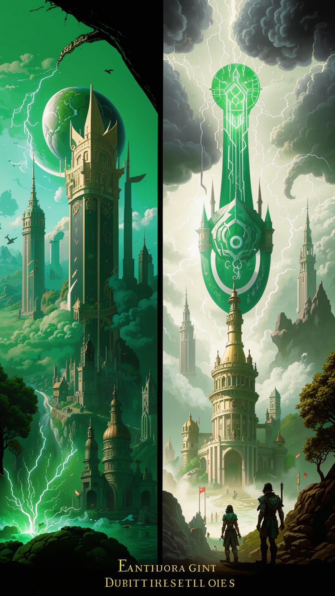
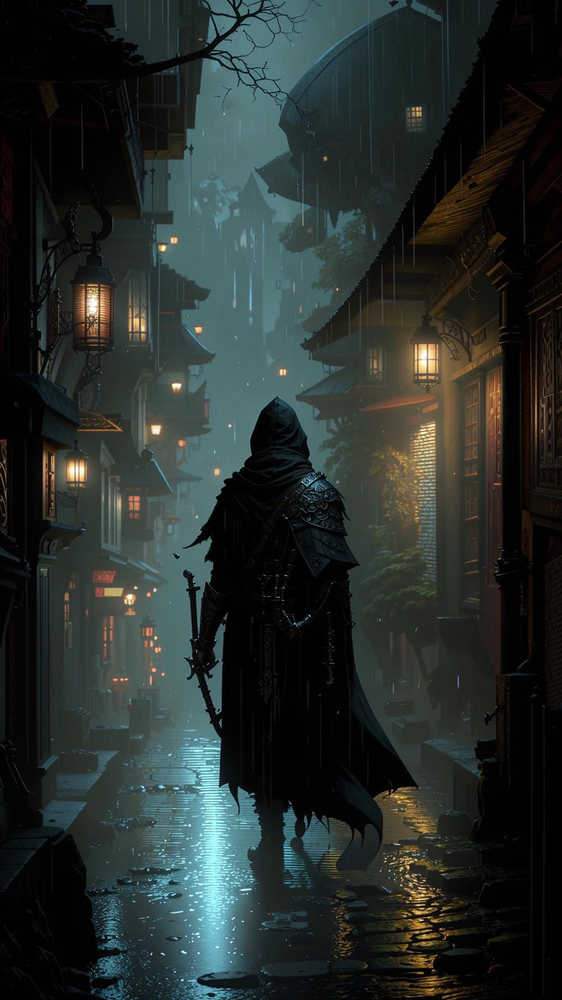
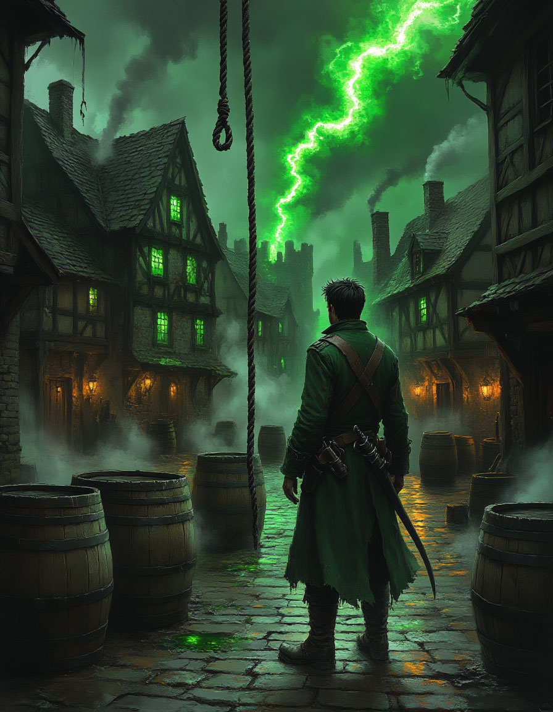
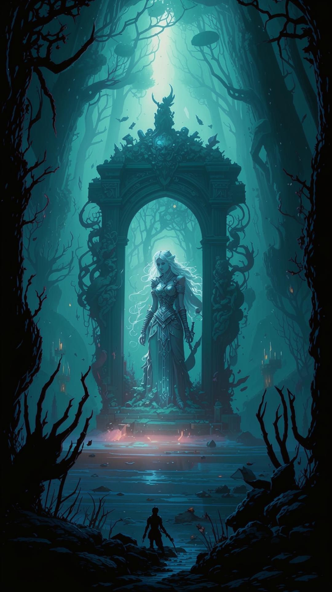
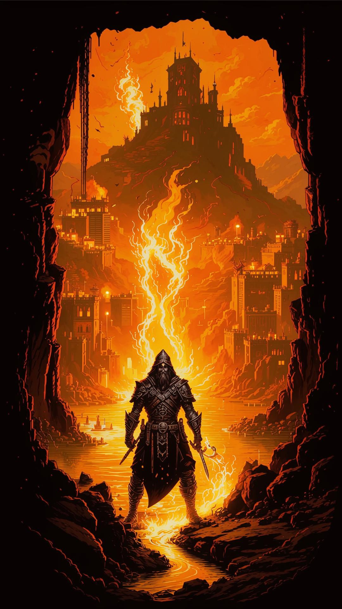
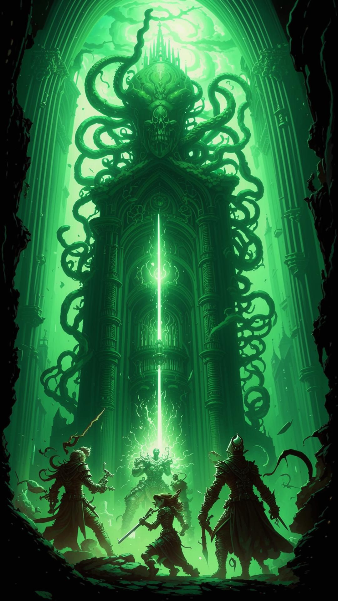
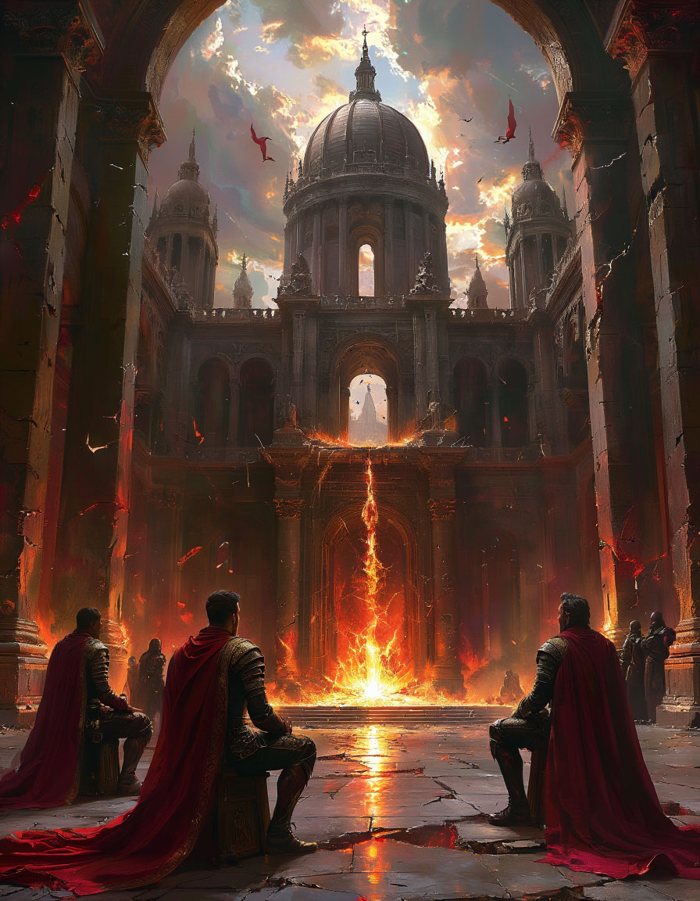

{width=1080px height=1920px}

<note>

**Уровни:** 1 -- 13+

**Общая цель:** Помешать культу «Сынов Безмолвного Шепота» и их лидеру, Архимагу Келвину Торну, пробудить Древнего Бога, используя фрагменты Сердечного Камня.

**Связующая нить:** Культисты активно охотятся за фрагментами Камней князей, чтобы использовать их энергию в ритуале. Герои должны защищать князей, находить союзников и в конечном итоге сорвать апокалиптический ритуал.

</note>

## Структура кампании и прогресс уровней

<table header="row">
<colgroup><col width="121"/><col width="660"/></colgroup>
<tr>
<td>

**Уровень**

</td>
<td>

**Глава / Ключевое событие**

</td>
</tr>
<tr>
<td>

**1-4**

</td>
<td>

Глава 1: Шепот в камне. Расследование в Солнцеграде. Первое столкновение с культом.

</td>
</tr>
<tr>
<td>

**5-7**

</td>
<td>

Глава 2: Удавка голода. Путешествие в Верданию и противостояние с Лигой.

</td>
</tr>
<tr>
<td>

**8-10**

</td>
<td>

Глава 3: Кровь Аурелиуса. Охота за наследием императора.

</td>
</tr>
<tr>
<td>

**11-12**

</td>
<td>

Глава 4: Глубинная Кузня. Путешествие в Пепельные Земли за помощью и артефактом.

</td>
</tr>
<tr>
<td>

**13+**

</td>
<td>

Глава 5: Сердце Тьмы. Финальный ритуал в Солнцеграде.

</td>
</tr>
</table>

## Глава 1: Шепот в камне (Уровни 1-4)

<note type="danger" title="Антагонист главы">

**Брайс**, полуэльф-аcolyte культа, фанатичный и жестокий.

</note>

<note type="lab" title="Союзники">

**Мастер Элрик** (пожилой архитектор), **Капитан Маркус** (глава городской стражи, скептик, но честен).

</note>

<note type="info" title="Общая цель">

Раскрыть локальный заговор культа «Сынов Безмолвного Шепота» в Солнцеграде, начиная с расследования исчезновения картографа.

</note>

---

### Крючок: Знак в таверне

-  Сцена: Таверна «Пьяный Единорог» в бедном квартале Солнцеграда. Герои здесь по своим делам (ищут работу, отдыхают, встречаются с информатором).

-  Событие: Дверь с грохотом распахивается. Вбегает перепуганный молодой человек в одежде скрипача -- Картер. За ним гонятся трое грубых бандитов.

Диалог:

Картер (задыхаясь, хватая первого попавшегося героя за рукав):

<note type="quote">

«Они нашли меня! Возьмите... ради всего святого! Отнесите мастеру Элрику, в квартал ремесленников! Скажите, что «Глаз» открылся! Они всё перекроили!»

</note>

Он суёт в руки герою свёрток и пытается бежать, но бандиты настигают его у выхода.

-  Бой: 3 Бандита (AC 12, HP 11). Их задача -- отобрать свёрток и заткнуть свидетелей.

-  После боя: Картер умирает от ран на руках у героев. Прибывает городская стража во главе с капитаном Маркусом.

Диалог с капитаном Маркусом:

Капитан Маркус (осматривает тела, скептически):

<note type="quote">

«Картер... давал уроки музыки детям купцов. И эти ублюдки... наёмники Гильдии Каменщиков. Странная компания для перестрелки. Ладно, герои. Вы хотите расследовать? Вперёд. Но если натворите бед -- ваши головы покроют ущерб. Ясно?»

</note>

-  Социальное взаимодействие: Хозяин таверны видел, что бандиты частые гости на стройке новой Площади Морвана. Капитан Маркус, прибывший на шум, скептичен. Он считает это бытовой разборкой, но позволяет героям расследовать, если те не будут мешать.

---

### 1\. Окружение и Атмосфера

Локация: Переулок рядом с таверной «Пьяный Единорог» в беднейшем районе Солнцеграда, Квартале Разбитых Фонарей.

-  Визуал: Узкая, грязная мостовая, на которой вечно стоит лужа сомнительной жидкости. Стены домов покосились, штукатурка облупилась, обнажив чёрное от копоти дерево и кирпич. На стенах -- слои афиш, объявлений о наградах и похабных граффити.

-  Запахи: Кислый запах дешёвого пива и рвоты из таверны, смешанный с ароматом жареной рыбы с уличной жаровни и вездесущей городской вони -- пота, мочи и гнили.

-  Звуки: Приглушённый гул голосов из таверны, лай собак где-то вдали, скрих колёс телеги на соседней улице. В переулке неестественно тихо.

-  Освещение: Единственный источник света -- тусклый, мигающий фонарь над дверью в таверну, который отбрасывает длинные, искажённые тени. Основное освещение -- от бледной луны, пробивающейся сквозь разорванные облака.

Детали для осмотра (если герои проявят любопытство ДО нападения):

-  Проверка Восприятия (СЛ 12): Герои замечают, что из щели в стене соседнего дома за ними кто-то наблюдает (пара блестящих глаз), но тут же скрывается.

-  Проверка Расследования (СЛ 10): На земле у стены валяется свёрток (потрёпанная, но чистая ткань), перевязанный бечёвкой. Внутри -- несколько серебряных монет (3 зм) и ключ от какой-то двери (ключ к следующей сцене).

2\. Социальное взаимодействие (До нападения)

Герои могут зайти в таверну «Пьяный Единорог» перед событиями в переулке.

-  Внутри таверны: Дымно, шумно, тесно. Типичная клиентура: пьяные матросы, подвыпившие ремесленники, подозрительные типы в капюшонах.

-  НПС: Барни, хозяин таверны. Толстый, лысый, с глазом на повязке. За стойкой вытирает кружку грязной тряпкой.

Диалог с Барни:

Барни (хриплым голосом): «Эй, новенькие! Что-то надо? Эль -- медяк, мясо -- два. Комнаты свободны, но не советую -- крысы с кошками размером». (Если спросить о Картере) «Картер? Скрипач? Да, парень тут частый гость... нервный какой-то в последнее время. Как будто ждал, что за ним придут. Сидел вон в том углу, что-то чертил на салфетке, потом скомкал и сбежал, как ошпаренный».

-  Находка (СЛ 14 Внимательность): Под указанным столом герои могут найти скомканную салфетку с наброском спирали и словом «Элрик».

---

### 3\. Развитие сцены: Нападение

Внезапно дверь таверны распахивается, и в переулок вбегает Картер. Он выглядит измождённым, его одежда порвана.

Диалог:

Картер (задыхаясь, его глаза полны ужаса):

<note type="quote">

«Они нашли меня! Не дайте им... возьмите! Ради всего святого, отнесите мастеру Элрику, в квартал ремесленников! Скажите, что «Глаз» открылся! Они всё перекроили!»

</note>

Он суёт в руки ближайшему герою трубку с картами (не свёрток!) и пытается бежать, но из темноты появляются трое бандитов.

-  Бандиты: Выглядят как наёмные громилы, но их одежда хоть и грубая, новая и одинаковая -- тёмные кожаные куртки.

Главарь бандитов (обращаясь к Картеру):

<note type="quote">

«Молодец, музыкант. Сам принёс нам посылку. А теперь давай сюда, и maybe мы оставим тебе пальцы, чтобы играть». (Оборачивается к героям) «А вы, мусор, проваливайте. Не ваше дело».

</note>

Бой: 3 Бандита (AC 12, HP 11). Их тактика -- попытаться окружить Картера и того героя, у которого трубка, игнорируя остальных, чтобы быстро отобрать добычу и скрыться.

---

### 4\. Альтернативные решения (Кроме драки)

Герои могут попытаться решить ситуацию иначе:

Запугивание (СЛ 13 Харизма (Запугивание)):

Герой:

<note type="quote">

«Вы действительно хотите связываться с \[Гильдией Воров/Церковью Этериуса/названием отряда героев\]? Убирайтесь, пока целы».

</note>

1. <note type="info">

   -  Успех: Бандиты колеблются. Их главарь плюнет: «Ладно, сегодня вам везёт. Но мы ещё встретимся». Они отступят и растворятся в темноте.

   -  Провал: Бандиты смеются и атакуют с преимуществом в первом раунде.

   </note>

Подкуп (10 зм):

Герой: (бросает кошель на мостовую) «Вот ваша плата. Теперь исчезните».

1. <note>

   -  Реакция: Бандиты переглянутся. Главарь поднимет кошель: «...Принято. Но за музыкантом всё равно придёт другой. Удачи». Они уйдут.

   </note>

Обман (СЛ 15 Харизма (Обман)):

Герой: (показывая на трубку)

<note type="quote">

«Опоздали. Мы уже стража вызвали. Капитан Маркус будет здесь через минуту. Хотите объяснить ему, за кем вы гонитесь?»

</note>

1. <note>

   -  Успех: Бандиты нервно оглянутся и, не сказав ни слова, ретируются.

   -  Провал: «Капитан Маркус? Он сегодня в другом конце города! В атаку!»

   </note>

---

### 5\. После боя / Развязка

-  Если Картер жив: Он будет бесконечно благодарен, но смертельно напуган.

Картер (дрожащими руками):

<note type="quote">

«Спасибо... вы не представляете, что это... Элрик... он единственный, кто всё поймёт... Ищите его вывеску -- «Старые Чертежи»... Скажите ему... «Глаз открылся»... Мне нужно бежать!»

</note>

Он убежит, оставив героев с трубкой.

-  Если Картер мёртв: Герои могут обыскать его тело и найти на груди зашитый кусок пергамента с тем же знаком спирали и адресом: «Квартал ремесленников, мастерская «Старые Чертежи».

-  Появление стражи: Через 1к4 минут после стычки появится Патруль городской стражи во главе с капитаном Маркусом.

Капитан Маркус (осматривает место): «Опять разборки Гильдии Каменщиков? Или новые лица решили пошуметь? Ладно, герои. Вы хотите расследовать? Вперёд. Но если натворите бед -- ваши головы покроют ущерб. Ясно? Двое, уберите этот мусор». (кивает на тело бандита)

6\. Переход к следующей сцене

Крючок: Адрес мастера Элрика («Старые Чертежи» в Квартале ремесленников) и кодовое слово <highlight color="lemon-yellow">**«Глаз открылся».**</highlight>

Пути перехода:

1. Прямой: Герои сразу отправляются по адресу.

2. Осторожный: Они могут сначала спросить у местных или у Барни в таверне о мастере Элрике, чтобы узнать о нём больше и убедиться, что это не ловушка.

3. Отвлечённый: Если герои заинтересуются ключом, найденным в свёртке, они могут попытаться найти дверь, которую он открывает (это может быть дверь в тайное убежище Картера, где есть дополнительные записи). Это задержит их, но даст больше информации.

---

### Квест 1: Язык камня

Цель: Найти мастера Элрика и выяснить, что значат чертежи, полученные от Картера.

#### Сцена 1: Квартал ремесленников

Окружение:

-  Внешний вид: Узкие, извилистые улочки, мощённые булыжником. Дома -- двух-трёхэтажные, с покатыми черепичными крышами. Воздух наполнен запахами древесной стружки, горячего металла, кожи и краски. Повсюду стоят лотки уличных торговцев, продающих инструменты, полуфабрикаты и простую еду для рабочих.

-  Атмосфера: Квартал живёт своей размеренной, шумной жизнью. Слышен стук молотков, скрип пил, звонкая болтовня подмастерьев. Люди здесь относятся к незнакомцам с лёгким подозрением, но в целом дружелюбно, если те не нарушают порядок.

Поиск мастерской:

Герои ищут дом №14 по Улице Старых Дубов. Это ничем не примечательное, немного обветшалое здание. Дверь -- потрёпанный дуб с простой железной скобой вместо ручки.

-  На двери мелом нарисован странный знак -- переплетение линий, напоминающее сложный архитектурный чертёж. Это личная метка Элрика.

#### Сцена 2: В мастерской Элрика

Окружение:

-  Внутреннее убранство: Мастерская -- это хаос гениального ума. Повсюду груды свитков, макеты зданий из дерева и гипса, странные механические приспособления. На большом столе в центре разложены чертежи, засыпанные обломками угля и крошкой от точильного камня. Воздух густой от пыли и запаха старой бумаги.

-  Детали: На стене висит портрет молодого Элрика на фоне величественного собора. На другом -- карта Солнцеграда с десятками непонятных пометок и линий, соединяющих новые здания.

Встреча с Элриком:

Внешность: Элрик -- мужчина за 60, с седой взъерошенной шевелюрой, в очках с толстыми линзами и запачканном чернилами халате. Его движения резкие, взгляд умный и усталый, но при виде чертежей из свёртка загорается беспокойным огнём.

Диалог (социальное взаимодействие):

Элрик (хватает чертежи, его руки дрожат): «Откуда у вас это?! Это же... это не строительный план здания. Смотрите на углы, на изгибы линий... Это чистая геометрия безумия! Эти пропорции... они не для нашего мира! Они нарушают все законы архитектуры!» Элрик (понижает голос, бросая взгляд на дверь): ««Глаз»... Картер сказал про «Глаз»? Это их знак. Культ «Всевидящего Ока». Слуги тех, кто шепчет из глубин. Я думал, это просто байки... но они в городе! Они не строят, они вписывают в город узор! Руну призыва!» Элрик (умоляюще смотрит на героев): «Им нужны карты лей-линий! Только так их ритуал обретёт силу. Мой коллега, Алрик, картограф... он изучал подземные течения магии для реконструкции канализаций... он исчез три дня назад! Его дом на Улице Ткачей, 17. Найдите его! Скажите, что Элрик послал вас! Ради всего святого!»

**Небоевое решение:**

Герои могут расспросить Элрика о культе, о Алрике, о том, как всё началось. За успешную \*\*проверку Проницательности (СЛ 13)\*\*они понимают, что Элрик не сумасшедший, а напуганный и абсолютно уверенный в своей правде.

Элрик может дать им **письмо к библиотекарю Главного архива**, своему старому другу, который может дать доступ к закрытым разделам об городской планировке (альтернативный путь к информации).

#### Сцена 3: Улица Ткачей, 17 (Внешний осмотр)

**Окружение:**

Это тихий, бедный переулок. Дом Алрика -- небольшое, скромное двухэтажное здание. Ставни на окнах второго этажа **прикрыты, но не закрыты на ставню**.

Зацепки (требуют проверок):

-  Внимательность (СЛ 12): На земле у порога -- несколько капель засохшей, почти чёрной крови.

-  Анализ (СЛ 14): Замочная скважина поцарапана и слегка повреждена, как будто её вскрывали отмычкой или грубой силой.

-  Магия (***Определение магии***): В воздухе витают следы магии школы Вызов -- едва уловимый запах озона и морской воды.

**Действия героев (до взлома):**

Они могут опросить **соседей** (**Проверка Убеждения или Запугивания СЛ 13**).

Соседка-старушка (шепотом, боязливо оглядываясь): «Да, бедный господин Алрик... Три дня назад ночью слышала я крик... и скрежет, будто мебель ломают. Выглянула -- видела людей в тёмных плащах... они тащили какой-то свёрток к повозке... У них на шеях... знаки какие-то, спиральные, светились в темноте...»

Это может дать им информацию о количестве нападавших (3-4 человека) и их возможной цели (похищение, а не убийство).

Пути перехода к следующей сцене (Квест 2: Кровавый след):

1. Прямое вторжение: Герои взламывают дверь (силой или отмычкой) и попадают в зачищенную квартиру, где их ждут засада или следы для расследования.

2. Обходной путь: Герои могут решить не лезть в лоб. Успешная проверка Восприятия (СЛ 15) позволяет заметить открытую форточку на втором этаже. Они могут попытаться забраться туда с помощью акробатики или магии, potentially избежав ловушек на первом этаже.

3. Официальный путь: Если герои связаны со стражей, они могут пойти к капитану Маркусу и попытаться получить \*\*ордер на обыск (Проверка Убеждения СЛ 16 -- Маркус скептичен, но бумаги Картера и слова Элрина могут его убедить). Это займёт время, но позволит войти легально.

Что получают герои:

-  Ключевая информация: Имя жертвы (Алрик), имя культа («Всевидящее Око»), их метод (вписывание рун в архитектуру), их цель (лей-линии).

-  Новая цель: Обследовать дом Алрика и найти clues о его местонахождении.

-  НПС-союзник: Мастер Элрик, который может в будущем помогать с расшифровкой архитектурных планов.

---

### Квест 2: Кровавый след

Цель: Обследовать дом пропавшего картографа Алрика, найти улики и столкнуться с охраной культа.

Локация: Улица Ткачей, 17

Внешний вид: Дом Алрика -- один в ряду таких же невзрачных двухэтажных каменных домов для ремесленников и мелких торговцев. Он выглядит заброшенным: ставни на втором этаже закрыты, на двери висит ржавый замок. Отличительная черта -- символ гильдии картографов (скрещённые циркуль и свиток), едва заметный на дверном косяке, почти стёршийся от времени.

Окружение:

Узкая, мощёная булыжником улица. Стоит лёгкий запах влажной шерсти и краски от соседних мастерских.

Мимо occasionally проходят **горожане** с озабоченными лицами, торопясь по своим делам. Они поглядывают на подозрительных незнакомцев у закрытого дома.

Напротив находится оживлённая **лавка пряностей**. Её хозяин, толстый человек в запачканном фартуке, **подозрительно поглядывает** на любой шум у дома Алрика.

Проникновение в дом

Герои могут проникнуть в дом несколькими путями:

1. Грубая сила (Сл 15): Выбить дверь. Это привлечёт внимание Смотрителя квартала (пожилой, ворчливый мужчина с дубинкой), который потребует объяснений. Его можно:

   -  Подкупить (5 зм): «Делайте что хотите, я ничего не видел».

   -  Обмануть (Обман, Сл 13): Сказать, что вы работаете на Гильдию картографов и пришли по срочному делу.

   -  Запугать (Запугивание, Сл 14): Он испугается и уйдёт, но позже может привести стражу.

2. Взлом (Сл 17): Взломать замок. Более тихий способ.

3. Проникновение через задний двор: Обойти дом через узкий переулок. Задняя дверь заперта, но окно в погреб имеет старую, сгнившую решётку (Сл 10 на силу, чтобы выломать).

Внутри дома: Описание и Зацепки

Дом состоит из двух этажей.

Первый этаж (Мастерская и кухня):

-  Обстановка: Пол завален рулонами пергамента, на столе -- незаконченные карты, чертёжные инструменты. Вся мебель покрыта толстым слоем пыли. На кухне -- грязная посуда, заплесневевший хлеб.

Зацепки (требуют активного поиска):

-  Расследование (Сл 13) у главного стола: Герои находят несколько обрывков черновика с бессвязными записями Алрика: «...углы не сходятся... Элрик был прав... это не строительство, это надрез на теле города...».

-  Внимательность (Сл 10) под ковром у камина: Небольшое пятно засохшей крови и серебряный кинжал с выгравированным знаком спирали -- символом культа.

-  Магия (Сл 15) в углу комнаты: Чувствуются слабые следы магии телепортации (остаточное колебание, запах озона). Это место, откуда забрали Алрика.

Второй этаж (Спальня):

-  Обстановка: Кровать застелена, всё аккуратно. На прикроватной тумбе -- недописанное письмо (ключевая зацепка).

Зацепка: Письмо Алрика.

«Дорогой Элрик, я должен признать, ты был прав. Мои замеры фундаментов на площади Морвана... они не просто неточны. Они ***намеренно искажены***. Старые планы не совпадают с новыми. Это не ошибка, это узор. Они не строят, они... вписывают город в какую-то чудовищную геометрию. Я боюсь, что...» Письмо обрывается на полуслове.

Социальное взаимодействие (без боя)

Пока герои исследуют дом, за ними может наблюдать соседка-старушка из окна напротив. Если герои проявят к ней доброту или дадут монету (2-3 зм), она прошепчет:

**Старушка:** «Бедняга Алрик... Три дня назад к нему приходили люди в хороших плащах. Говорили тихо, пахли морем и... металлом. Он им что-то показывал на картах, спорил. А потом ушёл с ними. Добровольно? Не знаю... Но выглядел он, как приговорённый к казни».

Если герои попытаются расспросить **хозяина лавки пряностей**, он будет груб и немного испуган:

Хозяин лавки: «Не видел ничего, не слышал ничего! И вам советую не совать нос не в своё дело. Любопытство до добра не доводит. Теперь прочь от моего магазина!»

Боевая сцена (если герои задержались)

Если герои шумели или провели в доме больше 15 минут, на них нападает группа ликвидаторов культа.

-  Противники: 2 Культиста и 1 Аколит.

-  Тактика: Они врываются в дом, чтобы замести следы. Аколит пытается зажать группу в узком пространстве заклинанием Туманное облако или Паутина, пока культисты атакуют.

Диалог во время боя:

Аколит (кричит, заходя с тыла): «Глупцы! Вы приблизились к истине, которую не способны постичь! Ваши жизни -- ничто перед величием грядущего рассвета!»

После боя (допрос раненого аколита):

Аколит (хрипит, истекая кровью): «Вы... ничего не остановите... Алрик станет... топливом для великого ритуала... на площади... Его кровь... откроет врата...»

Пути перехода к следующей сцене

1. Прямая конфронтация: Записка Алрика прямо указывает на площадь Морвана как на место, где творятся «намеренные искажения». Герои могут сразу отправиться туда.

2. Отчёт капитану Маркусу: Герои могут вернуться к капитану стражи, чтобы показать улики (кинжал культа, письмо). Он будет впечатлён, выдаст им награду (25 зм) и официальное разрешение на обыск площади, что даст им формальный повод для следующего этапа.

3. Визит к Элрику: Герои могут вернуться к архитектору, чтобы показать письмо. Элрик придет в ужас и ярость: «Я знал это! Они используют священную геомантию города в своих тёмных целях! Мы должны немедленно всё остановить!». Он может дать им схему канализационных туннелей, ведущих под площадь, как путь для скрытного проникновения.

Любой из этих путей логично ведёт к кульминационной сцене на площади.

---

### Квест 3: Площадь Шепчущих Статуй

Цель: Проникнуть на площадь Морвана и остановить ритуал.

1\. Окружение и Атмосфера

-  Локация: Центральная площадь Солнцеграда, носящая имя бога морей Морвана. Площадь только что реконструирована, мощение свежее, пахнет камнем и известью.

-  В центре: Новая колоссальная статуя Морвана из белого мрамора, держащего трезубец. Взгляд статуи направлен в сторону моря.

-  По периметру: Установлены шесть новых статуй поменьше, изображающих мифических существ Морвана (гиппокампов, тритонов, русалок). Их позы неестественны, а взгляды, если приглядеться, направлены не на статую Морвана, а внутрь площади, формируя скрытый геометрический узор.

-  Вечер: Площадь красиво освещена магическими фонарями, но их свет почему-то не достигает самых тёмных уголков, создавая неестественно густые, «живые» тени у оснований статуй.

**Признаки ритуала:**

У основания каждой статуи высечены **мелкие, почти невидимые спирали**.

По площади расставлены **braziers** (жаровни), в которых горят **зеленоватые угли**, испускающие лёгкий сладковато-гнилостный запах.

-  <note>

   -  Алрик, картограф, прикован цепями к постаменту главной статуи. Он без сознания, его лицо искажено гримасой ужаса, а по рукам и ногам ползут тёмные, похожие на чернильные пятна.

   </note>

2\. Социальное взаимодействие (До боя)

Герои могут подойти к площади под видом гуляющих горожан. Капитан Маркус и несколько стражников наблюдают за периметром, но не вмешиваются, так как «мероприятие» официально разрешено Гильдией Каменщиков.

Диалог с Главным Каменщиком:

Главный Каменщик (суетливый мужчина в богатой одежде): «Эй, вы! Не мешайте! Какое величественное зрелище, не правда ли? Скоро начнётся церемония зажжения вечного огня в честь Морвана! Вся гильдия трудилась днями и ночами!» Проверка Проницательности (СЛ 14): Он выглядит напуганным и говорит заученными фразами, будто под принуждением.

Диалог с Горожанином:

Пожилая горожанка (тихо, озираясь): «Красиво, да... но что-то тут не так. Моя кошка Шерстяшка обычно спит на солнышке тут, а сегодня убежала, шипя. И тени... посмотрите на тени от статуй. Они же двигаются!»

Диалог с Культистом-Часовым:

«Стражник» (в форме городской стражи, но с пустыми глазами): «Площадь закрыта для посторонних. Идите своей дорогой. Церемония скоро начнётся». Он не отступит, и если герои будут настаивать, его глаза на мгновение вспыхнут зелёным.

3\. Небоевое решение: Сорвать ритуал

Герои могут попытаться остановить ритуал, не вступая в прямой бой. Это потребует времени, проверок и даст культистам возможность среагировать.

Вариант А: Осквернить ритуальные фокусы.

-  <note>

   -  Действие: Герои должны испортить три из шести браzier с зелёными углями (залить водой, опрокинуть, засыпать землёй).

   -  Проверка: Ловкость (Скрытность) против пассивной Восприимчивости культистов (СЛ 14), чтобы сделать это незаметно. Или Сила (Атлетика) (СЛ 16), чтобы сделать это быстро, но вызвав шум.

   -  Эффект: Каждый испорченный фокус ослабляет ритуал. При уничтожении трёх фокусов энергетические лучи, бьющие из Алрика, перестают появляться.

   </note>

Вариант Б: Освободить Алрика.

-  <note>

   -  Действие: Подобраться к Алрику и разбить цепи.

   -  Проверка: Цепи заколдованы. Требуется Сила (Атлетика) (СЛ 18) или заклинание, наносящее урон по площади (например, Кислотный плевок), чтобы разъесть магические связи.

   -  Эффект: Если освободить Алрика до конца ритуала, он впадает в шок, но ритуал полностью срывается, так как теряет фокус.

   </note>

Вариант В: Использовать религиозный символ.

-  <note>

   -  Действие: Герой со святым символом Этериуса может попытаться очистить один из ритуальных узоров на статуе.

   -  Проверка: Харизма (Убеждение) или Мудрость (Религия) (СЛ 15).

   -  Эффект: При успехе узор на одной статуе тускнеет, и все культисты должны совершить спасбросок Мудрости от эффекта «Страх».

   </note>

4\. Боевая сцена (Если герои замечены или атакуют)

Если небоевые попытки проваливаются или герои атакуют, начинается бой.

Противники:

-  <note>

   -  Брайс (Жрец): Находится у главной статуи, концентрируется на ритуале. Не атакует первые 2 раунда.

   -  4 Культиста: Расставлены у браzier, поддерживают ритуал.

   -  2 Сторожевых Голема ( reskinned Stone Cobble): Замаскированы под груды строительного камня по краям площади. Активируются, если ритуалу угрожают.

   </note>

Особенность поля боя:

-  <note>

   -  Лучи Скверны: В начале каждого раунда (пока ритуал активен) из Алрика выстреливает 3 магических луча по случайным целям в пределах площади. Луч: +4 к попаданию, 1к6 + 2 урона силовым полем.

   -  Тени у Статуй: Раз в 2 раунда из теней у одной из статуй появляется Теневая Змея (Shadow Mastiff) и атакует ближайшего героя.

   </note>

5\. Развязка и Переход к следующей сцене

-  После победы: Спасённый Алрик приходит в сознание. Он в ужасе, но благодарен.

Алрик (дрожащим голосом): «Они... они не строили. Они меняли саму геометрию города... создавая гигантский узор... руну призыва... Спросите... спросите у князя... о «Наследии Аурелиуса»... «Ключи»... они охотятся за «Ключами»...»

-  Появление стражи: На шум прибывает Капитан Маркус с отрядом. Он ошеломлён масштабом заговора.

Капитан Маркус: «Культисты... прямо под носом у церкви. Дело серьёзнее, чем я думал. Князь должен знать об этом. Он хочет вас видеть. И да... хорошая работа.»

-  Переход к Финалу Главы: Капитан Маркус сопровождает героев во Дворец князя для аудиенции. Это плавный переход от уличного расследования к высшим эшелонам власти, где герои узнают о «Когте Ворона» и получают миссию в Верданию.

---

### Финал: Тени прошлого

Локация: Площадь Морвана, ночь.

Окружение и Атмосфера

-  Визуал: Площадь освещена факелами и магическими фонарями, готовящимися к грядущему празднику Морвана. В центре -- новая, почти достроенная статуя Морвана из тёмного, отполированного базальта, возвышающаяся на 15 футов. Её глаза инкрустированы перламутром. Вокруг статуи -- строительные леса, груды мешков с песком и каменных блоков.

-  Несоответствие: Герои, видевшие чертежи Элрика, замечают, что статуя и постамент установлены неправильно. Они образуют не симметричную композицию, а являются центром гигантской спирали, выложенной из тёмных плит на мостовой. Эти плиты почти не видны под грязью и строительным мусором, но при детальном осмотре заметны.

-  Звуки: Сначала -- обычные ночные звуки города. По мере начала ритуала: нарастающий низкочастотный гул, который ощущается скорее костями, чем ушами. Шёпот на непонятном языке, исходящий от самой статуи. Лай собак вдали, замолкающий одним моментом.

-  Запахи: Резкий запах озона и медной крови, смешивающийся с запахом морского воздуха.

#### Сцена: Обнаружение ритуала

Герои видят следующее:

-  Четверо культистов в тёмных robes с вышитыми спиралями стоят по углам спирали, раскачиваясь и бормоча.

**Аколит** (будущий жрец Брайс) стоит у основания статуи. Он держит в одной руке кинжал, а в другой -- древний свиток, с которого он зачитывает ритуал.

К самой статуе, в её незаконченное основание, прикован **Алрик**. Он бледен, без сознания. От его запястий по спиральным канавкам в плитах стекает тонкая струйка крови, которая **светится** sickly зеленым светом, питая энергией всю конструкцию.

Социальное взаимодействие (до боя)

Герои могут попытаться действовать скрытно или дипломатично.

Вариант 1: Переговоры (Сложность Харизма (Обман или Убеждение) СЛ 15)

Диалог с Аколитом (Брайсом):

Герой: «Во имя Князя! Прервите это безумие немедленно!» Брайс (не оборачиваясь, голос напряжённый, одержимый): «Безумие? Вы слепы! Мы не разрушаем, мы... перестраиваем. Мы готовим почву для Нового Рассвета! Этот город станет первым алтарём Того, Кто Спит! Присоединяйтесь, и вы узрите Истину!»

-  <note>

   -  Успех: Брайс на мгновение задумается, давая героям преимущество при инициативе или один свободный ход на действия.

   -  Провал: Он крикнет: «Смерть неверующим!» -- и ритуал начнётся.

   </note>

Вариант 2: Скрытный подход (Сложность Ловкость (Скрытность) против Пассивной Восприятия культистов (11))

Герои могут попытаться:

-  <note>

   -  <note>

      -  Освободить Алрина, пока культисты не видят.

      -  Испортить ритуальные компоненты (опрокинуть жаровни, порвать свиток).

      -  Занять выгодную позицию для внезапной атаки.

      </note>

   -  Успех: Герои получают раунд на подготовку до начала боя.

   -  Провал: Культисты поднимают тревогу.

   </note>

Боевая сцена + Альтернативные цели

Если начинается бой, его динамику меняют элементы окружения.

-  Основная цель: Победить Аколита Брайса и 4 Культистов.

Альтернативные цели (что ещё могут делать герои):

-  <note>

   1. Спасение Алрика: Требует действия и проверки Силы (Атлетика) СЛ 15 или Ловкости (Воровские навыки) СЛ 13, чтобы сломать/вскрыть цепи. Если его освободят, он приходит в сознание и может weakly помочь (отдать healing potion, указать на слабое место).

   2. Разрушение ритуальных фокусов: На площади есть 3 ритуальных жаровни, испускающих дурманящий дым. Их можно опрокинуть (действие). Каждая разрушенная жаровня ослабляет культистов (они теряют сопротивление магическому урону) или наносит 1к6 урона огнём всем в радиусе 5 футов.

   3. Порча спирали: Герои могут замазать кровные канавки землёй или заблокировать их камнями (действие). Это прерывает поток энергии: в начале каждого хода Аколит и культисты получают 1к4 урона некротической энергией от обратной связи.

   4. Использование окружения: Герои могут:

      -  Столкнуть строительные леса на группу культистов (проверка Силы, урон дробящий по области).

      -  Ослепить факелами или заклинаниями, использующими свет.

   </note>

Диалог во время боя

-  Брайс (кричит, когда его ранят): «Вы... ничего не понимаете! Его взгляд упадёт на этот город! Мы все станем частью Великого Целого!»

-  Культист (при смерти): «Во славу... Спящего...»

Развязка и переход к следующей сцене

-  После победы: Алрик спасён. Ритуальная спираль на площади тускнеет. Алрик приходит в себя.

Диалог с Алриком:

Алрик (кашляя, дрожащей рукой указывая на статую): «Спасибо... Они... они не просто строили. Они меняли саму геометрию города... создавая гигантский узор... руну призыва... Она соединяется с другими... по всему городу...» Алрик (хватая героя за рукав): «Спросите... спросите у князя... о «Наследии Аурелиуса»... «Ключи»... они охотятся за «Ключами»... Мои исследования... они что-то нашли...»

-  Вмешательство стражи: Раздаётся звук горнов и тяжёлых шагов. На площадь входит отряд городской стражи во главе с капитаном Маркусом.

Диалог с капитаном Маркусом:

Капитан Маркус (осматривая место битвы с мрачным видом): «Культисты... прямо под носом у церкви. И статую осквернили. Дело серьёзнее, чем я думал. Князь должен знать об этом. Он хочет вас видеть. И да... хорошая работа.»

-  Переход: Капитан Маркус предлагает героям проследовать с ним во дворец для аудиенции у Князя Люциана, чтобы доложить обо всём произошедшем и услышать о «Наследии Аурелиуса». Это плавно переводит квест в финальную сцену главы и создаёт переход ко второй главе.

### Эпилог: Аудиенция у князя

Окружение: Тронный зал Солнцеграда

-  Внешний вид: Герои входят в зал через массивные дубовые двери, инкрустированные бронзой в виде молний -- символа Этериуса. Зал огромен, его своды теряются в полумраке на высоте 50 футов. По бокам возвышаются десятки мраморных статуй прежних правителей Ауреи и великих героев, их каменные взгляды сурово следят за всеми входящими.

-  Освещение: Свет льётся через гигантские витражные окна с изображением побед Этериуса над силами Хаоса. Основной источник света -- огромная хрустальная люстра с сотнями свечей, парящая прямо над центром зала с помощью почти невидимой магии.

-  Убранство: Пол выложен мозаикой из золота, лазурита и яшмы, изображающей карту объединённой Империи Этерии. Воздух густой от запаха ладана и старого камня. Каждый шаг эхом отдаётся в гробовой тишине зала.

-  Стража: Вдоль всего зала, от дверей до трона, неподвижно стоят гвардейцы в сияющих золотых латах и алых плащах -- Личная Гвардия Молота. Их лица скрыты за полностью закрытыми шлемами. Они не двигаются и не издают ни звука.

Действующие лица и социальная игра

-  Князь Люциан вал'Мор: Сидит на Солнечном Троне -- не просто кресле, а архитектурном сооружении из золота, мрамора и вписанном в стену с витражом. Он не старик, но его лицо обезображено усталостью и грузом власти. Он одет в относительно простые, но безукоризненно сшитые одежды из тёмно-синего бархата с серебряной вышивкой. На его груди -- единственная регалия: золотая брошь в виде молнии.

-  Советники: По обе стороны от трона, на несколько ступеней ниже, на скамьях сидят его советники:

   -  Канцлер, тучный мужчина с хитрой ухмылкой (представляет интересы торговых гильдий).

   -  Верховный Жрец Этериус, сухой и аскетичный старик с горящим фанатичным взглядом.

   -  Магистр Гильдии Магов, женщина в строгих robes с невозмутимым лицом.

-  Придворные: По краям зала толпятся придворные в богатых одеждах. Они перешёптываются, бросая на героев любопытные, надменные или опасливые взгляды.

Сценарий аудиенции (пошагово)

1\. Представление и доклад: Капитан Маркус делает шаг вперёд, громко стуча каблуками по мозаике. Его голос гулко разносится по залу.

Капитан Маркус: «Ваше Сиятельство, позвольте представить вам странников, чьими усилиями был раскрыт заговор в сердце вашей столицы и спасён картограф Алрик».

Героям даётся слово кратко изложить суть событий (игроки могут отыграть это). Князь слушает, не перебивая, с закрытыми глазами.

2\. Вопросы и сомнения: После рассказа советники начинают задавать каверзные вопросы, пытаясь найти слабые места в истории или переложить вину.

**Канцлер** (сладковатым голосом): «Интересно... и ни один из этих «культистов» не выжил, чтобы дать показания? Как удобно». **Верховный Жрец** (сухо и резко): «Актёр Картер... не числился ли он в списках тех, кто посещал лекции по запрещённой геомантии? Не сами ли вы привели этого человека к ереси?»

Герои могут парировать эти обвинения, используя найденные улики (**серебряный кинжал со спиралью**), или заручиться поддержкой **Магистра Гильдии**, которая подтвердит, что ритуал был реальным.

3\. Признание и награда: Князь Люциан наконец поднимает руку, и зал замирает.

Князь Люциан (голос тихий, но чёткий, слышный в каждом уголке зала): «Довольно. Я чувствую правду в их словах. Солнцеград обязан вам благодарностью». Он делает едва заметный жест слуге. Тот подносит героям кошель с золотом (500 зм) и по изящному плащу с вышитой молнией на clasp (Плащ Посланника Князя, даёт преимущество на проверки Убеждения в пределах Ауреи).

4\. Новое задание -- переход к следующей главе: Князь не отпускает героев. Он медленно встаёт с трона.

**Князь Люциан:** «Но тень над моим городом -- лишь симптом болезни, поразившей всё тело Этерии. Ваше следующее задание куда опаснее. «Коготь Ворона»... это прозвище Леди Морганы, княгини Вердании. Но я отказываюсь верить, что она behind this madness. Это слишком очевидно. Кто-то хочет войны между нами, пока настоящая угроза копит силы. Вы отправитесь в Верданию как мои личные emissaries. Вручите ей это письмо. Узнайте, что происходит, и остановите это. Не подведите меня».

Слуга вручает героям **запечатанный пергамент с личной печатью Люциана**.

Альтернативные пути (помимо боя)

Пока герои находятся в зале, они могут проявить бдительность и не только отбиваться от verbal attacks.

-  Внимание к деталям (Восприятие, СЛ 18): Герой замечает, что один из советников (например, Канцлер) старается не смотреть на верховного жреца, а на его пальце -- кольцо с едва заметным символом спирали, которое он прикрывает плащом. Это прямо указывает на крота в ближнем круге князя!

-  Анализ поведения (Проницательность, СЛ 15): Герой понимает, что Верховный Жрец не просто фанатик. Его обвинения -- это попытка быстро замять дело и не дать копнуть глубже. Он что-то скрывает.

-  Магия в зале: Заклинание Обнаружение магии может выявить:

Над троном витает мощная аура очарования (заклинание для поддержания авторитета).

Один из советников (тот же Канцлер) излучает ауру иллюзии (возможно, это не его истинная внешность) или одурманивания.

-  Социальное взаимодействие: Герои могут попытаться тайно поговорить с Магистром Гильдии после аудиенции, чтобы узнать её мнение. Она может намекнуть на то, что жрецы Этериуса стали подозрительно активны и требовательны в последнее время.

**Важность:** Эти находки не изменят сиюминутное задание (поездка в Верданию), но они:

Дадут героям **ключевые зацепки** на будущее.

Покажут, что угроза куда ближе и опаснее, чем кажется.

1. Создадут ощущение, что они -- не просто исполнители, а действительные участники большой политической игры.

### Награды Главы 1

-  Сокровища: С каждого культиста можно найти по 10-15 зм, у Брайса -- серебряный кинжал со спиралью (25 зм) и Амулет Защиты (+1 к КД, пока носишь).

-  Влияние: Благосклонность капитана Маркуса и князя Люциана.

-  Информация: Имя «Коготь Ворона», термин «Ключи», знание о ритуальной архитектуре.

Переход на 4 уровень.

### Бестиарий Главы 1

#### 1\. Бандит (Thug)

-  Класс Доспеха 11 (кожаная куртка)

-  Хиты 32 (5к8 + 10)

-  Скорость 30 фт.

-  Действия: Мультиатака. Две атаки дубинкой (+4 к попаданию, 1к6+2 дробящего урона) или заточкой (+4 к попаданию, 1к4+2 колющего урона, бонусным действием при преимуществе).

#### 2\. Культист (Cultist)

-  Класс Доспеха 12 (кожаная броня)

-  Хиты 9 (2к8)

-  Скорость 30 фт.

-  Действия: Атака скимитаром (+3 к попаданию, 1к6+1 рубящего урона). Бонусное действие: Тёмный шёпот (цель в пределах 10 фт. должна преуспеть в спасброске Мудрости КС 10, иначе совершит следующий бросок атаки с помехой).

#### 3\. Аколит (Acolyte)

-  Класс Доспеха 12 (кожаная броня)

-  Хиты 27 (5к8 + 5)

-  Скорость 30 фт.

-  Заклинания: Заговоры: Священное пламя, Направление. 1-й уровень (4 ячейки): Наказ, Лечение ран, Щит веры. 2-й уровень (3 ячейки): Молчание, Облако кинжалов.

-  Действия: Атака булавой (+2 к попаданию, 1к6+1 дробящего урона).

#### 4\. Жрец Брайс (Priest)

-  Класс Доспеха 13 (кольчуга)

-  Хиты 27 (5к8 + 5)

-  Скорость 30 фт.

-  Заклинания: Заговоры: Священное пламя, Слово боли. 1-й уровень (4 ячейки): Наказ, Причинение ран, Щит веры. 2-й уровень (3 ячейки): Облако кинжалов, Молчание, Духовное оружие. 3-й уровень (2 ячейки): Аура жизни, Духовные стражи.

-  Действия: Атака посохом (+2 к попаданию, 1к6 дробящего урона). Бонусное действие: Призыв Бездны (1/день) -- призывает Беса (Imp) на 1 минуту.

### Лавки и таверны Солнцеграда

#### 1\. Таверна «Пьяный Единорог» (Бедный квартал)

-  Владелец: Барни (толстый, весёлый, с глазом на повязке).

-  Услуги: Ночлег (общий зал - 5 медяков, комната - 2 зм), ужин (5 медяков), информация (1 зм, ненадёжно).

-  Побочный квест: «Долг чести» -- Барни просит найти и «убедить» моряка, который сбежал, не оплатив огромный счёт. Награда: 50% от долга.

#### 2\. Оружейня «Сталь и Верность» (Квартал ремесленников)

-  Владелец: Торгрен (суровый, но честный дварф).

-  Товары: Обычное оружие/доспехи, ремонт (10-50 зм), +1 оружие (500 зм, под заказ).

-  Побочный квест: «Украденные клинки» -- Партия дорогих клинков была похищена по пути в магазин. Торгрен просит найти их до того, как их переправят в Верданию. Награда: выбор одного клинка из партии.

#### 3\. Аптека «Корни и Сны» (Квартал ремесленников)

-  Владелец: Старая Элоди (полуэльфийка, помешанная на чистоте).

-  Товары: Зелья лечения (50 зм), антидоты (50 зм), редкие травы (цена договорная).

-  Побочный квест: «Чистый источник» -- Элоди подозревает, что городской источник воды отравлен. Она просит пробу воды из самого сердца акведука, куда стража не пускает. Награда: бесплатные зелья на выбор.

#### 4\. «Позолоченный Единорог» (Богатый квартал)

-  Владелец: Мадам Изабель (бывшая придворная дама).

-  Услуги: Ночлег (люкс - 10 зм), ужин (5 зм), хранение ценностей (2 зм/день).

-  Побочный квест: «Семейная реликвия» -- Знатный гость потерял фамильное кольцо. Он подозревает горничную, сбежавшую в трущобы. Награда: 50 зм и благосклонность знатного рода.

## Глава 2: Удавка голода (Уровни 5-7)

Общая цель: Расследовать деятельность Лиги Бесконечного Змея в Вердании, выяснить её связь с культом и остановить отравление водных источников.

Крючок: Больная земля

Детальное описание окружения

Герои подходят к деревне Песчаная Коса с юга, по пыльной проселочной дороге. Первое, что они замечают -- заброшенные поля.

-  Поля: Ржавые серпы валяются у края поля. Посевы пшеницы и овощей не убраны, они сгнили на корню, покрылись серой плесенью и неестественно чёрными пятнами. В воздухе стоит сладковато-гнилостный запах, смешанный с привычным ароматом навоза, но и он кажется каким-то «больным».

-  Окраина деревни: Первые дома -- это покосившиеся хижины с прогнившей соломенной кровлей. Заборы развалились. Никаких животных. Ни кур, ни собак, ни кошек. Тишину нарушает лишь навязчивое жужжание крупных мух.

-  Центр деревни: Небольшая площадь с колодцем -- единственное место, где есть признаки жизни. Но и здесь люди движутся медленно и бесцельно, как сомнамбулы. Они не разговаривают, их движения вялые и заторможенные. Они смотрят на героев пустыми, отсутствующими глазами, без любопытства или страха.

-  Колодец: Деревянная конструкция старая, ведро почти развалилось. Если заглянуть внутрь, вода кажется мутной, а на поверхности плавает странная радужная плёнка. Проверка Мудрости (Выживание) СЛ 12 позволяет определить, что вода непригодна для питья -- она горьковата на запах и оставляет на языке металлический привкус.

-  Атмосфера: Давят тишина и апатия. Кажется, что сама жизнь покинула это место. Даже ветер не шелестит листьями на немногих уцелевших деревьях.

Социальное взаимодействие и диалоги

Герои могут попытаться поговорить с жителями. Большинство просто игнорируют их или бормочут что-то невнятное.

1\. Встреча с девочкой:

У колодца сидит девочка лет 8-ми, она качает тряпичную куклу и монотонно напевает:

«Раз, два, Лига пришла... три, четыре, воду залила... пять, шесть, все мы здесь исчезнем...»

Если герои попытаются её расспросить, она просто продолжит напевать, не реагируя. При агрессивном воздействии -- расплачется и убежит.

**2\. Встреча с дедом-рыбаком:**

На крыльце крайней хижины сидит старик и чинит сеть. Его руки дрожат. Это **дед Еремей**. Он один из немногих, кто ещё более-менее в сознании.

Диалог:

Герой: «Что случилось с вашей деревней?» Еремей (не поднимая глаз, хрипло): «Река... река умерла. И мы следом. Месяц назад они были... „добрые люди“ из Лиги. Белые повозки, улыбки как у маски. „Почистим ваш колодец, -- говорят, -- от заразы“. Ну почистили... С тех пор и пошло. Сначала скот сдох. Потом люди... не умирать, а так... уснуть стали. И сны они снятся... не наши сны». Герой: «Кто они? Куда они ушли?» Еремей (кашляет, смотрит на север): «Кто их знает... Говорили, у них склад на севере, в бухте Трёх Скал. Говорят, там и „лекарство“ своё варят. Только нам оно... не поможет».

3\. Встреча с обезумевшей матерью:

Из одного дома доносятся приглушённые рыдания. Войдя, герои увидят женщину, пытающуюся накормить кашей своего взрослого сына. Он сидит, уставившись в стену, и каша стекает у него по подбородку.

Диалог:

Женщина (истерично, оборачиваясь): «Уйдите! Оставьте нас! Вы тоже от них? Вы принесли новое „лекарство“? Оно не помогает! Оно только усыпляет! Он мой мальчик, а я не могу его дозваться!»

Что, кроме боя, могут сделать герои?

Медицинское обследование:

1. <note>

   -  Зельеварение/Медицина (СЛ 14): Герои могут определить симптомы: сильное обезвоживание, мышечная атрофия, признаки воздействия на нервную систему. Яд не смертельный, но вызывающий глубокую апатию и подавление воли.

   -  Магия: Заклинание Обнаружение яда и болезней ярко подсветит колодец и всех, кто пил из него воду, ядовитой аурой. Лечение ран не поможет, так как это не рана, а болезнь. Нужно Снять проклятие или Уменьшить болезнь.

   </note>

Поиск улик:

1. <note>

   -  Внимательность (СЛ 12) у колодца: Герои находят несколько отпечатков сапог с необычным узором (не деревенским) и обрывок упаковки с символом Лиги Бесконечного Змея (бесконечный змей, кусающий себя за хвост).

   -  Расследование (СЛ 10) на окраине: Обнаруживается брошенный лагерь с пустыми бочками из-под реагентов. На одной бочке есть та же символика Лиги и надпись: «Сонная отрава. Опасно».

   </note>

**Помощь выжившим:**

Герои могут попытаться **очистить колодец** (например, огнём или магией). Это даст деревне шанс на выживание в долгосрочной перспективе, но не поможет уже отравленным.

Они могут **раздать свои запасы еды и воды** самым слабым жителям (детям, старикам). За это дед Еремей подарит им **вырезанный из кости амулет** (без магических свойств, но как знак благодарности) и подробно опишет дорогу к бухте.

Пути перехода к следующей сцене

1. Прямая дорога: Расспросив деда Еремея или найдя упаковку от яда, герои узнают название места -- Бухта Трёх Скал -- и направление (на север, вдоль побережья).

2. Ночное нападение: Если герои задержатся в деревне до ночи, на них нападут 4 Сахагина и 1 Сахагин-Следопыт. Их послали «очистить» улики и забрать «испорченный товар» (ослабевших жителей для экспериментов). После боя на теле Следопыта можно найти карту с маршрутом к бухте.

3. Неожиданная помощь: Если герои проявят доброту (очистят колодец, раздадут воду), наутро к ним придёт Ариэль, молодая друид-следопыт из Круга Изумрудной Росы. Она скажет: «Леса видели ваши дела. Вы ищете тех, кто отравил это место? Я знаю тропу к их логову. Пойдёмте со мной».

### Квест 1: Ночные гости

Цель: Защитить деревню от набега существ, похищающих ослабевших жителей.

Локация: Деревня Песчаная Коса, ночь. Деревня состоит из двух дюжин покосившихся домов из темного дерева с камышовыми крышами, построенных вокруг высохшего колодца. Воздух влажный и спёртый, пахнет гниющим камышом и стоячей водой. С западной стороны деревню подпирает стена непроглядного Леса Теней, с восточной -- топкие болота, уходящие к морю. Единственный источник света -- несколько коптящих факелов, воткнутых в землю, и тусклый свет из окон хижины старейшины Брена.

Сцена 1: Подготовка к засаде

Действующие лица:

-  Старейшина Брен: Дряхлый, больной старик. Сидит на крыльце своей хижины, кутается в потертое одеяло. Его кашель -- единственный громкий звук в ночной тишине.

-  Мейра: Молодая, напуганная женщина, внучка Брена. Выглядывает из-за двери, глаза полны слез.

-  Торвен: Молодой парень, рыбак. Нервно перебирает старую зазубренную алебарду -- единственное более-менее приличное оружие в деревне.

Социальное взаимодействие (до нападения):

Герои могут поговорить с жителями, чтобы получить информацию и подготовиться.

Диалог с Бреном:

Брен (кашляя): «Спасибо, что остаётесь... Они приходят с тех пор, как вода испортилась... Всегда ночью. Тащят самого слабого... того, кто уже не может кричать... Сегодня... они придут за мной. Чувствую костями. Мейра, дитя мое... спрячься в погребе.»

Диалог с Торвеном:

Торвен (дрожащим голосом): «Я видел их лишь мельком... Тени из воды. Скользкие, с глазами как у мёртвой рыбы... и зубами... острыми, как иглы. Мы стреляли из луков -- стрелы отскакивают от их чешуи!»

Диалог с Мейрой (если уговорить её выйти, Проверка Убеждения СЛ 10):

Мейра (шёпотом, плача): «Дедушка прав... Они забрали старуху Эллу, потом рыбака Корвина... Перед этим они всегда... шепчутся. Как будто зовут друг друга. Из леса и из болот... Этот шёпот сводит с ума.»

Что могут сделать герои (помимо боя):

1. Подготовить укрепления: Используя телеги, бочки и сети, можно создать труднопроходимую местность на подступах к хижине Брена. Это потребует проверки Сила (Атлетика) СЛ 13 и даст врагам помеху на первые раунды боя при попытке приблизиться.

2. Исследовать колодец: Герои могут осмотреть колодец. Проверка Мудрость (Восприятие) СЛ 14 обнаружит на срубе слизь и чешую необычного фиолетового оттенка. Это знание даст преимущество на первый бросок атаки против сахагинов, так как герои поймут, откуда ждать атаки.

3. Накопать ямы-ловушки: Неглубокие ямы, замаскированные ветками. Проверка Ловкость (Скрытность) СЛ 15 для их установки. Первое существо, проходящее по ним, должна преуспеть в спасброске Ловкости КС 13, иначе упадёт ничком.

4. Спрятать лучников: Можно уговорить Торвена и ещё пару крестьян с луками забраться на крыши. Это даст им укрытие и преимущество высоты (+2 к броскам атаки).

Сцена 2: Нападение

Окружение:

-  Освещение: Тусклое, от факелов. Полутьма (-5 к пассивному Восприятию). Существа вне радиуса 20 фт. от факелов считаются скрытыми легким укрытием.

-  Местность: Грязь, лужи. Труднопроходимая местность в радиусе 10 фт. от хижины (если герои построили баррикады).

-  Укрытия: Углы домов, телеги, бочки.

Противники: 4 Сахагина и 1 Сахагин-Следопыт. Они появляются не сразу все:

-  Раунд 1: 2 Сахагина emerge из темноты леса, атакуют баррикады, пытаясь отвлечь внимание.

-  Раунд 2: 1 Сахагин и Следопыт появляются из колодца и пытаются прорваться к двери хижины Брена.

-  Раунд 3: Последний Сахагин вылезает из болота с тыла.

Тактика врагов: Сахагины не стремятся убить всех. Их цель -- прорваться к хижине, схватить Брена и отступить. Они будут пытаться оттащить его к колодцу или в болото.

**Небоевое решение:** Герои могут попытаться **отпугнуть** сахагинов. Если они догадаются (или узнали от Мейры) о их чувствительности к шуму, они могут:

Устроить грохот (бить по железу, кричать). *Проверка Харизма (Запугивание) СЛ 15*.

Разжечь огромный костёр. *Проверка Интеллект (Выживание) СЛ 10*. При успехе сахагины получат **помеху** на броски атаки, а может, и вовсе отступят после 2-3 раундов, не добившись цели.

Сцена 3: После боя

Если сахагины отступили или убиты:

-  Торвен (облегчённо выдыхая): «Мы... мы отбили их! Впервые!»

-  Брен (все ещё дрожа, но с надеждой): «Вы... вы настоящие воины. Но они вернутся. Их вожак... тот, что больше других... он шептал моё имя. Они не отстанут.»

Если сахагина взяли в плен:

-  Сахагин-Следопыт (шипит, искажаясь от боли и ненависти): «Сухокожие слабаки! Морская Королева... «Удавка»... ждёт припасы! Мы забираем сильных... для Великого Перерождения в Глубинах! Слабых... топиим! Ваша деревня -- лишь рыбья ловушка! Бухта Трёх Скал... там наш Пост... приходите... вас ждёт хозяин!»

Переход к следующей сцене:

-  Прямая зацепка: Название «Бухта Трёх Скал» и ключевая фраза «Удавка» (прозвище Алиссы Рей).

-  Через исследование: На теле Следопыта герои могут найти записку, написанную на сахаукинском. Если перевести (или найти переводчика в деревне), там будет: «Пост «Три Скалы». Груз для «Удавки» готов к отправке. Ждём новых «даров» из деревни.»

-  Через жителей: Торвен, услышав название бухты, может сказать: «Я знаю это место! Это старая пиратская бухта в день ходьбы на север вдоль побережья! Туда сейчас только контрабандисты снуют.»

### Квест 2: Бухта Трёх Скал

Цель: Найти и обыскать склад Лиги в прибрежной пещере, чтобы найти доказательства их причастности к отравлению воды и связь с культом.

1\. Подход к Бухте

Окружение:

-  Дорога: Герои движутся по узкой, размытой дождём тропе, которая петляет между покрытых птичьим помётом утёсов. Воздух солёный, влажный, с примесью запаха гниющей водоросли и чего-то химически-сладковатого.

-  Вид сверху: С вершины последнего утёса открывается вид на Бухту Трёх Скал. Это небольшой, почти круглый залив, окружённый тремя остроконечными скалами-исполинами. Вода в бухте неестественно мутная, зеленоватая. У самой дальней скалы пришвартована лёгкая шхуна под чёрным парусом без опознавательных знаков.

-  Склад: У подножия центральной скалы виден вход в пещеру, искусственно расширенный и укреплённый брёвнами. Перед ним -- деревянный пирс и площадка с ящиками, бочками и тачками.

Действие: Герои могут осмотреть бухту до спуска.

**Проверка Внимания (Мудрость) СЛ 14:** Герой замечает два важных момента:

На пирсе стоит **два охранника** (один ленино курит трубку, второй чистит нож). Они выглядят расслабленно, но не пьяны.

Из пещеры доносится **приглушённый, металлический лязг** и **ворчание**, словно оттуда тащат что-то тяжёлое.

2\. Социальное взаимодействие (Проникновение без боя)

Герои могут попытаться подойти под видом.

Вариант 1: Дипломатия и Обман

-  Подход: Герои выходят на пирс, стараясь выглядеть уверенно.

Диалог с Охранником №1 (Гарри):

Гарри (переставая чистить нож, смотрит с подозрением): «Стойте! Вы кто такие? Частная территория Лиги. Проходите мимо». Герой (проверка Обмана или Убеждения СЛ 15): «Мы с инспекции из Волнистой Гавани. Капитан Рейнольдс прислал. Поступила жалоба на... несоответствие условий хранения груза. Стандартная проверка».

Развитие:

-  <note>

   -  Успех: Гарри заколеблется. «Грёбаные бюрократы... Ладно, проходите. Но только вы и только на пять минут. Босс(Гаррет) внутри, он вас проведёт».

   -  Провал: Гарри хмурится. «Капиан Рейнольдс? Да он своих людей всегда письмом предупреждает. А у вас ничего нет. Валите отсюда, пока целы!» -- это приводит к бою.

   </note>

Вариант 2: Скрытность

-  Подход: Герои могут попытаться подкрасться к пещере с тыла, со стороны скалы.

-  Проверка Скрытности (Ловкость) СЛ 12: Если успех, они проскальзывают внутрь, минуя охранников, и получают преимущество на первый раунд боя внутри или возможность устроить засаду.

3\. Внутри пещеры (Исследование)

**Окружение:**

Пещера глубокая, освещена **самовоспламеняющимися грибами** (дают тусклый зелёный свет) и факелами. Воздух спёртый, пахнет плесенью, химикатами и потом.

-  Зона 1: Причал. Несколько лодок, бочки с провизией и водой.

-  Зона 2: Основной склад. Груды ящиков с маркировкой Лиги. Среди обычных товаров (ткань, зерно) герои находят замаскированные бочки с опасной маркировкой: «Сонная Отрава» и символом спирали.

-  Зона 3: Стол Гаррета. В глубине пещеры -- грубый стол, заваленный бумагами, и сундук.

Что можно найти (кроме боя):

-  Осмотр ящиков (СЛ 13): Герои находят шифрованные отчёты для «Когтя Ворона».

-  Взлом сундука (СЛ 15): Внутри -- бухгалтерская книга с записями о поставках «особого груза» в Лес Теней и ключот клетки (см. ниже).

-  Пассивное восприятие 12: Герои слышат тихое поскуливание из-за груды ящиков в углу. Там они находят клетку с избитым, напуганным грузчиком-полуросликом. Он видел, как грузили «странные бочки» и может рассказать про корабль и маршрут («вверх по реке Энвина, к старой часовне»).

4\. Боевая сцена (если всё пошло не так)

Противники:

**Гаррет, капитан Лиги** (Bandit Captain)

Его **гиена** (Hyena)

2 **Охранника** (Guard)

**Тактика Гаррета:**

Он не герой. Он прикажет гиене и охранникам атаковать, а **сам будет отстреливаться из лёгкого арбалета** из-за укрытия (ящиков).

Если бой складывается против него, он попытается **сбежать** на лодке или **поджечь склад** (устроить пожар, который нанесёт урон 1d6 огня всем в пещере каждый ход).

Диалог в бою:

Гаррет (кричит из-за укрытия): «Идиоты! Вы понятия не имеете, с кем связались! «Удавка» вас сожрёт! Мне заплатили слишком хорошо, чтобы я провалил это дело!»

5\. Пути перехода к следующей сцене

После боя или успешного обыска герои находят ключевую зацепку:

1. Основная зацепка: Шифрованное письмо на столе Гаррета. При расшифровке (или со слов полурослика) становится ясно: следующий пункт назначения груза -- «Зелёный Собор» (старое название Часовни в Лесу Теней).

2. Дополнительная зацепка: Карта маршрута по реке Энвина, найденная в том же сундуке.

3. Встреча с Ариэль: Когда герои выходят из пещеры, их уже ждёт Ариэль, друид-следопыт. Она наблюдала за бухтой.

Ариэль (серьёзно): «Я видела, что вы нашли. Часовня в Лесу Теней... это древнее, священное место. Его осквернение не может остаться безнаказанным. Идите вдоль реки на север. Я встречу вас на опушке и проведу остаток пути. Мы должны успеть до полнолуния».

6\. Альтернативные действия (помимо боя)

-  Подкуп: Гаррет -- прагматик. Если герои предложат ему взятку (от 100 зм), он может отдать им одну бочку с ядом и книгу, чтобы они отстали, но будет лгать о дальнейшем маршруте.

-  Диверсия: Герои могут не вступать в конфликт, а тайно испортить груз (продырявить бочки, подменить яд на воду) и скрыться. Это отсрочит планы культа, но не остановит их.

-  Шантаж: Найдя бухгалтерскую книгу, герои могут шантажировать Гаррета, обещая отдать её его начальству в Лиге, если он не выдаст информацию. Он сдастся и расскажет про часовню.

### Квест 3: Часовня в лесу

Цель: Опередить культистов и не дать им осквернить гробницу дочери Аурелиуса.

1\. Подход к Часовне (Создание атмосферы)

Окружение: Герои выходят на опушку, откуда открывается вид на долину. Сама Часовня Зимней Спящей стоит в центре заросшей каменной площадки. Это не здание, а гигантское дерево-монолит, в стволе которого вырезаны окна-глазницы и дверной проём. Каменная кладка эльфийской работы оплетена корнями и вековым плющом, создавая впечатление, что лес поглощает руины.

Внешние детали:

-  <note>

   -  Кладбище: Рядом -- старые, покосившиеся могилы эльфийских воинов. Некоторые надгробия сдвинуты, будто что-то выбралось из-под земли.

   -  Тишина: В лесу вокруг царит неестественная, гнетущая тишина. Не слышно птиц, не шелестит листва.

   -  Воздух: Пахнет озоном, прелой листвой и сладковатым, тошнотворным запахом гниющей плоти.

   -  Следы: У входа -- свежие следы сапог, волочения чего-то тяжёлого и несколько капель засохшей чёрной крови.

   </note>

2\. На подступах (Небоевое взаимодействие)

У входа в часовню герои натыкаются на двух культистов, которые о чём-то спорят. Это не боевая сцена, а социальный вызов.

НПС:

-  <note>

   -  Новичок Карл: Молодой, нервный парень. Он напуган и сомневается. «Я не signing up для осквернения могил... Мне сказали, мы будем искать знание...»

   -  Ветеран Лена: Цynичная, опытная культистка. «Не ной. «Коготь» знает, что делает. Эта «спящая красавица» откроет нам глаза на реальность! Теперь тащи ящик, пока Старшие не вышли».

   </note>

Варианты действий героев:

1. Напасть: Стандартный бой с двумя культистами (легкая схватка). Шум может привлечь внимание изнутри.

2. Убедить (СЛ 15 Убеждения/Обмана): Герои могут притвориться новыми членами культа, посланными на помощь. Лена будет подозрительна, но если проверка успешна, она прикажет им «тащить ящики с компонентами» внутрь, что даст им предлог зайти.

3. Подкупить/Запугать (СЛ 13): Заставить их молча уйти. Карл поддастся, Лена будет сопротивляться.

4. Тайно обойти: Используя Скрытность, герои могут забраться на крышу часовни через древние эльфийские ступени, вросшие в дерево, и проникнуть внутрь через разбитое окно на втором ярусе.

3\. Внутри Часовни (Исследование и атмосфера)

Интерьер -- это один большой зал с высоким потолком. Воздух густой и холодный.

Детали:

-  <note>

   -  Саркофаг: В центре -- каменный саркофаг принцессы Ланы. Крышка сброшена на пол. Внутри пусто.

   -  Ритуальный круг: Вокруг саркофага мелом нарисован сложный спиралевидный круг. Горят чёрные свечи, пахнет серой и медью.

   -  Жертвенный алтарь: На бывшем алтаре эльфийского бога теперь разложены окровавленные инструменты и кости животных.

   -  Ящики: Повсюду ящики с символом Лиги Бесконечного Змея. В них -- не только ритуальные предметы, но и украденные товары (шёлк, spices), которые cultists используют для финансирования.

   -  Гримуар: На полу важется дневник жреца Вальтера с пометками. Ключевая запись: «Плоть -- лишь проводник. Истинный «Ключ» -- в её крови, что мы пробудим в Пепельных Землях у Сердца Вулкана».

   </note>

4\. Конфронтация (Не только бой)

Герои застают Жреца Вальтера и его наёмника-гнома за попыткой отделить древний меч принцессы от её останков, которые прислонены к алтарю.

Диалог с Вальтером (до боя):

Вальтер (не оборачиваясь, голос скрипучий и нетерпеливый): «Не мешайте! Каждая секунда на счету! Её кровь ещё тепла, связь с артефактом ещё сильна! Скоро «Коготь» получит то, что ему нужно, и завеса между мирами истончится!»

Альтернативы прямому бою:

1. Переговоры (СЛ 17 Обмана/Убеждения): Герои могут притвориться посланниками от «Когтя Ворона» и потребовать передать меч им. Вальтер потребует пароль. Если у героев есть информация от Гаррета, они могут блефовать.

2. Диверсия: Один герой может отвлечь cultists, устроив шум снаружи (например, свалив ящик), пока другие освобождают останки.

3. Спасение останков: Главная цель cultists -- не бой, а завершение ритуала. Герои могут действием выхватить кости принцессы из круга (что потребует проверки Ловкости (Акробатика) СЛ 14, чтобы избежать атаки opportunity), что приведёт Вальтера в ярость и ослабит его связь с мечом.

4. Угроза артефакта: Герои могут пригрозить уничтожить меч (ударить по клинку). Это заставит Вальтера паниковать и предложить сделку (например, золото в обмен на свободный проход).

5\. Завершение квеста и переход к следующей сцене

**После победы/разрешения ситуации:**

Герои завладевают **«Среброжилом»**. При касании он излучает лёгкое свечение и тепло.

Появляется **Ариэль**, друг-следопыт. Она вышла по следу cultists.

Ариэль (с благоговением касается меча): «Вы остановили их... Вы спасли её покой. Этот клинок... он один из «Ключей». Второй, по слухам, находится в Пепельных Землях, у дуэргаров. Их кузница, Сердце Вулкана, может разбудить его силу... или уничтожить его. Леди Моргана должна узнать об этом. Она предоставит вам проводников через горы».

**Переход к следующей главе:**

Ариэль leads героев обратно в **Оакхолм**.

-  Аудиенция у Леди Морганы становится логичным следующим шагом. Она -- единственная, у кого есть ресурсы и знания для организации экспедиции в враждебные Пепельные Земли.

Квест «Глава 4: Глубинная Кузня» начинается с получения заданий и помощи от Морганы.

### Финал: Перед княгиней

1\. Окружение: Тронный зал Оакхолма

Герои не просто входят в комнату -- они попадают в сердце живого леса.

-  Архитектура: Тронный зал -- это не здание, а гигантская естественная пещера внутри самого древнего и массивного дерева Вердании, Древа-Города. Стены -- это не стены, а переплетённые живые корни, образующие арочные своды. Они пульсируют мягким зелёным светом, словно по ним течёт магия вместо соков.

-  Освещение: Зал освещается биолюминесцентными грибами и светящимися мхами, растущими на «стенах» и «потолке». Их свет холодный, зелёно-голубой, создающий таинственную и немного отстранённую атмосферу. Лучи обычного солнечного света пробиваются сквозь щели в куполе пещеры, подсвечивая клубы легкого природного тумана.

-  Воздух: Воздух прохладный, влажный, наполненный запахом влажной земли, старого дерева и цветущих ночных растений.

-  Трон: Трон Леди Морганы -- это не изделие из металла, а живой сплетённый трон из корней и ветвей, который продолжает медленно расти и меняться. За ним на стене из корней висит её легендарный лук, выглядящий как сплетение серебряных ветвей.

-  Свита: Рядом с троном стоят не придворные в шелках, а друиды в плащах из листьев и молчаливые следопыты в практичной leather armor. Их взгляды оценивающие, но не враждебные. Где-то в тенях между корнями мелькают пара волков-- личные стражи Морганы.

2\. Социальное взаимодействие и диалоги

Аудиенция -- это не просто передача предмета, это сложный ритуал и проверка на дипломатию.

-  Вступление: Героев проводит через зал Ариэль. Она шепчет им на прощание: «Говорите прямо и уважительно. Она ненавидит лесть, но ценит силу. И не смейте лгать -- лес шепчет ей правду».

-  Представление: Леди Моргана не сидит на троне пассивно. Она ходит вокруг них, изучая их взглядом хищной птицы. Её движения бесшумны и грациозны.

Ключевой диалог:

Леди Моргана (останавливаясь перед носителем меча, её голос низкий, без эмоций): «Итак, «спасители». Вы принесли в мой дом клинок, омытый кровью моего предка. Вы показали силу, разгромив крыс, осмелившихся осквернить её покой. Но сила без мудрости -- это топор в руках дровосека, который рубит сук, на котором сидит. Почему я должна видеть в вас не угрозу, а союзников?»

-  <note>

   -  Вариант ответа 1 (Правда и уважение): «Мы не искали этой битвы. Мы идём по следу greater evil, того, кто манипулирует и вашим именем, и теневыми гильдиями. Этот клинок -- ключ, и мы просим вашей помощи, чтобы тот, кто его ищет, не получил его».

      -  Проверка: Убеждение (СЛ 14) или Проницательность (СЛ 12), чтобы понять, что она ценит прямолинейность.

      -  Реакция Морганы: Она медленно кивает. «Правда. Наконец-то. Лес слышит её в ваших словах. Вы понимаете, что имеете дело не с мелким злодеем, а с эпидемией, разъедающей мир. Хорошо».

   -  Вариант ответа 2 (Вызов и дерзость): «Угроза? Мы только что вырезали гнездо ваших проблем. Пока вы сидели в своём гнезде, мы действовали. Нам не нужно ваше разрешение, но ваш ресурс был бы полезен».

      -  Проверка: Запугивание (СЛ 18) или очень сложное Убеждение (СЛ 16).

      -  Реакция Морганы: Она издаёт короткий, похожий на вороний крик, смех. «Дерзость! Новичкам, которые случайно нашли игрушку, она часто кружит голову. Но... мне нравится этот огонь. Он греет лучше, чем трусливое бормотание придворных. Докажите, что можете его удержать».

   -  Вариант ответа 3 (Ложь или лесть): «Мы лишь скромные слуги, желающие вернуть реликвию её законной владелице, такой мудрой и прекрасной правительнице...»

      -  Проверка: Обман (СЛ 20, с помехой, так как «лес шепчет ей правду»).

      -  Реакция Морганы: Её глаза сужаются. «Ложь! Она воняет сладко и гнило, как испорченный мёд. Стража! Конфискуйте клинок и выбросьте этих болтунов к окраинам леса! Пусть сами найдут дорогу обратно!»(Начинается социальный провал, возможно, даже стычка со стражей).

   </note>

3\. Небоевое решение: Договор и клятва

Бой здесь -- это провал. Успех -- это заключение союза.

-  Предложение Морганы: Если герои проявили себя достойно, Моргана предлагает не просто помощь, а Договор с Лесом.

Леди Моргана: «Я дам вам проводников через перевалы Хаймрока. Я дам вам припасы, которые не купите ни в одной человеческой лавке. Но взамен... вы поклянётесь Кругу, что уничтожите того, кто стоит за этим. Не просто победите, а сотрёте его наследие. И если вы предадите клятву... мой гнев покажется вам милостью по сравнению с тем, что сделает с вами проснувшийся лес».

-  Клятва: Это может быть чисто риторическое соглашение. Но для большей эффектности можно провести малый ритуал: каждый герой должен оставить каплю крови на корне Древа-Города или произнести клятву на языке друидов(если кто-то его знает).

4\. Переход к следующей сцене

Аудиенция заканчивается не просто словами «идите туда».

-  Появление проводника: Из теней к группе выходит следопыт -- молчаливый полу-эльф с лицом, покрытым ритуальными татуировками. Он просто кивает, давая понять, что готов вести их.

-  Последнее предупреждение: Ариэль прощается с героями и вручает им сверток с припасами (зелья лечения, антидоты). «Дорога в Пепельные Земли опасна. Не только монстрами... дуэргары не любят гостей. А их бог... он говорит с ними через огонь и молот. Будьте осторожны».

-  Направление: Проводник ведёт группу не через главные ворота, а по потайной тропе, ведущей вглубь корней Древа-Города и выходящей далеко за пределы Оакхолма, прямо к подножию горной тропы, ведущей в Хаймрок.

### Награды Главы 2

-  Сокровища: С Гаррета можно снять Кожаный доспех +1, с Жреца Вальтера -- Серебряный кинжал с ядом (1к4 урона + 2к6 урона ядом, КС 13). Деньги и ценности со склада (\~300 зм).

-  Артефакт: «Среброжил» -- длинный меч +1, наносит дополнительно 1к6 урона излучением существам из Бездны.

-  Влияние: Поддержка Леди Морганы и друидов Круга.

-  Информация: Подтверждение связи Лиги и культа, цель культа -- «Ключи», направление -- Пепельные Земли.

Переход на 7 уровень.

### Бестиарий Главы 2: «Удавка голода»

1\. Охранник Лиги (Guard)

Средний гуманоид (любая раса), нейтрально-злой

Класс Доспеха 16 (кольчуга, щит) Хиты 11 (2к8 + 2) Скорость 30 фт.

| СИЛ     | ЛОВ     | ТЕЛ     | ИНТ     | МДР     | ХАР     |
|---------|---------|---------|---------|---------|---------|
| 13 (+1) | 12 (+1) | 12 (+1) | 10 (+0) | 11 (+0) | 10 (+0) |

Навыки Внимательность +2 Чувства пассивная Внимательность 12 Языки Общий Опасность 1/8 (25 опыта)

Строгий дозор. Охранник совершает проверки Внимательности с преимуществом против существ, которых он не заметил.

Действия

Длинный меч. Рукопашная атака оружием: +3 к попаданию, досягаемость 5 фт., одна цель. Попадание: 5 (1к8 + 1) рубящего урона.

Лёгкий арбалет. Дальнобойная атака оружием: +3 к попаданию, дистанция 80/320 фт., одна цель. Попадание: 5 (1к8 + 1) колющего урона.

2\. Сахагин (Sahuagin)

Средный гуманоид (сахагин), законопослушно-злой

Класс Доспеха 12 (природный доспех) Хиты 22 (4к8 + 4) Скорость 30 фт., плавание 40 фт.

| СИЛ     | ЛОВ     | ТЕЛ     | ИНТ     | МДР     | ХАР    |
|---------|---------|---------|---------|---------|--------|
| 13 (+1) | 11 (+0) | 12 (+1) | 12 (+1) | 13 (+1) | 9 (-1) |

Чувства тёмное зрение 120 фт., пассивная Внимательность 11 Языки Сахаукин Опасность 1/2 (100 опыта)

Кровавое безумие. Если сахагин ниже половины хитов, он совершает броски атаки с преимуществом.

Действия

Коготь. Рукопашная атака оружием: +3 к попаданию, досягаемость 5 фт., одна цель. Попадание: 4 (1к4 + 2) рубящего урона.

Укус. Рукопашная атака оружием: +3 к попаданию, досягаемость 5 фт., одна цель. Попадание: 4 (1к4 + 2) колющего урона.

Гарпун. Дальнобойная атака оружием: +3 к попаданию, дистанция 20/60 фт., одна цель. Попадание: 5 (1к8 + 1) колющего урона. Если цель -- существо не сахагин, оно должно преуспеть в спасброске Силы КС 11, иначе будет pulled up to 20 feet toward the sahuagin.

3\. Сахагин-Следопыт (Sahuagin Hunter)

Средний гуманоид (сахагин), законопослушно-злой

Класс Доспеха 13 (природный доспех) Хиты 32 (5к8 + 10) Скорость 30 фт., плавание 40 фт.

| СИЛ     | ЛОВ     | ТЕЛ     | ИНТ     | МДР     | ХАР     |
|---------|---------|---------|---------|---------|---------|
| 14 (+2) | 14 (+2) | 14 (+2) | 13 (+1) | 14 (+2) | 10 (+0) |

Навыки Скрытность +6, Выживание +6 Чувства тёмное зрение 120 фт., пассивная Внимательность 12 Языки Сахаукин Опасность 1 (200 опыта)

Острый Нюх. Следопыт имеет преимущество на проверки Мудрости (Восприятие), основанные на обонянии.

Подводное Камуфляж. Следопыт имеет преимущество на проверки Ловкости (Скрытность), совершаемые под водой.

Действия

Мультиатака. Следопыт совершает две атаки: одну укусом и одну когтями, либо две атаки гарпуном.

Укус. Рукопашная атака оружием: +4 к попаданию, досягаемость 5 фт., одна цель. Попадание: 6 (1к6 + 3) колющего урона.

Коготь. Рукопашная атака оружием: +4 к попаданию, досягаемость 5 фт., одна цель. Попадание: 5 (1к4 + 3) рубящего урона.

Гарпун. Дальнобойная атака оружием: +4 к попаданию, дистанция 20/60 фт., одна цель. Попадание: 6 (1к8 + 2) колющего урона. Если цель -- существо не сахагин, оно должно преуспеть в спасброске Силы КС 12, иначе будет pulled up to 20 feet toward the hunter.

4\. Ветеран (Veteran)

Средний гуманоид (любая раса), законопослушно-нейтральный

Класс Доспеха 17 (полулаты) Хиты 58 (9к8 + 18) Скорость 30 фт.

| СИЛ     | ЛОВ     | ТЕЛ     | ИНТ     | МДР     | ХАР     |
|---------|---------|---------|---------|---------|---------|
| 16 (+3) | 13 (+1) | 14 (+2) | 10 (+0) | 11 (+0) | 10 (+0) |

Навыки Атлетика +5, Восприятие +2 Чувства пассивная Внимательность 12 Языки Общий Опасность 3 (700 опыта)

Боевой Опыт. Ветеран совершает броски атаки с преимуществом против существ, которые below половины своих хитов.

Действия

Мультиатака. Ветеран совершает две атаки длинным мечом. Если он вооружён коротким мечом, то также проводит атаку коротким мечом.

Длинный меч. Рукопашная атака оружием: +5 к попаданию, досягаемость 5 фт., одна цель. Попадание: 7 (1к8 + 3) рубящего урона, или 8 (1к10 + 3) рубящего урона если использует как двуручное.

Короткий Меч. Рукопашная атака оружием: +5 к попаданию, досягаемость 5 фт., одна цель. Попадание: 6 (1к6 + 3) колющего урона.

Тяжелый арбалет. Дальнобойная атака оружием: +3 к попаданию, досягаемость 100/400 фт., одна цель. Попадание: 6 (1к10 + 1) колющего урона.

5\. Гиена (Hyena)

Средний зверь, без мировоззрения

Класс Доспеха 11 Хиты 5 (1к8 + 1) Скорость 50 фт.

| **СИЛ**     | **ЛОВ** | **ТЕЛ** | **ИНТ** | **МДР** | **ХАР** |
|-------------|---------|---------|---------|---------|---------|
| **11 (+0)** | 13 (+1) | 12 (+1) | 2 (-4)  | 12 (+1) | 5 (-3)  |

Навыки Восприятие +3 Чувства пассивная Внимательность 13 Языки -- Опасность 0 (10 опыта)

Тактика стаи. Если гиена находится в пределах 5 фт. от своего хозяина или другой гиены, она совершает броски атаки с преимуществом.

Действия

Укус. Рукопашная атака оружием: +2 к попаданию, досягаемость 5 фт., одна цель. Попадание: 3 (1к6) колющего урона.

### Лавки и таверны Песчаной Косы и окрестностей

1\. Таверна «Сухой кеклик»

-  Описание: Убогое заведение с липкими столами и дешёвым самогоном. Основные посетители -- местные рыбаки и охотники, потерявшие вкус к жизни.

-  Владелец: Гарт -- угрюмый, молчаливый детина, бывший солдат.

Услуги и цены:

Ночевка в сарае: 5 медяков

Стакан самогона: 2 медяка

Миска рыбной похлебки: 3 медяка

Побочный квест: «Тихое озеро»

-  <note>

   -  Суть: Гарт просит узнать, почему перестал клевать окунь на ближайшем озере.

   -  Задача: На озере герои обнаруживают труп странного существа, отравляющего воду. Его нужно уничтожить, а воду очистить.

   -  Награда: Бесплатная выпивка на месяц и информация о «проходящих по ночам чужаках».

   </note>

2\. Лавка «Сеть и удочка»

-  Описание: Крошечная лавка, заваленная снастями, капканами и самодельными зельями из местных трав.

-  Владелец: Лия -- худая, юркая женщина, знает все тропы и все сплетни.

Товары и цены:

Рыболовная сеть: 1 зм

Набор для ремонта: 5 зм

Антидот от змеиного яда: 10 зм

Карта местности: 15 зм

Побочный квест: «Цветок для дочки»

-  <note>

   -  Суть: Дочка Лии тяжело больна. Нужно найти в лесу редкий серебристый лотос, который растёт только в болотистой части.

   -  Задача: Лотос охраняется болотными змеями. Его нужно сорвать и вернуть до заката.

   -  Награда: Любой товар из лавки и информация о том, кто нанял сахагинов.

   </note>

## Глава 3: Кровь Аурелиуса (Уровни 8-10)

**Антагонист главы:** **Жрец-фанатик Вальтер** (Priest statblock + заклинания некромантии).

**Союзник:**

Общая цель: Не дать культу «Сынов Безмолвного Шепота» создать Клинок Эреба -- артефакт, способный убивать богов, используя останки дочери основателя империи, принцессы Ланы.

Крючок: Наследие, отлитое в стали

-  Сцена: Герои в Оакхолме. Леди Моргана изучает «Среброжил» -- меч принцессы Ланы, добытый в предыдущей главе.

Диалог:

Леди Моргана (её пальцы осторожно касаются лезвия): «Её душа... она всё ещё кричит от ужаса. Они не просто убили её. Они поймали её душу в момент величайшей боли и отчаяния и вковали в сталь. Этот клинок -- не оружие. Это клетка. И культ хочет использовать её как ключ... ключ к убийству богов.» Моргана (поднимает взгляд): «Второй «Ключ» -- её сердце. Оно должно находиться в её гробнице, здесь, в Вердании. Но мои следопыты сообщают о активности дуэргаров у наших восточных границ. Ярл Ульфрик из Хаймрока... его люди внезапно стали очень активны. Найдите его. Выясните, что ему пообещал Торн. Остановите их. Любой ценой.»

Сцена 1: Аудиенция у Когтя Ворона

А. Окружение и атмосфера

Местоположение: Сердце Оакхолма, Тронный Зал Древа-Города.

-  Зал: Зал находится не в здании, а в гигантской, естественной амфитеатром полости древнего дуба, чей возраст исчисляется тысячелетиями. Воздух прохладный и влажный, пахнет старой древесиной, свежей землей и цветущими ночными цветами.

-  Стены: Стены -- это живые, пульсирующие волокна дерева. В них вплетены биолюминесцентные грибы и светящиеся мхи, которые мерцают мягким серебристо-зеленым светом, заменяя факелы.

-  Трон: Трон Леди Морганы -- не изделие из металла, а живой сплетенный корень, поднятый из самого пола. Он усеян живыми цветами и острыми, похожими на когти, сучками.

-  Пол: Пол устлан мягким мхом и лепестками. Сводчатый «потолок» из переплетенных ветвей пропускает лучи Setting солнца, создавая длинные таинственные тени.

-  Охрана: Стражники -- не солдаты в латах, а молчаливые друиды в плащах из листьев и следопыты с натянутыми луками, неподвижно стоящие в нишах между корней. Их глаза внимательны и суровы. Где-то наверху, в тенях ветвей, слышен глухой крик ворона.

Б. Социальное взаимодействие и диалоги

Героев проводят в зал. Леди Моргана не сидит на троне. Она стоит к ним спиной, рассматривая сложную карту Вердании, вырезанную прямо на стене дерева.

1\. Этап: Испытание (Проверка характера)

-  Моргана (не оборачиваясь, её голос низкий и властный): «Странники из Солнцеграда. Люциан прислал ко мне щенков на побегушках? Или всё же воинов?»

Она поворачивается. Её взгляд -- холодная сталь. Она изучает героев, не их доспехи, а их души.

-  Цель: Произвести первое впечатление. Герои могут:

   -  Проявить уважение (Убеждение/Проницательность): «Мы не щенки князя. Мы те, кто сорвал планы «Сынов Безмолвного Шепота» в его собственном городе. Он прислал нас к той, чья мудрость столь же известна, как и её ярость».

   -  Проявить дерзость (Запугивание/Обман): «Щенки кусаются больнее старой собаки, леди. И нам сказали, что здесь ищут охотников, а не болтунов».

   -  Проявить честность (Честность): «Мы всего лишь пытаемся предотвратить беду, которая грозит всем. Ваше имя использовали впустую, и мы здесь, чтобы выяснить правду».

-  Реакция Морганы: Успех заставит её уважать их. Неудача заставит её говорить с ними свысока, как с слугами.

2\. Этап: Суть дела

Герои излагают суть: культ, чертежи, ритуал на площади, имя «Коготь Ворона».

-  Моргана (её глаза вспыхивают яростью, и ветер завывает сильнее в ветвях над головой): «Они посмели... Они посмели использовать мое имя? Имя, данное мне духами этих лесов за защиту их детей? Чтобы сеять раздор и хаос?»

Она сжимает рукоять кинжала. Кажется, тень за её спиной на мгновение обретает форму гигантской птицы с когтями.

-  Ключевая фраза: «Эта гадюка Торн... или тот, кто стоит за ним... заплатит. Вы хотите остановить их? Я дам вам всё, что вам нужно. Проводников, припасы. Но я хочу его голову. Понятно? Не пленника. Не извинения. Его голову.»

3\. Этап: Торг и информация (Необязательно)

Герои могут попытаться выторговать большее вознаграждение или информацию.

-  Проверка (Проницательность СЛ 15): Заметив их сомнения, Моргана добавляет: «Вы ищете «Ключи», не так ли? Дочь Аурелиуса была лишь первым. Следующий, говорят, спрятан в Пепельных Землях. Помогите мне -- и я обеспечу вам welcome в этом аду из огня и металла. Откажитесь... и лес станет для вас негостеприимным».

В. Пути перехода к следующей сцене

1. Прямое согласие: Герои принимают условия. Моргана вызывает Ариэль -- молодую, яростную друид-следопыта, которая станет их проводником к месту осквернения в Лесу Теней.

2. Несогласие/Провал: Если герои грубы или отказываются, Моргана холодно указывает на дверь. В этом случае им придётся самим искать путь через враждебный лес, что означает проверки Выживания (СЛ 17) и случайные столкновения.

3. Обман: Герои могут солгать, что согласны, а потом передумать. Но Моргана не глупа. Она может наложить на них «Метку Охоты» (заклинание типа Следующий шаг), чтобы следить за ними через духов леса.

Г. Альтернативы бою

Помимо прямого согласия или отказа, герои могут:

-  Предложить альтернативу (Проверка Убеждения/Обмана СЛ 18): «Мёртвый враг не может говорить. Мы возьмём его живым, вы узнаете всё о его покровителях, а затем я лично передам его вам для... правосудия». Это сложный путь, но он может понравиться её стратегическому уму.

-  Шантаж/Интрига: Если герои узнали какой-то её секрет (например, нашли доказательства её связей с тёмными духами леса до встречи), они могут осторожно намекнуть на это, чтобы получить больше рычагов влияния. Это ОЧЕНЬ опасный путь.

-  Испытание: Моргана может предложить им доказать свою ценность: например, немедленно отправиться и выследить её личного врага -- могучего оборотня-нежить, оскверняющего северные рощи. Это станет отдельным небольшим квестом перед главным.

Эта сцена -- не просто диалог, а тонкая игра на политической арене, где первое впечатление, уважение и демонстрация силы значат больше, чем любое оружие.

### Квест 1: Перевал Предателей

Цель: Перехватить отряд культа, перевозящий останки Принцессы Ланы, до того как они достигнут убежища в горах Хаймрока.

Этап 1: Прибытие на Перевал Каменного Зуба

Описание местности: Перевал представляет собой узкую, извилистую тропу, зажатую между двумя высокими скальными пиками. Воздух здесь разреженный и холодный. Скалы покрыты пятнами серого лишайника и колючим кустарником. Под ногами хрустит щебень. С одной стороны тропы -- отвесная скала, с другой -- глубокая пропасть, с которой дует ледяной ветер. Чуть выше по склону виднеются остатки старого караванного поста -- полуразрушенная каменная башенка и завал из камней.

Приметы:

-  Следы: На земле видны свежие следы телег с необычно глубокими колеями (груз очень тяжёлый).

-  Знак: На одном из камней у тропы -- выцарапанный знак спирали -- метка культа.

-  Звуки: Сверху, со стороны старого поста, доносится приглушённый лязг металла и грубые голоса.

Этап 2: Социальное взаимодействие (Дипломатия или Обман)

Герои могут заметить дозорного культа, скрывающегося среди камней выше по тропе. Это не фанатик, а наёмник-полуорк по имени Гарт.

Диалог с Гартом:

Гарт (грубо, спрыгивая с утёса и загораживая путь): «Стой! Дальше прохода нет. Обвал. Убирайтесь обратно, пока целы». Если герои настаивают: Гарт (меняясь в лице, кладёт руку на топор): «Последнее предупреждение. Вы лезете не в своё дело». Если герои пытаются договориться (Убеждение/Обман/Подкуп): Проверка Убеждения (СЛ 14): Убедить его, что они тоже наёмники, посланные для подкрепления. Проверка Обмана (СЛ 16): Обмануть, что за ними идёт отряд стражи, и он должен их пропустить, чтобы избежать боя. Подкуп: Гарт с готовностью соглашается отвлечься за 25 зм. Успех: Гарт отходит в сторону, показывая головой на завал: «Ладно, ладно... Ваша потеха. Они там, за камнями. Только скажите, что не видели меня». Провал: Гарт свистит, предупреждая своих, и бой начинается.

Этап 3: Засада (Боевая сцена или Скрытность)

Расстановка сил за завалом:

-  Жрец Вальтер -- стоит на самом высоком валуне, наблюдает за работой.

-  2 Варвара-полорога -- растаскивают камни, чтобы провести телегу.

-  Каменный голем -- неподвижно стоит, как часть завала, и будет активирован для атаки.

**Тактика врага:**

Вальтер останется на высоте, используя заклинания поддержки (*Духовное оружие*, *Наказ*).

Варвары бросятся в ближний бой.

Голем активируется по команде Вальтера или если герои подойдут слишком близко к телеге. Его задача -- заблокировать узкий проход.

Альтернатива бою -- Скрытность: Герои могут попытаться обойти завал по опасному горному склону (проверка Акробатика или Атлетика СЛ 15), чтобы незаметно подобраться к телеге сзади и осмотреть её, пока варвары заняты расчисткой завала.

Этап 4: Небоевое решение -- Исследование и Диверсия

Пока варвары и Вальтер отвлечены, герои могут:

1. Изучить телегу: Заглянуть под брезент. Они увидят два больших свинцовых гроба, от которых исходит лёгкий морозный воздух. Это останки Принцессы Ланы и её оруженосца.

2. Устроить диверсию: Подпилить одну из осей телеги (Проверка Ловкости рук СЛ 13). Через несколько сотен метров колесо отвалится, задержав отряд.

3. Украсть ключ: Подкрасться к Вальтеру и попытаться стащить у него с пояса ключ от гробов (Проверка Ловкости рук СЛ 17). Это сложно, но даст им доступ к содержимому позже.

4. Подслушать: При успешной Проверке Скрытности (СЛ 14) герои услышат разговор Вальтера с варварами:

Вальтер: «Торопитесь, увальни! Пока эти глупцы в Вердании ищут нас в лесах, мы доставим «Спящую Красавицу» прямиком в «Печь»! Хаймрок ждёт своего груза!»

Этап 5: Завершение квеста и переход к следующей сцене

**После боя/вмешательства:**

На телеге можно найти **шифрованные документы** с маршрутом до Пепельных Земель и упоминанием «Печи» (Сердца Вулкана).

Если герои победили, Вальтер (перед смертью или пытаясь спасти жизнь) выкрикнет:

Вальтер: «Вы... ничего не понимаете! Вы лишь оттянули неизбежное! Глаз уже обратил свой взор на Хаймрок! Ярл Снежный Медведь уже наш!»

Переход к следующей сцене: Эта фраза и документы -- прямая зацепка. Теперь герои знают:

Культисты действуют и в Хаймроке.

Один из ярлов (правителей кланов) замешан в заговоре.

Конечная цель -- Пепельные Земли.

Варианты действий:

-  Прямой путь: Отправиться в Хаймрок, чтобы разоблачить предателя и предотвратить доставку других «ключей».

-  Осторожный путь: Вернуться в Оакхолм к Леди Моргане, чтобы доложить о находке и получить официальную поддержку и проводников для похода в суровые земли дуэргаров.

-  Опережающий удар: Отправиться прямиком в Пепельные Земли, чтобы опередить культ и предупредить дуэргаров или подготовить засаду у Сердца Вулкана.

### Квест 2: Суд горных королей

Цель: Получить аудиенцию у Ярла Ульфрика Скай-Айса, доказав свою честь и силу, и выяснить связь его людей с культом.

Этап 1: Врата Фростхольда

-  Окружение: Герои подходят к гигантским, высеченным в скале Вратам Снежного Зуба. Двадцатифутовые створки из синей стали украшены рунами кланов. По бокам -- ниши с каменными изваяниями древних королей, покрытыми инеем. Воздух тонкий и холодный, с гор дует пронизывающий ветер. Путь охраняет патруль из трёх угрюмых варваров-полороговв пластинах из синей стали и с огромными секирами.

Диалог с капитаном стражи:

Капитан стражи (грубым, но не агрессивным голосом): «Стой, путник! Чертоги Ярла не для праздных глаз. Назови свою цель, или поворачивай назад, пока ветер не стал ещё холоднее».

Варианты ответов и исходы:

-  <note>

   -  <note>

      -  Сила/Угроза: «Мы ищем предателей, и ваш ярл даст нам ответы!» -- Проверка Запугивания (СЛ 15). Успех: стража нехотя пропускает, с подозрением следя за группой. Неудача: стража хмурится, и героям приходится ждать у ворот несколько часов, демонстрируя смирение.

      -  Уважение/Честь: «Мы ищем аудиенции у Ярла Ульфрика, дабы обсудить дело чести и общую угрозу». -- Проверка Убеждения (СЛ 13) или Истории (знание обычаев кланов). Успех: капитан кивает: «Ярл уважает прямоту. Ждите у огня».

      -  Обман/Хитрость: «Мы торговцы с юга, везём редкие товары для ярла». -- Проверка Обмана (СЛ 17), так как горцы чувствуют ложь. Неудача: их обыскивают и проводят в город под конвоем.

      </note>

   </note>

Этап 2: Зала Совета Камня

-  Окружение: Внутри горы героев проводят в гигантский зал. Это не уютная комната, а огромный природный грот с высоким сводчатым потолком, с которого свисают ледяные сталактиты. В центре -- яма с вечным Очагом Предков, от которого исходит жар. Вокруг очага -- каменные скамьи, на которых сидят ярлы и старейшины кланов. Ярл Ульфриквосседает на троне, высеченном из цельного кристалла синего льда. Стены испещрены руническими летописями.

-  Социальное взаимодействие (Суд чести): Ульфрик выслушивает героев. Его советники -- старый скальд Бьярни и яростный ярл клана Снежного Медведя Магнус -- настроены скептически.

**Ярл Ульфрик:** «Ты говоришь, что воины *моего* народа служат Тьме? Это тяжкое обвинение. Слова -- ветер. Железо -- правда. Докажи свою честь в **Суде Камня**. Победи моего чемпиона, и твои слова обретут вес. Проиграешь -- будешь изгнан как клеветник».

Герои могут попытаться **убедить** его (Проверка **Убеждения (СЛ 18)**), приведя доказательства (например, тот самый кинжал со спиралью). В случае успеха Ульфрик отменяет поединок, но требует заложника или клятвы.

Если доказательств нет, бой неизбежен.

Этап 3: Суд Камня (Не только бой)

-  Окружение: Ритуальная площадка за очагом. Круглая платформа из чёрного базальта, окружённая torches. На скамьях вокруг собираются десятки горцев, чтобы наблюдать.

-  Противник: Храмовник клана (Knight statblock) в полных доспехах из синей стали, с огромным двуручным мечом.

Что ещё могут сделать герои (альтернативы или помощь в бою):

-  <note>

   1. Найти слабость (Исследование): Пока идёт бой, другой герой может сделать проверку Внимательности (СЛ 14), чтобы заметить, что доспех храмовника повреждён под мышкой (старая вмятина). Успех даёт преимущество на следующую атаку по нему.

   2. Обратиться к публике (Выступление/Запугивание): Герой может вместо атаки попытаться обратиться к собравшимся кланам (Проверка Выступления или Запугивания (СЛ 15)), рассказывая о подлости культа и том, как они используют честь горцев. Успех сбивает храмовника с толку (он совершает следующий бросок атаки с помехой).

   3. Ритуальное оскорбление (История/Атлетика): Персонаж может громко прокричать ритуальное оскорбление предкам храмовника (Проверка Истории на знание его рода или Атлетики для демонстрации силы). Успех приводит храмовника в ярость: он совершает свою следующую атаку с преимуществом, но даёт преимуществона все атаки по себе до конца своего хода.

   </note>

-  Исход боя: Если герои побеждают (или с честью выдерживают 5 раундов), Ульфрик встаёт с трона, впечатлённый.

Этап 4: Беседа у Очага (Развязка)

Диалог после победы:

Ярл Ульфрик (голос громоподобен, но в нём есть уважение): «Хмф. Ты силён. И честен в бою. Теперь я слушаю. Говори». Герои показывают доказательства (кинжал, рассказывают о нападении). Ульфрик (мрачнеет, сжимая рукоять своего топора): «Клан Снежного Медведя... Магнус... он говорил о «великой печи», что даст нам силу против южан... Он обманул нас! Он вёл наших воинов к погибели!»

Награда и переход:

-  <note>

   -  Награда: Ульфрик даёт героям проводников через перевал и своё руническое кольцо как знак доверия для дуэргаров в Пепельных Землях.

   -  Переход к следующей сцене: Ульфрик указывает путь: «Идите к Вратам Пепла на южной границе. Покажите кольцо стражникам-дуэргарам. Скажите, что Ульфрик Скай-Айс послал вас остановить безумие, что разжигают в их кузницах». Это чётко направляет группу в Главу 3.

   </note>

### Квест 3: Пещера Забытых Теней

Цель: Найти и обезвредить лагерь предателей-варваров, похитивших останки Принцессы Ланы, и помешать ритуалу переноса.

1\. Подход к пещере

-  Окружение: Проводник приводит группу к подножия Скалистого Хребта. Воздух становится холодным и разреженным. Тропа узкая, обрывистая. Ветер выстукивает тревожный ритм по камням. Вдалеке слышен вой баргестов.

-  Признаки активности: Герои находят следы:

   -  Свежие следы телег: Глубокие колеи, говорящие о тяжелом грузе. На земле валяется обрывок ткани от погребальных саванов.

   -  Отходы лагеря: Обглоданные кости, пустая тара из-под вина с клеймом клана Снежного Медведя, окурок дорогой трубки (несвойственный простому варвару).

Диалог с проводником (если он есть):

Проводник-дварф (указывает на узкий проход между скал): «Дальше я не пойду. Дыхание Бездны чувствуется даже здесь. Удачи вам. Если через сутки вы не вернётесь... я передам ярлу, что вы пали с честью».

2\. Вход в пещеру

-  Окружение: Вход в пещеру искусственно расширен кирками. Он скрыт под нависающей скалой и завешан шкурами, чтобы скрыть свет изнутри. От входа тянет запахом ладана, крови и медной проволоки -- знакомое сочетание для тех, кто сталкивался с культом.

-  Стража: У входа дежурят 2 Изменённых Варвара. Они не пытаются скрыться, их глаза мутны и полны фанатичного огня. Они перебрасываются фразами:

Варвар 1: «Скоро уже? Моя плоть зудит, жаждет благословения Нового Тела». Варвар 2: «Терпение. Жрец сказал: «Когда луна достигнет зенита, врата плоти откроются». Скули как щенок ещё немного».

Пути проникновения:

-  Сила: Прямая атака на стражу. Бой будет коротким, но шумным и наверняка поднимет тревогу в пещере.

-  Скрытность: Обход по скалам над входом (проверка Ловкость (Акробатика) СЛ 14). Это позволит зайти с верхнего яруса пещеры.

-  Дипломатия/Обман: Попытка выдать себя за новых recruits культа (проверка Харизма (Обман) СЛ 18). Можно использовать найденную трубку или знание пароля («Новое Тело»), подслушанное из разговора.

3\. Основной грот

-  Окружение: Обширная пещера с высоким потолком. В центре -- грубо сколоченный деревянный помост, на котором установлены два каменных стола.

   -  На одном столе: Тело Принцессы Ланы, завернутое в полуистлевшие шелка и покрытое синим, мерцающим грибком.

   -  На другом столе: Безвольное тело могучего варвара (будущий сосуд), покрытое ритуальными татуировками, которые пульсируют зловещим светом.

-  Освещение: Пещера освещена ядовито-зелёными светящимися грибами и чёрными свечами, горение которых отбрасывает неестественно длинные тени.

-  Прочие детали: Стены исписаны спиралями и формулами переноса сознания. В углу сложены ящики с припасами Лиги (ещё одна зацепка к их involvement). С потолка капает вода, создавая жутковатую капель.

Противники:

-  Жрец Вальтер: Стоит между столами, проводит подготовительный ритуал.

-  3 Культиста-фанатика: Расставлены по углам, читают монотонные мантры.

-  1 Священник культа: Помогает Вальтеру, готовит алхимические reagents.

4\. Небоевое решение

Помимо прямой атаки, герои могут:

-  Нарушить ритуал: Ритуал хрупкий. Можно:

   -  Погасить чёрные свечи. Это потребует скрытности или магии (Ловкость (Скрытность) СЛ 15 или заклинание Создание воды).

   -  Испортить ритуальные круги на полу (размыть, повредить). Это вызовет «обратную вспышку» -- все в пещере должны будут совершить спасбросок Телосложения от урона некротической энергией.

-  Украсть тело: Если герои очень тихие и быстрые, они могут попытаться стащить тело принцессы с помоста и бежать, не вступая в бой. Это вызовет панику и замешательство.

-  Переговоры: Можно попытаться обратиться к варварам. Не все из них фанатики. Проверка Харизма (Убеждение) СЛ 20 с преимуществом, если герои используют информацию от Ярла Ульфрика, может расколоть группу. Один из варваров может крикнуть: «Они правы! Мы стали скотами!» и напасть на культистов.

5\. Диалоги перед/во время боя

При приближении героев:

Жрец Вальтер (не оборачиваясь, голос вибрирует от напряжения): «Не мешайте! Великий переход уже начался! Её душа станет ключом, а его тело -- дверью! Мы создадим нового бога!»

Если герои атакуют:

Вальтер (кричит, разворачиваясь, его глаза горят зелёным огнём): «Слепые черви! Вы не понимаете величия замысла! Убейте их! Принесите в жертву их жизненную силу!»

Если ритуал нарушен:

Вальтер (в панике, пытаясь стабилизировать бушующую энергию): «Нет! Нет! Всё рушится! Вы обрекли нас всех на безумие!»

6\. После боя / Переход к следующей сцене

-  Успех: После победы энергия рассеивается. Тело варвара-сосуда застывает в безжизненной позе. Тело Принцессы Ланы нужно аккуратно подготовить к транспортировке. Среди вещей Вальтера герои находят:

   -  Дневник Принцессы Ланы (ключевой предмет).

   -  Письмо с указанием следующей цели культа: «Сердце Вулкана» в Пепельных Землях.

Карту с маршрутом караванов Лиги.

-  Неудача (если герои сбежали или ритуал завершился): Тело варвара-сосуда оживает. Его глаза вспыхивают зелёным светом. Он издаёт неестественный смех и произносит: «Плоть... приемлема... Теперь... за инструментом...», после чего ломает себе шею. Это демонстрирует, что душа принцессы была слишком сильна для сосуда, но культ уже знает, где искать следующий артефакт («Клинок Эреба»).

-  Переход: Независимо от исхода, следующая цель ясна -- Пепельные Земли. Герои могут вернуться к Ярлу Ульфрику за наградой и проводниками или сразу отправиться в путь, получив координаты из дневника или письма.

### Финал: Путь в Глубину

Предыдущая сцена: Герои получили доступ в Нижние Ярусы Глубинной Кузни, разобравшись с Надзирателем Граззом или обманув его.

1\. Окружение: Шахта «Вечной Песни»

Это не просто туннель. Это гигантская, почти мифическая индустриальная полость.

-  Визуал: Огромная пещера, уходящая вниз в кромешную тьму. Её стенки испещрены бесчисленными мостками, лестницами, лифтами на паровых и цепных приводах. Воздух густой, наполнен мелкой металлической пылью, которая сверкает в свете многочисленных лава-фонтанов -- трещин в полу, из которых бьют контролируемые потоки магмы, освещая всё в кроваво-оранжевых тонах. Грохот тысячи молотов сливается в один оглушительный, низкочастотный гудящий гимн труду(«Вечная Песня»).

-  Запах: Сероводород, раскалённый металл, пепел, пот.

Детали:

-  <note>

   -  Мосты: Шаткие, из рифлёного железа и цепей. Некоторые раскалены от близости к магме.

   -  Лифты: Громоздкие платформы, которые приводятся в движение огромными паровыми машинами. Они могут застрять или стать местом засады.

   -  «Уши» надзирателей: Медные трубы, идущие вдоль стен. Через них надзиратели отдают приказы. В них же можно подслушать разговоры.

   -  Рабочие зомби: Десятки опустошённых, механически движущихся работников-дуэргаров и рабов. Они неагрессивны, но будут мешать движению, создавая «живые» баррикады.

   </note>

2\. Социальное взаимодействие (Альтернатива бою)

Здесь можно избежать многих стычек через дипломатию, скрытность или обман.

Диалог с Надсмотрщиком-дуэргаром:

-  <note>

   -  Надсмотрщик Казгар: Старый, уставший дуэргар с хриплым голосом. Он стоит у контроля парового лифта, ведущего в самый низ.

   </note>

Диалог:

Казгар (не поднимая глаз, крича над грохотом): «Следующая платформа -- через десять тактов! Не загораживайте проход!» Герой:«Мы по приказу Сверху. Проверка подачи руды на Главный Пресс». Казгар (впервые смотрит на них, оценивающе): «Приказа у меня не было. Печать?»

Варианты решения:

-  <note>

   -  <note>

      -  Подделка печати: Если герои нашли у Гразза или подделали печать, Казгар пропустит их.

      -  Убеждение (СЛ 17): «Приказ только что поступил! Если Пресс встанет из-за задержки, Гразз сдерёт с нас шкуры!»

      -  Запугивание (СЛ 15): «Ты хочешь лично объясняться с самим Дурном, почему его ритуал сорвался?»

      -  Взятка: 25-50 зм за «слепоту».

      </note>

   </note>

Взаимодействие с рабами:

-  <note>

   -  Отчаявшийся раб-человек: Может схватить героя за плащ.

   </note>

Раб (шёпотом, срывая голос): «Вы... вы не похожи на них... Возьмите это...» (суёт зажатый в кулаке обломок кристалла) «...скажите вольным кузнецам Фростхольда... мы держимся... как можем...»

-  <note>

   -  Этот кристалл -- ключ к побочному квесту позже, но также может быть использован для диверсии. Если бросить его в лава-фонтан, он вызовет небольшой взрыв и отвлечёт стражу.

   </note>

3\. Пути перехода к следующей сцене (Сердце Вулкана)

Герои могут добраться до цели разными путями, что определит их позицию в начале финальной битвы.

1\. На лифте (Прямой путь):

-  <note>

   -  Как: Убедив или одолжив Казгара.

   -  Преимущество: Быстро, минуют многие опасности.

   -  Недостаток: Они прибудут на главную платформу на виду у всех -- Торна, Дурна и всей стражи. У них не будет времени на подготовку.

   </note>

2\. По аварийным лестницам (Скрытный путь):

-  <note>

   -  Как: Обнаружив потайной люк или пройдя по раскалённым балкам над пропастью.

   -  Проверка: Ловкость (Акробатика) СЛ 15, чтобы не сорваться и не обжечься.

   -  Преимущество: Они выйдут на балконе над главной платформой, получив тактическое преимущество высоты и внезапности.

   -  Недостаток: Долго, риск получить урон от жары и падения.

   </note>

3\. Через вентиляционные шахты (Сложный путь):

-  <note>

   -  Как: Уговорив или подкупив раба, чтобы он показал тайный ход, используемый для побегов.

   -  Проверка: Выносливание (Выживание) СЛ 12, чтобы не задохнуться от жара и газов.

   -  Преимущество: Они выйдут прямо у Сердца Вулкана, за спинами врагов, получив шанс на внезапную атаку или попытку саботировать ритуал до начала боя.

   -  Недостаток: Герои получат уровень истощения из-за невыносимой жары и могут прибыть на поле боя уже ранеными.

   </note>

4\. Небоевые действия (Что ещё можно сделать?)

Помимо драки, герои могут радикально изменить расстановку сил.

Саботаж оборудования:

-  <note>

   -  Цель: Паровые трубы, питающие платформы.

   -  Действие: Проверка Интеллекта (Ремесло) СЛ 14 или Ловкости (Воровские инструменты) СЛ 16.

   -  Эффект: При успехе, когда начнётся бой, время от времени из труб будет бить облако обжигающего пара(радиус 10 фт., 2к6 огненного урона, спасбросок Ловкости). Это затрагивает всех, включая героев.

   </note>

Освобождение рабов:

-  <note>

   -  Цель: Разбить несколько контрольных амулетов надзирателей.

   -  Действие: Тихо пробраться и уничтожить амулеты (сильный удар по ним).

   -  Эффект: Это вызовет массовый бунт. Рабы не станут мощными бойцами, но создадут хаос и отвлекут на себя часть стражников Торна. Это облегчит бой, но может привести к гибели десятков невинных.

   </note>

Сбор информации:

-  <note>

   -  Цель: Изучить диаграммы на стенах или подслушать через «Уши» надзирателей.

   -  Действие: Проверка Интеллекта (Расследование) СЛ 13 или Мудрости (Внимательность) СЛ 15.

   -  Эффект: Герои узнают слабое место ритуала (например, что фокусирующие кристаллы по краям платформы можно разрушить, чтобы ослабить Торна) или подслушают пароль для отмены аварийного протокола (что может остановить платформы).

   </note>

### **Награды Главы 3**

-  Сокровища: С Вальтера можно снять Кольцо Ледяной Души (сопротивление урону холодом). В пещере -- 500 зм в припасах и золоте.

-  Артефакт: Дневник Принцессы Ланы (даёт преимущество на проверки Истории, связанные с Империей).

-  Влияние: Поддержка и уважение Ярла Ульфрика и его кланов. Проводники в Пепельные Земли.

-  Информация: Истинная цель культа -- создание Клинка Эреба. Место действия -- Глубинная Кузня.

Переход на 10 уровень.

### **Бестиарий Главы 3**

1\. Варвар-полорог (Berserker)

Средний гуманоид (человек), хаотично-нейтральный Класс Доспеха 13 (грубая броня) Хиты 67 (9к8 + 27) Скорость 30 фт. Спасброски Сил +6, Тел +6 Иммунитет к состоянию испуг Действия: Мультиатака. Совершает две атаки топором. Ярость: +2 к урону от рукопашных атак.

2\. Каменный голем (Stone Golem)

Большой конструкт, без мировоззрения Класс Доспеха 17 (естественная броня) Хиты 178 (17к10 + 85) Иммунитет к урону яд, психинческий; дробящий, колющий, рубящий от немагических атак Действия: Мультиатака. Две атаки кулаком. Замедление:Дыхание, замедляющее цели (спасбросок Мудрости КС 17).

3\. Изменённый варвар (Corrupted Berserker)

Средний гуманоид (человек), хаотично-злой Класс Доспеха 14 (естественная броня) Хиты 80 (10к8 + 30) Сопротивление урону холод, огонь Уязвимость к урону излучение Действия: Мультиатака. Три атаки когтями. Безумный рык: Все существа в радиусе 10 фт. должны преуспетьть в спасброске Мудрости КС 14 или быть испуганными до конца своего следующего хода.

### Лавки и таверны Хаймрока

1\. Таверна «Горняцкая удача» (г. Айрон-Депозит)

-  Описание: Шумная, душная таверна, где шахтёры пьют крепкий эль после смены. Всё покрыто слоем пыли.

-  Владелец: Грюнда -- бывшая шахтёрша с грудным голосом и золотым зубом.

-  Услуги: Ночлег (1 зм), похлёбка (5 медяков), крепкий эль (2 медяка).

-  Побочный квест «Заброшенная шахта»: Грюнда просит investigate старую шахту, где пропала её команда. Там герои найдут не монстров, а логово контрабандистов, ворующих руду.

2\. Склад «Сталь и Упорство» (г. Фростхольд)

-  Описание: Мастерская и магазин оружейника. Горячие горны, запах раскалённого металла.

-  Владелец: Торгрим -- угрюмый, но величайший кузнец княжества.

-  Услуги: Ремонт брони (10-50 зм), покупка оружия из синей стали.

-  Побочный квест «Секретная сталь»: Торгрим подозревает, что его ученик продаёт секреты сплава дуэргарам. Герои должны поймать предателя с поличным.

## Глава 4: Глубинная Кузня (Уровни 11-12)

Общая цель: Проникнуть в Пепельные Земли, убедить дуэргаров помочь и остановить Келвина Торна у Сердца Вулкана, прежде чем он перенаправит его энергию для ритуала культа.

Крючок: Печать из Прошлого

1\. Окружение: Заброшенный архив Гильдии Картографов

-  Внешний вид: Небольшое, неприметное двухэтажное здание из потемневшего от времени камня в одном из тихих, старых кварталов Солнцеграда. Вывеска с изображением свитка и циркуля едва видна, краска облупилась. Окна первого этажа заколочены досками, на втором -- грязные стёкла, сквозь которые ничего не разглядеть.

-  Внутри (1 этаж): Герои проникают внутрь через заднюю дверь с сорванным замком.

   -  Основной зал: Полумрак, пропускаемый через щели в досках. Воздух спёртый, пахнет пылью, старой бумагой и плесенью. Высокие стеллажи, заваленные свитками и рулонами пожелтевших карт, многие из которых рассыпаются в прах при прикосновении. На полу -- груды обвалившейся штукатурки и обломков мебели.

   -  Кабинет архивариуса: Маленькая комнатка в углу. Стол завален бумагами, чернильница опрокинута, как будто хозяин ушёл в спешке. Ключевая деталь: На столе -- дневник архивариуса с закладкой на последней записи.

-  Внутри (2 этаж, Лестница): Деревянная лестница скрипит и прогибается под весом. Весь второй этаж -- это открытое пространство чердака под самой крышей.

   -  Чердак: Здесь ещё хуже. Воздух холоднее. В центре на полу нарисован замысловатый магический круг(Проверка Распознавание магии или История СЛ 14 позволяет определить, что это ритуал защиты/сокрытия). Круг старый, но следы мела свежие. По углам -- ящики с никому не нужными архивными документами.

2\. Социальное взаимодействие и диалоги

Герои не одни в архиве. Здесь уже есть другие «гости».

НПС 1: Старый сторож Барни.

-  <note>

   -  Внешность: Дрожащий старик в потрёпанной форме сторожа, с фонарём, который он никак не может зажечь.

   -  Местоположение: Сидит на развалившемся стуле у входа, бормочет что-то себе под нос.

   </note>

**Диалог (испуганно, увидев героев):**

«Вы... вы тоже от *них*? Я ничего не видел, клянусь! Я просто сторож... двадцать лет здесь мету полы... а вчера пришли эти... *тихие*... в плащах с капюшонами. Не сказали ни слова. Просто прошли наверх и начали там шептаться. А потом... потом оттуда пахнуло морем... гнилым морем и чем-то ещё... медным...»

-  <note>

   -  Роль: Он может дать ключевую зацепку о «тихих» (культистах) и странном запахе, намекающем на связь с Бездной.

   </note>

НПС 2: Любопытный уличный мальчишка, Лисёнок.

-  <note>

   -  Внешность: Юркий паренёк 10-12 лет в грязной одежде.

   -  Местоположение: Прячется среди стеллажей на первом этаже, подсматривает за всем происходящим.

   </note>

**Диалог (если его найти):**

«Эй, не бейте! Я просто смотрю! Тут странные дядьки ходят, я думал, клад искать... Они тут вчера что-то закапывали под лестницей! Потом наверху рисовали и пели страшные песенки. Я одну монетку от их мешка стырил!» *Достаёт из кармана мелкую монету с вычеканенной спиралью.*

-  <note>

   -  Роль: Прямая зацепка на тайник и подтверждение деятельности культа.

   </note>

3\. Что могут сделать герои (помимо боя)

-  Расследование (Проверка Внимательность СЛ 12): Найти потайной люк под сломанной лестницей. Внутри -- тайник культистов: пустая упаковка от благовоний, обрывок карты с отметкой в портовом районе и глиняная печать с оттиском спирали.

-  Разговор: Успокоить сторожа Барни (Харизма (Запугивание или Убеждение) СЛ 10), чтобы он не поднял шум, или (Харизма (Обман) СЛ 13), чтобы убедить его, что они городская стража.

-  Магия: Использовать заклинание Обнаружение магии на ритуале на втором этаже. Заклинание покажет школу Ограждения (защита) и следы Некромантии (попытка скрыть «след» души или артефакта).

-  Взлом / Поиск: Вскрыть запертый ящик в кабинете архивариуса (Ловкость (Взлом замков) или силой). Внутри -- письмо от Гильдии Магов с приказом о прекращении исследований «аномальных геометрических аномалий» в городской архитектуре и опись изъятых документов.

4\. Пути перехода к следующей сцене

-  Через сторожa: Если герои хорошо обошлись с Барни, он, рыдая, вспомнит: «Они всё спрашивали про старый фонтан на площади Морвана... Говорили, что там «сердце узора»...».

-  Через печать/документы: Изучение глиняной печати (Интеллект (История) СЛ 13) позволяет узнать, что это символ гильдии каменщиков, работавших на площади Морвана. Опись документов из ящика будет содержать название конкретного чертежа -- «Проект: Обновление фундамента, площадь Морвана».

-  Через мальчишку: Лисёнок, если его задобрить (1-2 зм), с радостью проведёт героев к площади Морвана тайными улочками, указав на back door, через которую ушли «страшные дядьки».

-  Прямая конфронтация: Если герои победят культистов и обыщут их, они найдут на одном из них записку с планом: «Фаза 2: Активация узора на площади Морвана. Ждать сигнала в полночь.»

### Квест 1: Испытание Раскалённым Железом

Цель: Доказать свою ценность дуэргарам, чтобы получить аудиенцию у Дурна.

Локация: Сердце Вулкана, Глубинная Кузня, Пепельные Земли.

1\. Окружение и Атмосфера

Внешний вид: Сердце Вулкана -- это не арена, а гигантская ритуальная кузница. Это естественная пещера размером с собор, стены которой -- чёрный вулканический базальт, испещрённый прожилками раскалённой магмы. В центре -- огромная кузнечная наковальня из обсидиана, над которой клубятся ядовитые испарения и жар.

Воздух: Густой, обжигающий. Дышать тяжело. Запах серы, озона и раскалённого металла. Герои чувствуют лёгкое першение в горле (1 урон кислотным уроном каждые 10 минут без защиты).

Освещение: Весь зал освещён агрессивным алым светом от:

-  Реки лавы, которая течёт по жёлобам вдоль стен и впадает в огненное озеро под ареной.

-  Раскалённых магом механизмов -- гигантских молотов, поршней, которые с грохотом опускаются в такт ударам сердца вулкана.

-  Глазниц-факелов в стенах, где горят вечные огни, питаемые подземным газом.

Зрители: На каменных террасах-скамьях вокруг арены стоят дуэргары -- воины, жрецы, ремесленники. Они не кричат, а стучато латы кулаками или молотками, создавая зловещий, ритмичный гул. Их лица непроницаемы.

2\. Социальное взаимодействие и Диалоги

Перед боем происходит церемония. Героев приводят на арену. Против них -- Верховный Жрец Дурн и Келвин Торн (в маскировке) на центральной трибуне.

Диалог с Дурном:

Дурн (его голос грохочет, как обвал, усиливаемый магией): «Пришёл час, мягкокожие! Вы жаждете слова? Докажите право на него делом! Огонь не лжёт. Сталь не льстит. Выживете -- может быть, мы вас выслушаем. Нет... ваши кости укрепят фундамент нашей кузницы!»

Диалог с Торном (шепотом, ядовито, для героев):

Торн (голос сладок, как яд): «Не волнуйтесь. Великий Дурн милостив. Он просто... проверяет качество стали. Быстрое поражение -- тоже достойный исход. Из вас выйдет прекрасная партия гвоздей».

Возможность Убеждения (СЛ 20 Интеллекта или Харизмы): Герой может попытаться оспорить испытание.

Герой: «Мы принесли не сталь, а знание! Угроза, что идёт на вас, не знает различия между дуэргаром и человеком!» В случае успеха: Дурн хмурится. Торн нервно вмешивается. Дурн может сократить количество волн противников или дать героям небольшое преимущество (например, бутылки с водой). В случае провала: Дурн смеётся: «Слова! Видишь? Один лишь пар!»

3\. Механика боя (Не только бой)

Испытание -- это не просто бой, а выживание в смертоносной среде.

Угрозы:

1. Волны противников: Из лавовых жерлов появляются Магмовые мефиты (Magma Mephit). Каждые 2 раундапоявляется 2 новых мефита. Их цель -- не убить, а столкнуть героев в лаву.

Опасная местность:

1. <note>

   -  Лавовые жерла: В начале каждого раунда Мастер бросает к4 для каждого героя. На выпадении 1 под ногами героя открывается жерло, нанося 2к6 огненного урона (спасбросок Ловкости для половины урона).

   -  Раскалённая наковальня: Существа, стоящие вплотную к ней, в конце хода получают 1к6 огненного урона.

   -  Ядовитые испарения: В начале каждого хода все существа на арене должны совершать спасбросок Телосложения КС 12 или получить 1к4 урона ядом и помеху на следующий бросок атаки.

   </note>

Альтернативные решения (Не только бой):

-  Интеллект (Расследование) СЛ 15: Герой замечает, что появление мефитов синхронизировано с ударами гигантского молота в глубине кузницы. Если механизм молота заклинить (атакой по КЗ 15 или проверкой Интеллекта (Ремесло)), поток мефитов прекратится.

-  Харизма (Запугивание) СЛ 15: Герой может обращаться не к Дурну, а к дуэргарам-зрителям, говоря об их чести. Успех заставит некоторых дуэргаров замолчать свой гул. Каждый успех снижает СЛ спасбросков от испарений на 1.

-  Магия: Заклинание Контроль над погодой может создать купол свежего воздуха, отменяя урон ядом. Заклинание Движение земли может создать барьер между героями и лавой.

4\. Переход к следующей сцене

После победы (или выживания): Дурн медленно хлопает в латы.

Дурн: «Хмф. Тыльная сторона клинка хоть и груба, но прочна. Говори. Но твои слова должны быть крепче, чем эта броня». Это прямой переход к социальной сцене в тронном зале.

Если герои использовали нестандартное решение:

Дурн (смотрит с интересом): «Хитрость... Неожиданно. Ты используешь голову, а не только мышцы. Это... уважаемо. Говори». Это даёт героям преимущество на последующие проверки Убеждения против Дурна.

Если герои проиграли, но выжили: Их захватывают в плен. Следующая сцена -- темница, откуда им придётся сбегать, подслушивая разговоры стражников о планах Торна. Это альтернативный путь к тому, чтобы узнать информацию.

### Квест 2: Заговор в Тени

Цель: Проникнуть в священную рощу, защищаемую духами, и не дать культистам осквернить гробницу дочери Аурелиуса.

#### Этап 1: Подход к Роще

-  Окружение: Герои подходят к Часовне Зимней Спящей. Это не здание, а гигантская, замшелая каменная арка, поросшая вековыми дубами, чьи корни оплели камни like snakes. Воздух густой, наполненный запахом влажной земли, гниющих листьев и странной, сладковатой пыльцы. Тишину нарушает only the rustle of leaves and the distant cry of a raven. Свет с трудом пробивается через плотный canopy, creating a perpetual twilight.

-  Защита Рощи: Сама роща -- не просто деревья. Это Древние Духи Леса (использовать статблок «Оживлённое Дерево» или «Древесный призыватель»). Они нейтральны, но агрессивны ко всем, кто проявляет злые намерения или несёт в себе скверну Бездны.

-  Задача: Герои должны войти, не будучи атакованными.

Небоевое решение:

-  <note>

   -  Друид/Следопыт: Может совершить проверку Мудрость (Убеждение) или (Выступление) СЛ 15, успокаивая духов песней или демонстрируя свой connection с природой (использование заклинания Разговор с животными или Разговор с растениями даёт преимущество).

   -  Жрец/Паладин: Может совершить проверку Религия (Интеллект) СЛ 15, чтобы почтить духов молитвой Сильване или предложить symbolic подношение (свежие травы, чистая вода).

   -  Скрытность: Группа может попытаться Групповую проверку Скрытности СЛ 18, чтобы проскользнуть незаметно.

   -  Последствия провала: Духи атакуют. Однако, если герои не убьют их, а only neutralizуют (например, используют заклинания усмирения или убегают), духи запомнят это и могут помочь им later against the cultists.

   </note>

#### Этап 2: Сердце Рощи

-  Окружение: В центре рощи находится clearing. В центре -- древний эльфийский саркофаг из белого stone, покрытый сложной, partially стёртой резьбой. Ритуал уже начался: Жрец Вальтер (в тёмных robes with a spiral symbol) стоит over the sarcophagus, his hands glowing with green energy. Его охраняют два фанатика-культа с обнажёнными кинжалами. Наёмник-гном (в practical leather armor, с двуручным топором) nervously pacing, his eyes scanning the tree line. Воздухvibrates with dark energy, и from the partially открытый sarcophagus исходит faint, sickly green light.

Диалог (если герои подходят скрытно или пытаются договориться):

Жрец Вальтер (не оборачиваясь, его голос -- скрип сухих веток): «Не мешайте, слепые щенки! Плоть принцессы станет ключом! Её жертва откроет врата для истинной власти!» Наёмник-гном (нервно сжимая топор): «Вальтер, maybe мы should... I don't like this. Эти woods are watching us.» Вальтер (раздражительно): «Молчи, наёмник! Их страх лишь усилит ритуал!»

Небоевые решения:

-  <note>

   1. Переговоры/Отвлечение: Герои могут попытаться Обмануть (Харизма) СЛ 16 Вальтера, заявив, что они присланы «Когтем Ворона» с urgent message, или что снаружи напала стража. Это заставит его прервать ритуал на раунд.

   2. Диверсия: Один герой может отвлечь внимание, создав шум (например, бросив камень в кусты с противоположной стороны). Это требует проверки Ловкость (Скрытность) СЛ 14, чтобы остаться незамеченным, и проверки Интеллект (Актёрское мастерство) СЛ 13, чтобы шум sounded convincing.

   3. Ультиматум наёмнику: Герои могут попытаться Убедить (Харизма) СЛ 15 гнома-наёмника. Он не фанатик и воюет за деньги. Ему можно предложить larger sum или напугать его, рассказав о истинной природе ритуала и его последствиях. Успех заставит его отступить или even turn against the cultists.

   4. Прямое вмешательство в ритуал: Герой может попытаться Разрушить магический круг around the sarcophagus (требуется проверка Сила (Атлетика) СЛ 16 чтобы разбить камни, или Интеллект (Магия) СЛ 14чтобы disrupt энергетические lines). Это immediately прерывает ритуал и вызывает ярость Вальтера.

   </note>

#### Этап 3: Развязка и Переход

-  После столкновения: Независимо от исхода (бой или переговоры), ритуал будет остановлен.

Диалог с побеждённым Вальтером (если он повержен):

Вальтер (истекая blood, хрипит): «You have... only delayed... the inevitable... The Key will be found... He Who Sleeps Below... will rise...»

-  Награда за небоевой подход: Если наёмник был переубеждён, он может дать героям Карту с отметкой о следующем месте meeting культа -- Пепельные Земли.

-  Лут: На теле Вальтера герои находят «Среброжил» -- изящный эльфийский клинок, который он пытался осквернить. Он излучает лёгкую ауру скорби, но also защиты от зла.

-  Появление Ариэль: Как только threat устранён, из-за деревьев появляется Ариэль, молодая друид-следопыт. Она была послана Кругом следить за рощей.

Ариэль (с благоговением и ужасом глядя на меч): «Вы остановили их... и спасли её покой. Этот клинок -- один из «Ключей», о которых говорил старик в Солнцеграде. Второй, по нашим сведениям, ищут в Пепельных Землях. Вам нужно увидеться с Леди Морганой. Она предоставит вам проводников через горы.»

-  Переход к следующей сцене: Слова Ариэль и/или карта наёмника чётко указывают next goal -- путешествие в Пепельные Земли. Герои могут вернуться в Оакхолм для audience с Леди Морганой, чтобы получить официальное разрешение и помощь.

Этот дизайн квеста предлагает множество путей для прохождения, поощряет творчество и ролевую игру, и плавно подводит героев к следующей главе приключения.

### Квест 3: Сердце Тьмы (Финальная конфронтация)

Уровень: 13+

Локация: Собор Золотого Молота, Солнцеград.

Цель: Прорваться к алтарю, остановить Келвина Торна и уничтожить/забрать фрагменты Сердечного Камня.

1\. Окружение и Атмосфера

Собор превращен в кошмарный храм Бездны. Герои входят в огромный неф, и их взгляду открывается ужасающая картина:

-  Искажение пространства: Стены и своды собора пульсируют и изгибаются, как живые. Витражи с изображениями Этериуса расплавились, и теперь на них проступают спирали и щупальца. Статуи святых плачут густой чёрной смолой.

-  Алтарь Бездны: В центре собора, там, где раньше был алтарь Этериуса, теперь парит конструкция из семи фрагментов Сердечного Камня. Они сложены в неестественную, болезненную на вид геометрическую фигуру и испускают ослепляющее зелёное сияние. От них по полу и стенам расходятся трещины, из которых сочится тот же зелёный свет.

-  Воздух: Воздух густой, тяжелый для дыхания, пахнет озоном, морской водой и гнилой плотью. Слышен постоянный низкочастотный гул, похожий на гигантское сердцебиение, и шёпот тысяч безумных голосов, нашептывающих обещания власти и безумия.

-  Освещение: Единственный источник света -- это pulsating glow Камней и зловещее зелёное сияние, льющееся из трещин в реальности. Оно отбрасывает длинные, искажённые тени.

2\. Социальное взаимодействие и Диалоги

Бой не должен начинаться сразу. У героев есть шанс на словах столкнуться с новым обликом Торна.

Появление Торна: Когда герои входят, фигура в развевающихся robes парит над алтарём, спиной к ним. Она оборачивается. Это Келвин Торн, Проводник Бездны. Его тело полупрозрачно, сквозь кожу видны звёзды и туманности, а из спины вырастают бледные, фантомные щупальца. Его глаза -- это врата в чистое безумие.

Диалог 1 (Величество Безумия):

Торн (его голос -- это хор, наложенный на его собственный, но искажённый): «Смотрите! Смотрите на рождение новой эры! Я стал проводником, живым мостом между миром убогой материи и вечной славой Бездны! Вы пришли见证овать триумф или стать первыми жертвами?»

-  Диалог 2 (Предложение): Торн не просто злодей, он фанатик, верящий в свою правоту.

Торн: «Присоединяйтесь ко мне! Зачем цепляться за этот бренный мир, за его ложные боги и хрупкие законы? Я могу даровать вам силу, о которой вы не смели мечтать! Станьте детьми Бездны, и мы вместе перепишем историю мироздания!»

-  <note>

   -  Если герои интересуются: «Цена? Цена -- лишь ваша старая, ограниченная форма. Я предлагаю вам стать больше. Величие требует жертв.»

   </note>

-  Диалог 3 (Слабость): Если герои упоминают его прошлое, его человечность.

Торн (его голос на мгновение трескается, проявляя ярость): «Человек? Я был слепым червём, ползавшим в грязи! Я сбросил эти оковы! То, что вы видите перед собой -- эволюция! А вас... я низведу до праха!»

3\. Небоевые пути и взаимодействие с окружением

Прямой бой с Торном и его приспешниками -- не единственный вариант.

1. Разрушение Ритуала: Герои могут попытаться деактивировать фрагменты Камня. Каждый фрагмент имеет КЗ 20, Сопротивление всем видам урона, кроме урона молнией (энергия Этериуса). Для этого нужно:

   -  Сила: Атаковать фрагменты физически или магией.

   -  Магия: Использовать заклинания Рассеивание магии или Защита от зла и добра на фрагментах (СЛ 18+).

   -  Жертва: Можно попытаться перетянуть на себя энергию Камня (добровольно получить урон некротической энергией, чтобы ослабить связь).

Использование Окружения:

1. <note>

   -  Опоры свода: Герои могут обрушить часть потолка на Торна или его прислужников, нанеся урон по области и создав труднопроходимую местность.

   -  Святые реликвии: В боковых часовнях можно найти уцелевшие священные реликвии (например, Слеза Этериуса-- сосуд со святой водой). Использование такой реликвии против Торна может ослепить его на 1 раунд или нанести ему дополнительный урон излучением.

   </note>

2. Спасение Заложников: По периметру собора прикованы несколько Очарованных Горожан и Священников. Они используются как «батарейки» для ритуала. Герои могут потратить действие, чтобы освободить их.

   -  Последствие: Каждый спасённый заложник ослабляет ритуал (Торн теряет 5 временных хитов или получает помеху на одну концентрацию).

### 4\. Переход к следующей сцене (Эпилог)

После победы: С падением Торна зелёный свет гаснет. Трещины на стенах затягиваются. Шёпот стихает, сменяясь оглушительной тишиной. Фрагменты Камня, теперь тусклые, падают на пол.

-  Сцена 1: Немедленные последствия. В собор врывается Князь Люциан со стражей и выжившими жрецами. Они в ужасе от увиденного. Люциан должен принять решение: что делать с Камнями?

-  Сцена 2: Совет. Героев приглашают на экстренный Совет Князей. Здесь каждый правитель будет высказывать свою точку зрения: уничтожить Камни, спрятать их, или попытаться восстановить Империю. Это чисто социальная сцена, где герои могут повлиять на будущее континента.

-  Сцена 3: Личные последствия. Каждый герой, находившийся рядом с Камнями во время их разрушения, получает постоянное изменение (на выбор игрока и Мастера): шрам, сияющий зелёным светом; возможность раз в день почувствовать присутствие Бездны; или кошмары, в которых они слышат последний шёпот Торна.

### Награды Главы 4

-  Сокровища: С Торна падает Амулет защиты +2 и его записи. С Дурна -- Молот Вулкана (см. прошлые сообщения).

-  Влияние: Прочный союз с дуэргарами и личная благодарность Гарны.

-  Информация: Полные планы Торна по использованию энергии Сердца Вулкана для финального ритуала в Солнцеграде.

Переход на 12 уровень.

### Бестиарий Главы 4: Глубинная Кузня

1\. Дуэргар-надзиратель (Duergar Taskmaster)

-  Тактика: Командует отрядами рабов. Использует заклинание Увеличиться (Enlarge), чтобы запугивать и наносить больше урона. Атакует психически ослабленных целей.

-  Статблок: Используйте Duergar (MPMM), но добавьте ему действие Психический крик (1/день, все в радиусе 10 фт. должны преуспеть в спасброске Интеллекта, иначе оглушены на 1 ход).

2\. Огненный элементаль (Fire Elemental)

-  Тактика: Движется через лаву, пытаясь столкнуть героев в неё. Сосредотачивает атаки на одном цели.

-  Статблок: Стандартный Fire Elemental (MM).

3\. Магмовый мефит (Magma Mephit)

-  Тактика: Атакует стаями, использует Дыхание огня. После смерти взрывается.

-  Статблок: Стандартный Magma Mephit (MM).

4\. Лавовая гончая (Homebrew)

-  Тактика: Призрачные псы, сделанные из застывшей лавы и дыма. Игнорируют броню, атакуют магическую защиту.

-  Статблок: AC 14, HP 30, Урон 2d6 огня + 1d6 силового. Сопротивление: огонь, дробящий, колющий, рубящий.

### Лавки и Таверны Глубинной Кузни

1\. Арсенал «Железный Холм»

-  Владелец: Торгрим -- угрюмый дуэргар с золотым зубом.

-  Товары: Лучшее оружие и доспехи за пределами Хаймрока. Огнестойкие плащи (100 зм), подземные карты (50 зм).

-  Услуги: Ремонт оружия (10-50 зм).

-  Побочный квест: «Закалённый в ненависти»: Торгриму нужен сердечный камень магмового элементаля для ковки уникального клинка. Он заплатит 200 зм или отдаст клинок.

2\. Таверна «Уголь и Пот»

-  Владелец: Гард -- молчаливый дуэргар с протезом-молотом вместо руки.

-  Услуги: Ночлег (2 зм), похлёбка (5 медяков), аренда противогаза (1 зм).

-  Атмосфера: Мрачная, шумная, полная уставших шахтёров.

-  Побочный квест: «Глубинный шёпот»: Шахтёры с нижних уровней слышат голоса из стен. Гард просит разобраться (ведёт к логову Бездонного).

3\. Рынок Рабов

-  Владелец: Надзиратель Гразз.

-  Товары: Рабы (50-500 зм).

-  Услуги: «Аренда» рабочей силы (10 зм/день).

-  Побочный квест: «Цепь свободы»: Один из рабов -- тайный агент Гильдии. Он предложит героям 1000 зм за помощь в побеге и саботаже кузницы.

## 

### Финал: Цена победы

Локация: Тронный зал Дворца Князей, Солнцеград.

Окружение:

-  Масштаб: Огромный круглый зал под куполом. Высокие витражи с изображениями истории Этерии частично разбиты, и через них льется неестественное зелёное сияние Бездны, смешиваясь с алым светом заката.

-  Разруха: Пол усыпан осколками мрамора, обломками статуй прежних правителей. По стенам ползут трещины, из которых сочится чёрная, маслянистая субстанция. Воздух вибрирует от остаточной магической энергии.

-  Центр зала: На месте where stood the Sunstone Throne теперь парит искажённое Сердце Камня -- кристалл, пронизанный pulsating black and green veins. Он является порталом, и из него медленно вытягиваются полуматериальные щупальца.

-  Звуки: Гулкая тишина, прерываемая далекими криками с улиц, треском магии и навязчивым, едва слышным шёпотом, который доносится из портала.

Социальное взаимодействие и Диалоги (После битвы)

Бой окончен. Торн повержен. Но кристалл всё ещё активен. Герои стоят среди разрушений, и к ним присоединяются выжившие лидеры.

Участники сцены:

-  Князь Люциан: Ранен, опирается на своего оруженосца. Выглядит постаревшим на двадцать лет.

-  Леди Моргана: Запятнана кровью и сажей, её доспехи повреждены. В руках она сжимает свой лук, готовая к новому выстрелу.

-  Верховный Жрец Дурн: Молча стоит над телом одного из своих павших дуэргаров. Его лицо -- каменная маска скорби и ярости.

-  Капитан Алисса «Удавка» Рей: Появилась как ни в чём не бывало, с идеальной причёской. Осматривает зал расчётливым взглядом торговца.

Ключевые диалоги:

**Люциан (смотря на кристалл):**

«Мы... остановили его. Но какой ценой? Город в руинах. Люди мертвы. И эта... *штука*... всё ещё угрожает всему сущему. Мы выиграли битву, но мы не можем позволить себе проиграть войну, которая последует.»

**Леди Моргана (резко поворачивается к Люциану):**

«Война *уже* здесь, Люциан! Пока мы тут лилили слезы, твои священники и мои друиды гибли, защищая твои стены! Ты говорил о мире, и он пришёл к нам с ножом у горла! Больше никаких полумер. Мы должны уничтожить это и покарать ВСЕХ, кто причастен!»

Капитан Алисса (ядовито):

«Как трогательно. Пока вы решаете, кто больше виноват, мои корабли горят в гавани. Это стоит мне денег. Предлагаю практичное решение: мы выбросим этот камень в океан, в самое глубокое место, какое найдём. Пусть Бездонные сами разбираются со своим хламом.»

**Верховный Жрец Дурн (поднимает голову, его голос -- скрежет камня):**

«НЕТ. Его осквернение коснулось самого камня. Он... *заразен*. Бросьте его в океан -- и через год ваши рыбы будут шептаться на забытых языках. Его можно уничтожить только в Сердце Вулкана. В моей кузнице. Огнем, который рождает миры, и молотом, который выковал первую сталь.»

Что могут сделать герои (помимо боя):

Финал -- это не только сражение, но и моральный и политический выбор.

Стабилизировать Портал (Проверка Магии/Религии СЛ 20):

1. <note>

   -  Как: Используя обломки Камня или свои силы, герои могут не разрушить портал, а временно стабилизироватьего.

   -  Последствия: Портал становится двусторонним. Лидеры могут заглянуть в Бездну, чтобы оценить угрозу. Но это крайне опасно -- что-то может заглянуть в ответ.

   </note>

Убедить Лидеров (Социальный вызов):

1. <note>

   -  Задача: Герои должны выступить арбитрами, используя навыки Убеждения, Запугивания или Обмана.

   -  Пример: Поддержать план Дурна (Убеждение СЛ 18) или предложить свой, третий путь (например, попытаться очистить кристалл, что потребует опасного квеста).

   </note>

Расследование (Внимание/Расследование СЛ 15):

1. <note>

   -  Задача: Осмотреть останки Торна и ритуальный алтарь.

   -  Находка: Герои обнаруживают на теле Торна личный дневник или карту с отметками других, меньших культов по всему Конклаву. Становится ясно, что Торн был лишь одним из многих орудий.

   </note>

Спасение (Медицина/Проницательность):

1. <note>

   -  Задача: Среди выживших стражников и жрецов есть раненые. Герои могут организовать их спасение.

   -  Последствия: Это повысит их репутацию в глазах Люциана и простых людей, что даст политический капитал в будущем.

   </note>

### Пути перехода к следующей сцене (Решение):

Итогом диалога должно стать решение о судьбе Сердечного Камня.

-  Вариант А (Уничтожение): Герои и лидеры соглашаются с Дурном. Финал -- общий план подготовки экспедиции в Пепельные Земли. Переход к главе: «Дорога на Глубинную Кузню».

-  Вариант Б (Изгнание): Побеждает точка зрения Алиссы. Финал -- герои и представители флотов готовятся к опасному плаванию, чтобы сбросить кристалл в Пучину Тоски. Переход к главе: «Миссия в Бездну».

-  Вариант В (Исследование): Герои убеждают всех в необходимости стабилизировать портал для изучения. Финал -- создание первой в истории Обсерватории Бездны вокруг кристалла. Переход к главе: «Взгляд в Бездну».

-  Вариант Г (Раскол): Лидеры не могут договориться. Княжества раскалываются на два лагеря (например, Аурея и Вердания хотят уничтожить, а Морская Утроба и Риверленд -- изгнать). Герои должны выбрать сторону. Переход к главе: «Холодная война».

Финальный акцент: Мастер должен подчеркнуть, что не бывает правильного выбора. Любое решение будет иметь непредсказуемые и опасные последствия, определяя будущее всего Конклава. Победа над Торном была лишь концом пролога.

### 