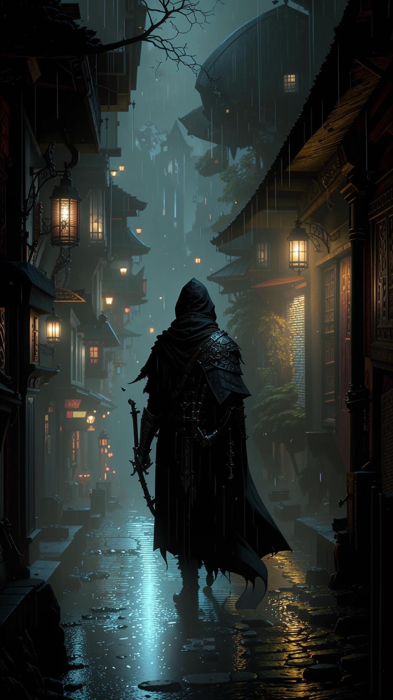

{width=1080px height=1920px}

<note type="danger" title="Антагонист главы">

**Брайс**, полуэльф-аколит культа, фанатичный и жестокий.

</note>

<note type="lab" title="Союзники">

**Мастер Элрик** (пожилой архитектор), **Капитан Маркус** (глава городской стражи, скептик, но честен).

</note>

<note type="info" title="Общая цель">

Раскрыть локальный заговор культа «Сынов Безмолвного Шепота» в Солнцеграде, начиная с расследования исчезновения картографа.

</note>

---

## Вступление

Солнечные лучи, словно робкие зверята, едва прорываются сквозь плотную мглу серых облаков. Вы идёте по узким улочкам столицы, где каждый дом -- это не просто камень и штукатурка, а история, наполненная эхами прошлого. Этот город, с его высокими стенами и зловещей тишиной, кажется вам знакомым, но в то же время Странным. Каждый поворот угла скрывает новые секреты, а воздух пропитан запахом сырости.

Столица -- это сердце империи, где пересекаются пути тысяч племён и культур. Вы видите перед собой монументальные строения, украшенные резными Заглавные буквы и сложные детали, которые свидетельствуют о былом величии. Но что-то в этих украшениях кажется вам странным -- как будто они были наспех отреставрированы, скрывая более древние, возможно, даже мистические элементы.

Ваши глаза невольно обращаются к знакомым местам. Там, где-то в глубине улиц, вы видите трактир "Пьяный Единорог", который стал для вас вторым домом. Его крыльцо с облупившейся краской и стаями морских птиц на флюгере напоминают вам о прошлых Ночь, Провел у теплого камина, делясь историями со старыми друзьями. Недалеко от него находится лавка старого Эрика, вашего давнего Поставщик магических компонентов. Его тихий голос до сих пор звучит в ваших ушах: "Всё есть на его месте, только платите, не задавайте лишних вопросов".

Но сегодня что-то изменилось. Город словно дышит непривычным ритмом. Вы чувствуете это в воздухе -- какая-то напряжённость, которая заставляет вас бросить взгляд на оружие под плащом. Люди на улицах смотрят друг на друга с опаской, а некоторые Даже Шепчет тихим тоном, как бы пряча от посторонних уши.

Вам становится холодно, несмотря на тёплую пору года. Вы останавливаетесь возле старой церкви Святого Марка, чьи стены украшены intricate carvings и mysterious symbols. Эти символы вы видели раньше -- они похожи на рунные писания, но не такие как обычно. Ваше сердце начинает бешено колотиться, когда вы замечаете, что некоторые из них светятся тускло чёрным светом.

"Это неправильно", -- думаете вы, глядя на символы. "Они не должны светиться".

Ваши мысли переносятся в прошлое, к тем дням, когда вы с друзьями только начинали своё приключение. Тогда город был полон жизни и надежды. Но теперь... что-то изменилось.

Но вы не собираетесь задаваться вопросами. У вас есть работа: найти ответы. Вы смотрите на церковь, затем на трактир "Пьяный Единорог", где оставили друзей, и решаете, что начать надо именно оттуда.

Перед вами распахивается дверь трактира, и вы входите внутрь, предчувствуя, что этот день принесёт вам больше вопросов, чем ответов.

---

### Крючок: Знак в таверне

-  Сцена: Таверна «Пьяный Единорог» в бедном квартале Солнцеграда. Герои здесь по своим делам (ищут работу, отдыхают, встречаются с информатором).

-  Событие: Дверь с грохотом распахивается. Вбегает перепуганный молодой человек в одежде скрипача -- Картер. За ним гонятся трое грубых бандитов.

Диалог:

Картер (задыхаясь, хватая первого попавшегося героя за рукав):

<note type="quote">

«Они нашли меня! Возьмите... ради всего святого! Отнесите мастеру Элрику, в квартал ремесленников! Скажите, что «Глаз» открылся! Они всё перекроили!»

</note>

Он суёт в руки герою свёрток и пытается бежать, но бандиты настигают его у выхода.

-  Бой: 3 Бандита (AC 12, HP 11). Их задача -- отобрать свёрток и заткнуть свидетелей.

-  После боя: Картер умирает от ран на руках у героев. Прибывает городская стража во главе с капитаном Маркусом.

Диалог с капитаном Маркусом:

Капитан Маркус (осматривает тела, скептически):

<note type="quote">

«Картер... давал уроки музыки детям купцов. И эти ублюдки... наёмники Гильдии Каменщиков. Странная компания для перестрелки. Ладно, герои. Вы хотите расследовать? Вперёд. Но если натворите бед -- ваши головы покроют ущерб. Ясно?»

</note>

-  Социальное взаимодействие: Хозяин таверны видел, что бандиты частые гости на стройке новой Площади Морвана. Капитан Маркус, прибывший на шум, скептичен. Он считает это бытовой разборкой, но позволяет героям расследовать, если те не будут мешать.

---

### 1\. Окружение и Атмосфера

Локация: Переулок рядом с таверной «Пьяный Единорог» в беднейшем районе Солнцеграда, Квартале Разбитых Фонарей.

-  Визуал: Узкая, грязная мостовая, на которой вечно стоит лужа сомнительной жидкости. Стены домов покосились, штукатурка облупилась, обнажив чёрное от копоти дерево и кирпич. На стенах -- слои афиш, объявлений о наградах и похабных граффити.

-  Запахи: Кислый запах дешёвого пива и рвоты из таверны, смешанный с ароматом жареной рыбы с уличной жаровни и вездесущей городской вони -- пота, мочи и гнили.

-  Звуки: Приглушённый гул голосов из таверны, лай собак где-то вдали, скрих колёс телеги на соседней улице. В переулке неестественно тихо.

-  Освещение: Единственный источник света -- тусклый, мигающий фонарь над дверью в таверну, который отбрасывает длинные, искажённые тени. Основное освещение -- от бледной луны, пробивающейся сквозь разорванные облака.

Детали для осмотра (если герои проявят любопытство ДО нападения):

-  Проверка Восприятия (СЛ 12): Герои замечают, что из щели в стене соседнего дома за ними кто-то наблюдает (пара блестящих глаз), но тут же скрывается.

-  Проверка Расследования (СЛ 10): На земле у стены валяется свёрток (потрёпанная, но чистая ткань), перевязанный бечёвкой. Внутри -- несколько серебряных монет (3 зм) и ключ от какой-то двери (ключ к следующей сцене).

2\. Социальное взаимодействие (До нападения)

Герои могут зайти в таверну «Пьяный Единорог» перед событиями в переулке.

-  Внутри таверны: Дымно, шумно, тесно. Типичная клиентура: пьяные матросы, подвыпившие ремесленники, подозрительные типы в капюшонах.

-  НПС: Барни, хозяин таверны. Толстый, лысый, с глазом на повязке. За стойкой вытирает кружку грязной тряпкой.

Диалог с Барни:

Барни (хриплым голосом): «Эй, новенькие! Что-то надо? Эль -- медяк, мясо -- два. Комнаты свободны, но не советую -- крысы с кошками размером». (Если спросить о Картере) «Картер? Скрипач? Да, парень тут частый гость... нервный какой-то в последнее время. Как будто ждал, что за ним придут. Сидел вон в том углу, что-то чертил на салфетке, потом скомкал и сбежал, как ошпаренный».

-  Находка (СЛ 14 Внимательность): Под указанным столом герои могут найти скомканную салфетку с наброском спирали и словом «Элрик».

---

### 3\. Развитие сцены: Нападение

Внезапно дверь таверны распахивается, и в переулок вбегает Картер. Он выглядит измождённым, его одежда порвана.

Диалог:

Картер (задыхаясь, его глаза полны ужаса):

<note type="quote">

«Они нашли меня! Не дайте им... возьмите! Ради всего святого, отнесите мастеру Элрику, в квартал ремесленников! Скажите, что «Глаз» открылся! Они всё перекроили!»

</note>

Он суёт в руки ближайшему герою трубку с картами (не свёрток!) и пытается бежать, но из темноты появляются трое бандитов.

-  Бандиты: Выглядят как наёмные громилы, но их одежда хоть и грубая, новая и одинаковая -- тёмные кожаные куртки.

Главарь бандитов (обращаясь к Картеру):

<note type="quote">

«Молодец, музыкант. Сам принёс нам посылку. А теперь давай сюда, и maybe мы оставим тебе пальцы, чтобы играть». (Оборачивается к героям) «А вы, мусор, проваливайте. Не ваше дело».

</note>

Бой: 3 Бандита (AC 12, HP 11). Их тактика -- попытаться окружить Картера и того героя, у которого трубка, игнорируя остальных, чтобы быстро отобрать добычу и скрыться.

---

### 4\. Альтернативные решения (Кроме драки)

Герои могут попытаться решить ситуацию иначе:

Запугивание (СЛ 13 Харизма (Запугивание)):

Герой:

<note type="quote">

«Вы действительно хотите связываться с \[Гильдией Воров/Церковью Этериуса/названием отряда героев\]? Убирайтесь, пока целы».

</note>

1. <note type="info">

   -  Успех: Бандиты колеблются. Их главарь плюнет: «Ладно, сегодня вам везёт. Но мы ещё встретимся». Они отступят и растворятся в темноте.

   -  Провал: Бандиты смеются и атакуют с преимуществом в первом раунде.

   </note>

Подкуп (10 зм):

Герой: (бросает кошель на мостовую) «Вот ваша плата. Теперь исчезните».

1. <note>

   -  Реакция: Бандиты переглянутся. Главарь поднимет кошель: «...Принято. Но за музыкантом всё равно придёт другой. Удачи». Они уйдут.

   </note>

Обман (СЛ 15 Харизма (Обман)):

Герой: (показывая на трубку)

<note type="quote">

«Опоздали. Мы уже стража вызвали. Капитан Маркус будет здесь через минуту. Хотите объяснить ему, за кем вы гонитесь?»

</note>

1. <note>

   -  Успех: Бандиты нервно оглянутся и, не сказав ни слова, ретируются.

   -  Провал: «Капитан Маркус? Он сегодня в другом конце города! В атаку!»

   </note>

---

### 5\. После боя / Развязка

-  Если Картер жив: Он будет бесконечно благодарен, но смертельно напуган.

Картер (дрожащими руками):

<note type="quote">

«Спасибо... вы не представляете, что это... Элрик... он единственный, кто всё поймёт... Ищите его вывеску -- «Старые Чертежи»... Скажите ему... «Глаз открылся»... Мне нужно бежать!»

</note>

Он убежит, оставив героев с трубкой.

-  Если Картер мёртв: Герои могут обыскать его тело и найти на груди зашитый кусок пергамента с тем же знаком спирали и адресом: «Квартал ремесленников, мастерская «Старые Чертежи».

-  Появление стражи: Через 1к4 минут после стычки появится Патруль городской стражи во главе с капитаном Маркусом.

Капитан Маркус (осматривает место): «Опять разборки Гильдии Каменщиков? Или новые лица решили пошуметь? Ладно, герои. Вы хотите расследовать? Вперёд. Но если натворите бед -- ваши головы покроют ущерб. Ясно? Двое, уберите этот мусор». (кивает на тело бандита)

6\. Переход к следующей сцене

Крючок: Адрес мастера Элрика («Старые Чертежи» в Квартале ремесленников) и кодовое слово <highlight color="lemon-yellow">**«Глаз открылся».**</highlight>

Пути перехода:

1. Прямой: Герои сразу отправляются по адресу.

2. Осторожный: Они могут сначала спросить у местных или у Барни в таверне о мастере Элрике, чтобы узнать о нём больше и убедиться, что это не ловушка.

3. Отвлечённый: Если герои заинтересуются ключом, найденным в свёртке, они могут попытаться найти дверь, которую он открывает (это может быть дверь в тайное убежище Картера, где есть дополнительные записи). Это задержит их, но даст больше информации.

#### 