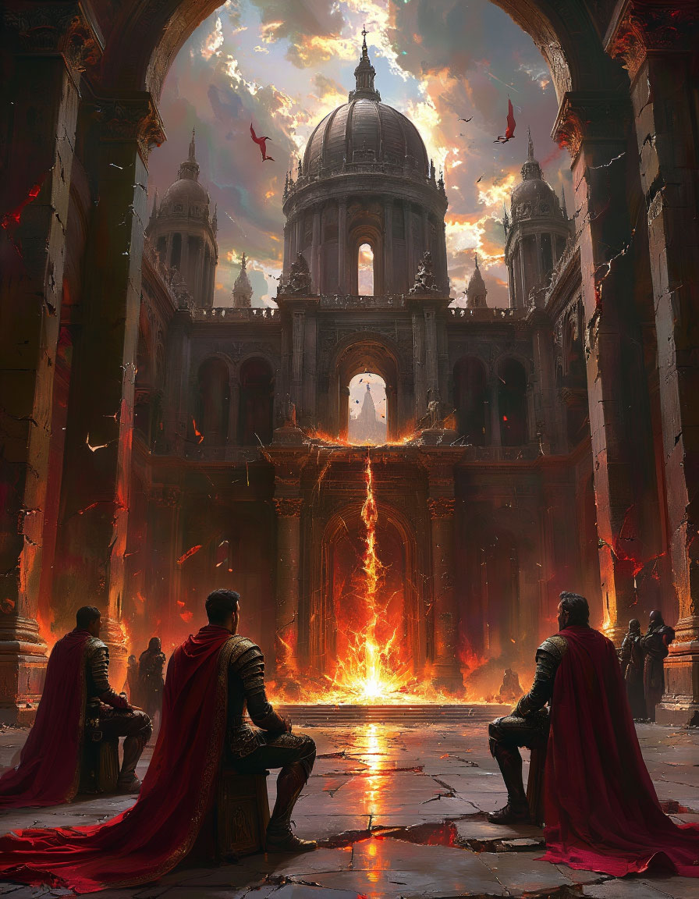

{width=896px height=1152px}

**Антагонист главы:** **Архимаг Келвин Торн** (усиленный, **Archmage** с лавкрафтианскими заклинаниями).

**Союзники:**

Общая цель: Штурмовать Собор Золотого Молота в Солнцеграде, остановить финальный ритуал Келвина Торна и спасти Этерию от пробуждения Древнего Бога.

Крючок: Город в осаде

Локация: Приграничный город-крепость Вестмарш в княжестве Аурея. Город расположен у подножия Скалистого Хребта, защищён высокими каменными стенами и рвом. Главные ворота -- массивные дубовые, окованные сталью.

Детальное описание окружения

1\. Внешний вид:

-  Стены: На каменных стенах видны свежие следы от таранных ударов и поджогов. Одна из башен сильно повреждена, из её бойниц валит дым.

-  Ров: Ров частично заполнен обломками и телами павших солдат и гоблинов. Вода в нём тёмно-красная.

-  Лагерь осаждающих: У стен раскинулся хаотичный лагерь орды Гнарра Кровавого Топора (орк-варвар). Видны уродливые шатры из шкур, дымные костры, клетки с пленными и примитивные осадные орудия (тараны, шаткие осадные башни).

-  Небо: Затянуто дымом. Над лагерем орков кружат стервятники и несколько упырей.

2\. Внутри города:

-  Улицы: Забаррикадированы повозками, мебелью и щитами. Повсюду следы паники: разбросанные вещи, опрокинутые лотки.

-  Население: Жители -- в основном женщины, старики и дети -- прячутся в подвалах или помогают ополченцам: носят стрелы, кипятят воду, перевязывают раненых. Лица испуганные, но решительные.

-  Запахи: Дым, кровь, пот, запах страха. Из кухни доносится слабый запах похлёбки -- кормят защитников.

-  Звуки: Лязг оружия, крики командиров, стоны раненых, глухие удары тарана о ворота, дикие вопли орков снаружи.

Социальные взаимодействия и диалоги

1\. Встреча с Капитаном Стражи: Герои находят Капитана Мартелла на стене у главных ворот. Он ранен (перевязана рука), но продолжает командовать.

Капитан Мартелл (оборачивается, его лицо усталое, но глаза горят): «Новые лица? Наёмники? Неважно. Если вы умеете держать оружие -- добро пожаловать в ад. Эти твари штурмуют нас третий день. Они хотят вырезать всех до единого. Наши лучники на исходе, а их шакалы лезут и лезут...»

2\. Разговор с Ополченцем: Молодой парень, Элберт, дрожащими руками пытается натянуть тетиву на арбалет.

Элберт: «Они... они забрали моего отца. В первую же атаку. Он был в дозоре... Мы даже тела не нашли... Просто... кровавое месиво. Я должен за него... я должен...» Он не может сдержать слёз.

3\. Просьба Горожанина: Старая Марта хватает самого харизматичного героя за рукав.

Марта: «Сер... пожалуйста... моя внучка, Лилия, она в подвале собора, больная. Если эти монстры ворвутся... они не пощадят детей. Умоляю, отведите её в старую кузницу, там потайной подвал. Я вам всё отдам, что есть!»

Что могут сделать герои (помимо боя)

Укрепить оборону:

1. <note>

   -  Ворота: Помочь подпереть главные ворота брёснами или завалить их мешками с песком (проверка Силы, СЛ 15). Успех откладывает пролом на 1к4 часа.

   -  Стены: Починить участок стены с помощью заклинания Починка или помочь инженерам (проверка Интеллекта (Ремесло), СЛ 13). Успех даёт +2 КД стене на этом участке.

   </note>

Поднять боевой дух:

1. <note>

   -  Речь: Выступить с вдохновляющей речью перед ополченцами (проверка Харизмы (Убеждение), СЛ 16). Успех даёт ополченцам преимущество на следующий бросок атаки.

   -  Лечение: Использовать заклинания или навык Медицина для помощи раненым. Каждый вылеченный солдат возвращается в строй через 1 час.

   </note>

Диверсия:

1. <note>

   -  Осадные орудия: Пробраться через потайную калитку (или ночью на верёвках) к лагерю орков и поджечь их осадные башни или таран (проверка Ловкости (Скрытность), СЛ 17).

   -  Убить лидера: Заметить среди орков их предводителя, Гнарра. Если его убить или тяжело ранить (например, метким выстрелом из арбалета), атака ослабеет.

   </note>

**Спасти civilians:**

Выполнить просьбу **Марты** или помочь другим горожанам добраться до укрытий.

Пути перехода к следующей сцене

1. Прорыв обороны (боевой): Орки проламывают ворота или стену. Начинается уличный бой. Герои должны сдерживать натиск, пока жители не эвакуируются в цитадель. Это прямой переход к масштабной сражению.

2. Тактическая победа (стратегический): Героям удаётся поджечь таран или убить лидера орков. Атака захлебнулась. Капитан Мартелл предлагает им план: пробраться через старые пещеры под Скалистым Хребтом в тыл к оркам и ударить оттуда, пока защитники города делают вылазку.

3. Тайный путь (скрытный): Во время боя герои находят на теле убитого орка-шамана карту с отметкой о «тайном туннеле», ведущем в горы. Они могут предложить капитану рискованный план: небольшой отряд (герои) проникает в тыл и устраивает диверсию.

4. Отступление (драматический): Оборона пала. Герои должны возглавить отступление выживших защитников и горожан в цитадель для последнего рубежа обороны. Следующая сцена -- отчаянная защита старой крепости в центре города.

### 

### 

### 

### 