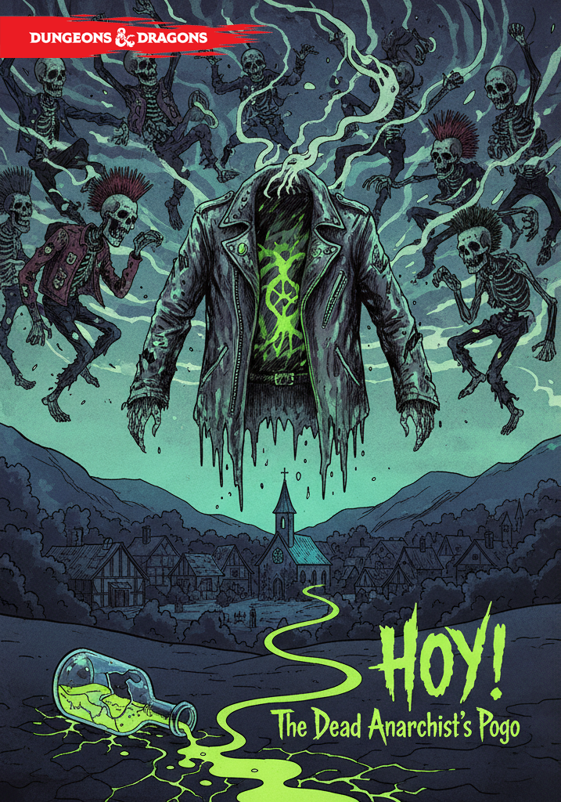

{width=717px height=1024px}

### **Обзор**

**Уровень группы:** 3-5\
**Обстановка:** Глухая деревня Тихозем на границе княжества\
**Сложность:** Средняя (с элементами социального взаимодействия)\
**Награда:** Уникальные предметы, расположение жителей, возможность морального выбора

---

## **АКТ 1: ДУРНЫЕ ВЕСТИ**

### **Сцена 1: Прибытие в Тихозем**

**Визуальное описание:** *Деревня, застывшая в страхе. Ставни плотно закрыты, на улицах ни души. Лишь дым из труб выдаёт присутствие людей. Воздух пахнет дымом и странной сладковатой гнилью. На заборах -- свежие царапины, у колодца валяется разбитая кружка.*

**Встреча со старостой:** *Егор -- мужчина лет 50, с уставшим лицом и нервно подрагивающими руками -- выходит навстречу, озираясь по сторонам.*

> **Егор** (шёпотом, хватая героя за рукав): «Слава богам, путники! Вы не из княжеской стражи? Нет? Тогда слушайте... Три ночи назад начался этот кошмар. Сначала думали -- волки. Потом увидели ИХ... Они ходят из старого кладбища на Проклятом Холме. Там вечный сон обрели отпетые негодяи -- разбойники, бунтовщики, пьяницы... А теперь старый Алборин, алхимик тот слепой, зелье своё проклятое пролил у их могил! И они восстали! И ведёт их... тот самый «Артист» в кожаном плаще. Они кричат «Хой!» и пляшут свою адскую пого-пого! Помогите, умоляю! Деревня с ума сойдёт!»

**Социальное взаимодействие:**

- **Проницательность СЛ 12:** Егор скрывает, что некоторые жители когда-то выдали «Артиста» страже

- **Запугивание СЛ 14:** Можно узнать о старом конфликте деревни с кладбищенской шванкой

- **Убеждение СЛ 13:** Жители могут предложить кров и еду в обмен на защиту

---

### **Сцена 2: Ночные гости**

**Визуальное описание:** *С наступлением темноты из леса доносится нарастающий гул -- нестройное пение, смех и топот. Вскоре появляются они: фигуры в лохмотьях, движущиеся странными подёргивающимися движениями. Воздух наполняется запахом гнили и дешёвого самогона.*

**Первая волна атаки:**

- **4-6 Пьяных Зомби**

- **1 Мертвый Анархист (координатор)**

**Диалог во время боя:**

> **Мертвый Анархист** (кричит хриплым голосом): «Хой! Разбудим спящих! Заставим их танцевать под наш ритм! Челюсть долой, братья!»

> **Пьяный Зомби** (обращаясь к герою): «Танцуй с нами! Сбрось оковы приличий! Хой!»

**Тактика нежити:**

- Зомби пытаются окружить и схватить, а не убить

- Ломают заборы, двери, бочки с вином

- Крики «Хой!» требуют **спасброска Мудрости СЛ 12** или оглушение на 1 раунд

**После боя:** *Из-за угла выбегает подросток Андрей, дрожа от страха.*

> **Андрей:** «Они... они заставили меня плясать! Тот, в плаще... он смеялся, но глаза... глаза у него были мёртвые и грустные. Он сказал: «Почувствуй свободу, мальчик. Свободу от страха и приличий!»

---

## **АКТ 2: СЛЕД СЛЕПОГО МАГА**

### **Сцена 3: Хижина Алборина**

**Визуальное описание:** *Небольшая избушка на краю леса, окружённая сушеными травами. Дверь приоткрыта. Внутри -- полный хаос: перевёрнутая мебель, разлитые зелья, разорванные книги. Слепой старик сидит на полу среди осколков.*

**Диалог с Алборином:**

> **Алборин** (не поднимая головы): «Идите прочь... или убейте меня. Я заслужил это. Я создавал эликсир вечного сна, чтобы усыпить тех несчастных на Проклятом Холме. Но я СЛЕП! Споткнулся... и пробудил их с их самыми тёмными страстями!»

> **Если герои проявляют сострадание:** «Вы... вы не хотите меня убивать? Спасибо... Спасибо за милосердие. Владимир «Артист»... его дух самый сильный. Он был поэтом и бунтарём. Князь казнил его за стихи о свободе. Теперь его гнев питает остальных.»

**Расследование в хижине:**

- **Внимательность СЛ 15:** Найти обрывок дневника с рецептом противоядия

- **Магия СЛ 14:** Обнаружить следы мощной некромантической энергии

- **Медицина СЛ 12:** Определить компоненты пролитого зелья

**Ключевая информация:**

- Для противоядия нужен **корень призрачного папоротника** с центра кладбища

- Нужна **личная вещь Владимира** для привязки антидота

- Ритуал должен быть проведён на месте пробуждения

---

## **АКТ 3: НА ПРОКЛЯТОМ ХОЛМЕ**

### **Сцена 4: Кладбище шванки**

**Визуальное описание:** *Заброшенное кладбище на холме. Кривые кресты, разбитые надгробия с оскорбительными надписями. Земля взрыта в нескольких местах. В центре -- полуразрушенная часовня с обвалившейся крышей.*

**Локации на кладбище:**

**1\. Врата забвения**

- Ржавая калитка с висячим замком

- **Взлом СЛ 15** или можно найти ключ в дупле старого дуба

**2\. Могила Владимира**

- Скромный холмик без креста

- **Расследование СЛ 16:** Найти скрытую нишу с его вещами

- Внутри: **истлевший кожаный плащ**, **пробитый кинжал**, **пожелтевший сборник стихов**

**3\. Статуя ангела**

- Мраморная статуя с отбитыми крыльями

- У основания растёт **призрачный папоротник**

- Охраняется **Призрачным Сторожем**

### **Встреча с Призрачным Сторожем**

> **Призрачный Сторож** (появляется из тени статуи): «Стой, живые! Вы пришли нарушить покой мёртвых? Я тридцать зим хранил этот покой... не позволю его разрушить!»

**Варианты взаимодействия:**

- **Бой:** Сторож атакует, защищая папоротник

- **Убеждение СЛ 16:** «Мы хотим восстановить покой, а не нарушить его»

- **Религия СЛ 14:** Воспользоваться знаниями о погребальных ритуалах

- **Подкуп:** Предложить починить ограду кладбища

---

## **Сцена 5: Ритуал создания противоядия**

**Визуальное описание:** *Алборин расставляет свечи по кругу, дрожащими руками смешивает компоненты. Воздух наполняется ароматом полыни и ладана. Корень папоротника светится серебристым светом, кинжал Владимира вибрирует.*

> **Алборин** (шепчет во время ритуала): «Духи предков, услышьте нас... Мы не оскверняем покой, а возвращаем его... Пусть гнев уйдёт, а души обретут мир...»

**Проверки во время ритуала:**

- **Магия СЛ 15:** Помочь стабилизировать энергию

- **Медицина СЛ 13:** Правильно измельчить корень

- **Религия СЛ 14:** Прочитать древние заклинания

**Результат:**

- **Успех:** Создан **«Эликсир Вечного Покоя»** -- фиалка с мерцающей жидкостью

- **Частичный успех:** Эликсир создан, но действует только на обычных зомби

- **Провал:** Ритуал привлекает внимание нежити досрочно

---

## **АКТ 4: ПРОТИВОСТОЯНИЕ С «АРТИСТОМ»**

### **Сцена 6: Финальная встреча**

**Визуальное описание:** *Когда герои возвращаются на кладбище, их встречает Владимир. Он парит над землёй, его кожанный плащ развевается как крылья. Вокруг -- усиленные зомби, глаза которых горят зелёным огнём.*

> **Владимир** (голос звучит как эхо): «Ах, новые гости! Пришли посмотреть на наш последний концерт? Мир, что запер нас в тесных гробах условностей при жизни, теперь не удержит! Хой!»

**Диалоговые возможности:**

**Вариант 1 -- Прямое противостояние:**

> **Герой:** «Твоя свобода стала тиранией для живых!» **Владимир:** «Тиранией? Я даю им то, чего они боялись желать! Свободу от страха, от стыда, от вечного «что скажут люди»!»

**Вариант 2 -- Сострадание:**

> **Герой:** «Ты хотел свободы для живых... Не уподобляйся тому князю, что тебя казнил.» **Владимир** (голос дрогнул): «Ты... ты читал мои стихи?»

**Вариант 3 -- Призыв к разуму:**

> **Герой:** «Твои последователи страдают! Дай им покой!» **Владимир:** «Покой? Покой -- это ещё одна тюрьма! Лучше яростный танец, чем вечный сон!»

### **Финальный бой**

**Тактика Владимира:**

- **«Кричащий хой!»** -- аналог *Громовой волны*, спасбросок Телосложения СЛ 14

- **«Пляска Пого!»** -- зомби получают дополнительную атаку

- **«Фак свободы»** -- 3d8 психического урона + отталкивание

- **«Последний стих»** (при \<25% HP) -- мощная областьвая атака

**Тактика зомби:**

- Окружают самых слабых членов группы

- При смерти взрываются (2d6 некротического урона в радиусе 5 фт.)

- Крики «Хой!» накладывают помеху на концентрацию

**Альтернативная победа -- Убеждение:**

- Требуется **Убеждение СЛ 18** с преимуществом, если герои прочитали его стихи

- Владимир осознаёт свою ошибку и самостоятельно отпускает души

---

## **РАЗВЯЗКА**

### **Сцена 7: Последний танец**

**Если убеждение успешно:** *Владимир опускается на землю, его призрачная форма становится прозрачнее. Он смотрит на свои руки, потом на героев.*

> **Владимир** (тихо): «Вы... вы правы. Я стал тем, против кого боролся. Простите меня... и их. Хой... в последний раз.»

*Он поднимает руки, и все зомби замирают. Медленно, один за другим, они начинают рассыпаться в прах, на их лицах появляются выражения покоя.*

**Если бой:** *После поражения Владимир какое-то время лежит без движения, потом поднимается -- уже без злобы.*

> **Владимир:** «Спасибо... за освобождение. Я зашёл слишком далеко... Прощайте.»

**В любом случае:** *Герои распыляют эликсир. Оставшаяся нежить замирает и медленно исчезает. Наступает тишина, нарушаемая лишь шелестом листьев.*

---

## **НАГРАДЫ**

### **Материальные:**

- **От деревни:** 250 зм, бесплатное проживание и лечение

- **От Алборина:**

   - 3 **Зелья лечения+** (2к4+2 HP)

   - **Свиток «Говорить с мёртвыми»**

   - **Кольцо ясновидения** (1 раз в день advantage на Внимательность)

### **Уникальные трофеи:**

1. **«Знак Анархиста»** (кинжал Владимира)

   - \+1 к броскам атаки и урона

   - 1 раз в день крик «Хой!» даёт +2 к атаке союзникам в радиусе 10 фт.

2. **«Плащ Поэта-Бунтаря»**

   - Преимущество на спасброски против эффектов страха

   - \+2 к проверкам Убеждения при разговоре о свободе и справедливости

3. **«Сборник запрещённых стихов»**

   - Можно продать коллекционеру за 100 зм

   - Или использовать для получения информации о других бунтовщиках

### **Нематериальные:**

- Репутация защитников в регионе

- Благословение духа леса

- Возможность вернуться за советом к Алборину

---

## **БЕСТИАРИЙ**

### **Владимир «Артист»**

*Среднее нежить (призрак), хаотично нейтральное*

**КЗ:** 15 (естественная броня) **Хиты:** 120 (16d8 + 48) **Скорость:** 0 фт., полёт 40 фт. (парит)

| СИЛ     | ЛОВ     | ТЕЛ     | ИНТ     | МДР     | ХАР     |
|---------|---------|---------|---------|---------|---------|
| 10 (+0) | 16 (+3) | 16 (+3) | 18 (+4) | 16 (+3) | 20 (+5) |

**Сопротивление урону:** дробящий, колющий, рубящий от немагических атак **Иммунитет к урону:** некротический, яд **Иммунитет к состояниям:** очарованный, истощение, схвачен, парализован, отравлен

**Действия:**

- **Мультиатака:** Две атаки Факом Свободы

- **Фак Свободы:** +8 к попаданию, 14 (2d8 + 5) психического урона, отталкивание на 10 фт.

- **Кричащий Хой! (3/день):** Все в радиусе 15 фт. спасбросок Телосложения СЛ 15 или 18 (4d8) урона звуком и оглушение на 1 раунд

**Легендарные действия (3/раунд):**

- **Насмешка (1 действие):** Одна цель делает спасбросок Мудрости СЛ 16 или получает помеху на следующую атаку

- **Призыв к пляске (2 действия):** 1d4 зомби получают дополнительное действие

- **Последний стих (3 действия):** Все враги в радиусе 30 фт. получают 21 (6d6) психического урона

### **Пьяный Зомби**

*Средное нежить, хаотично злое*

**КЗ:** 12 (естественная броня) **Хиты:** 30 (4d8 + 12) **Скорость:** 20 фт.

| СИЛ     | ЛОВ    | ТЕЛ     | ИНТ    | МДР    | ХАР    |
|---------|--------|---------|--------|--------|--------|
| 16 (+3) | 8 (-1) | 16 (+3) | 3 (-4) | 6 (-2) | 5 (-3) |

**Иммунитет к урону:** яд **Иммунитет к состояниям:** отравлен

**Действия:**

- **Кривой захват:** +5 к попаданию, цель схвачена (побег СЛ 13)

- **Пьяный удар:** +5 к попаданию, 7 (1d8 + 3) дробящего урона

- **Взрыв ярости (при смерти):** Все в радиусе 5 фт. спасбросок Ловкости СЛ 12 или 7 (2d6) некротического урона

### **Мертвый Анархист**

*Средное нежить, хаотично злое*

**КЗ:** 14 (кожаный доспех) **Хиты:** 45 (6d8 + 18) **Скорость:** 30 фт.

| СИЛ     | ЛОВ     | ТЕЛ     | ИНТ     | МДР     | ХАР     |
|---------|---------|---------|---------|---------|---------|
| 12 (+1) | 14 (+2) | 16 (+3) | 10 (+0) | 12 (+1) | 14 (+2) |

**Лидер стаи:** Пока жив, зомби в радиусе 30 фт. получают +2 к броскам атаки

**Действия:**

- **Координирующий крик:** Один зомби совершает дополнительную атаку

- **Кинжал анархиста:** +4 к попаданию, 5 (1d4 + 2) колющего урона

### **Призрачный Сторож**

*Средное нежить, законоплохой нейтральное*

**КЗ:** 13 (естественная броня) **Хиты:** 60 (8d8 + 24) **Скорость:** 30 фт.

**Сопротивление урону:** дробящий, колющий, рубящий от немагических атак

**Верность долгу:** Преимущество на спасброски против эффектов, заставляющих покинуть пост

**Действия:**

- **Призрачная кирка:** +5 к попаданию, 8 (1d10 + 3) дробящего урона

- **Страж могил:** Может телепортироваться к любой могиле на кладбище

---

### **ОПЫТ**

- **Победа/убеждение Владимира:** 1,800 опыта

- **Очистка кладбища:** 800 опыта

- **Спасение деревни:** 500 опыта

- **Общий опыт:** до 3,100 опыта