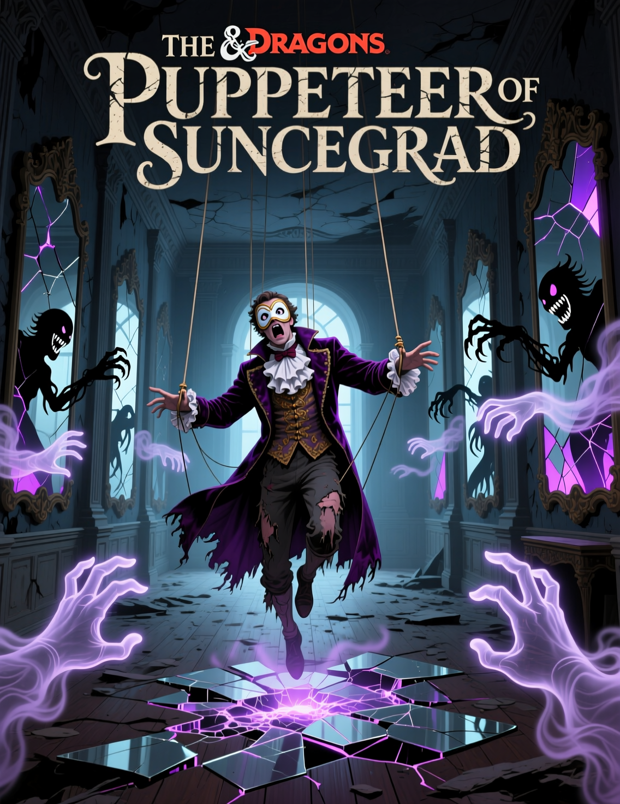

{width=1136px height=1472px}

### Завязка: Провал на сцене

**Локация: Театр «Золотая Маска»**

- **Атмосфера:** Роскошный, но слегка потертый театр в стиле барокко. Бархатные кресла, позолота, призраки былого величия. Воздух пахнет пылью, гримом и ладаном. Публика -- смесь аристократов, жаждущих зрелищ, и завсегдатаев из среднего класса.

- **Сцена перед инцидентом:** Представление в самом разгаре. Кассиан, актер в костюме трагического героя, импровизирует, как всегда. Его монолог о власти и предательстве завораживает. Но вдруг его речь становится прерывистой, взгляд -- стеклянным. Он замолкает на полуслове, смотрит на свои руки с ужасом и выкрикивает: «Он дергает за нитки! Я больше не могу!» -- после чего пулей вылетает со сцены, оставив зал в ошеломленной тишине.

**Взаимодействие с Лигией:**

- **Лигия,** женщина лет 50 с усталым, но властным лицом, находит героев после шоу (либо они сами приходят за кулисы по слухам, либо их нанимает кто-то из обеспокоенных покровителей театра).

- **Ключевые фразы:**

   - «Кассиан -- гений. Но гении хрупки. В последние недели он был тенью себя самого».

   - «Он жаловался на головные боли, говорил, что слышит шепот. Шепот, который диктует ему чужие мысли».

   - «Он боялся, что на сцене скажет что-то ужасное. Что его устами заговорят чужие тайны. И, кажется, его страх сбылся».

- **Задача:** Лигия умоляет найти Кассиана, обещая щедрую награду и благосклонность труппы. Она дает ключ от его гардеробной.

---

### **Акт I: Расследование за кулисами**

### 1\. Гардеробная Кассиана

- **Атмосфера:** Тесная, захламленная комната. Повсюду разбросаны костюмы, парики, грим. В воздухе витает запах пота и лаванды. На столе -- недопитая бутылка дорогого вина (признак нервного напряжения).

- **Проверки и находки:**

   - **Внимание (Мудрость, СЛ 12):** Герои замечают, что на столе лежит не один, а несколько одинаковых гримов-«белил», и один из них имеет странный, едва уловимый фиолетовый оттенок.

   - **Расследование (Интеллект, СЛ 14):** В потайном ящике стола находится дневник. Последние страницы испещрены бессвязными записями:

      - *«Снова этот голос. Он велит мне повторять слова, как попугаю. Я -- его говорящая птица в позолоченной клетке».*

      - *«Сегодня на репетиции я посмотрел на статую основателя города и... она посмотрела на меня в ответ. Ее каменные глаза были полны жизни. Он смотрит через них!»*

      - *«Я почти назвал имя любовника Герцогини. Откуда я это знаю? Я никогда его не видел! Он ворует чужие секреты и заставляет меня их произносить!»*

   - **Магия (Заклинание "Обнаружение магии" или Анализ магии, СЛ 16):** В комнате витают следы иллюзии (школа Иллюзий) и сильного очарования (школа Очарования). Источник -- тот самый фиолетовый грим. Это фокус -- проводник для ментального контроля Режиссёра.

### 2\. Социальное расследование в Верхах

Героям нужно понять, какие именно секреты раскрывал Кассиан, чтобы вычислить мотив и следующую цель Режиссёра.

- **Встреча с Герцогиней Элоизой (в ее салоне или в театре после представления):**

   - **Атмосфера:** Натянутая вежливость, ледяной взгляд. Она говорит через силу, едва сдерживая гнев.

   - **Ключевые фразы:** «Этот... *артист*... позволил себе намекнуть на некую "ночную бабочку, порхающую в моем саду". Под этим он явно подразумевал... кое-кого. Если эти слухи расползутся, последствия для этого человека будут плачевны. Ваша задача -- убедиться, что у Кассиана навсегда пропадет дар речи. Понимаете меня?»

   - **Награда:** Взамен на молчание она предлагает 200 зм и свое расположение.

- **Встреча с Мастером Элриком (в его мастерской, среди чертежей и моделей):**

   - **Атмосфера:** Деловая, но тревожная. Элрик напуган.

   - **Ключевые фразы:** «Кассиан в пьесе о древних храмах вдруг начал в деталях описывать систему потайных ходов под Храмом Самора. Это чертежи, которые видел только я и... тот самый культ, с которым вы разбирались. Это не случайность. Чья-то рука снова тянется к Солнцеграду, и использует он для этого бедного актера».

   - **Информация:** Элрик подсказывает, что Кассиан иногда скрывался в «старом городе», в районе опустевших особняков знати, которые разорились после последнего финансового кризиса.

---

### **Акт II: Преследование Марионетки**

**Локация: Чердак старого особняка**

- **Атмосфера:** Пыльно, темно, паутина. Сквозь щели в крыше пробиваются лучи света. В центре -- импровизированное логово: матрац, пустые бутылки, разбросанные листы с бессвязными стихами.

- **Встреча с Кассианом:** Актёр сидит, обхватив голову руками. Он бледен, глаза красные от бессонницы.

   - **Диалог:** «Вы нашли меня... или ОН вас привел? Он зовется Режиссёром! Он примеряет на меня роли, как костюмы! Сначала -- шута, потом -- доносчика... теперь он хочет, чтобы я примерил корону принца! Я должен идти... на финальную репетицию... в Зал Зеркал...»

- **Столкновение: Очарованные горожане**

   - Как только герои пытаются уговорить или схватить Кассиана, дверь на чердак с грохотом распахивается. В проеме стоят 3-4 человека в простой одежде (используйте статблок **Стража**). Их глаза остекленевшие, движения немного замедленные, на лицах -- отсутствующее выражение.

   - **Тактика:** Они атакуют молча и без эмоций, стремясь окружить и сковать героев, чтобы Кассиан мог сбежать. Это не злодеи, а жертвы. Нелетальные методы (оглушение, sleep) здесь уместны.

- **Побег:** Пока герои заняты боем, Кассиан с криком выпрыгивает в слуховое окно и бежит по крышам в направлении квартала заброшенных особняков.

---

### **Акт III: Финальная сцена в Зале Зеркал**

**Локация: Заброшенный бальный зал в особняке**

- **Атмосфера:** Мрачное, просторное помещение. Когда-то здесь кипела жизнь, теперь -- пыль и тишина, нарушаемая только скрипом половиц. Главная особенность -- стены, колонны и часть потолка покрыты огромными, почерневшими от времени зеркалами в золоченых рамах. Многие зеркала треснуты, и в их трещинах словно пульсирует тусклый фиолетовый свет.

- **Финальная сцена:** Кассиан стоит в центре зала в неестественной позе, его конечности подрагивают, будто за них дергают за невидимые нити. Его голос звучит в унисон с эхом, идущим отовсюду.

### Босс: Режиссёр (The Director)

- **Сущность:** **Зеркальный Фантом** (адаптированный **Призрак**)

   - **КД** 13 | **Хиты** 120 (16к8 + 48) | **Скорость** 0 ft., fly 40 ft. (hover)

   - **Спасброски:** Лов+4, Муд+5, Хар+7

   - **Иммунитеты:** яд, очарование, истощение, испуг, grapple, paralyze, petrify, prone, restrain

   - **Сопротивления:** кислота, огонь, молния, гром; дробящий, колющий и рубящий урон от немагических атак.

   - **Уязвимость:** урон излучением

   - **Чувства:** темное зрение 60 ft., пассивное Внимание 13

   - **Действия:**

      - **Призрачный Когть (Ghostly Claw).** Ближняя атака заклинанием: +5 к попаданию, досягаемость 5 ft., одна цель. Попадание: 12 (3к6 + 2) урона некротической энергией.

      - **Сценарист (Scriptwriter) (Бонусное действие, 1/раунд):** Режиссёр выбирает одно существо в пределах 60 футов, которое может видеть. Цель должна совершить спасбросок Мудрости КС 16. При провале она оказывается **Очарованной** Режиссёром до конца своего следующего хода. Очарованное существо видит в зеркальных отражениях своих союзников ужасными монстрами и должно своим ходом переместиться и совершить рукопашную атаку по ближайшему такому «монстру».

**Механика боя:**

1. **Зеркальная сцена:** Режиссёр не имеет физического тела. В свой ход он появляется в одном из зеркал зала, совершает атаку **Призрачным Когтем** (дальность атаки считается от зеркала) и затем исчезает.

2. **Атака по Режиссёру:** Чтобы нанести ему урон, герои должны:

   - **Разбить зеркало,** из которого он атаковал. Зеркало имеет **КЗ 15, 15 хитов, уязвимость к дробящему урону**. Разрушение зеркала наносит Режиссёру 3к6 урона силовым полем, и он не может атаковать из него до конца боя.

   - **Направить заклинание с уроном излучением** (например, **Луч Огня**, **Священное Пламя**, **Гнев Вельзевула**) в активное зеркало. Заклинание автоматически попадает в Режиссёра, и он не совершает спасбросок, получая урон с учетом уязвимости.

3. **Марионетка:** Кассиан (статблок **Ветерана**) под контролем атакует героев. Его можно попытаться оглушить, связать или изолировать (например, заклинанием *Узы Земли*). Если его хиты падают до 0, он не умирает, а падает без сознания.

**Диалог во время боя (голос Режиссёра, звучащий из всех зеркал):**

> «Аплодисменты! Мои новые актеры вышли на сцену! Не сопротивляйтесь сценарию! Ваши страхи -- мои реплики, ваши секреты -- мой сюжет! Давайте посмотрим, как вы будете сражаться с... самими собой!»

---

### **Развязка и Награды**

- **После битвы:** С последним ударом все зеркала в зале одновременно темнеют, становясь просто черными стеклами. Фиолетовый свет гаснет. Кассиан приходит в себя, дрожа и плача.

- **Диалог с Кассианом:** «Он... ушел. Тишина. В моей голове наконец-то тишина. Я снова чувствую свои руки, свои ноги... Спасибо вам. Я вечно буду в долгу».

- **Награды:**

   1. **«Осколок Истинного Зеркала»:** Магический предмет (щит). На его отполированной поверхности выгравированы руны. 1 раз в день владелец может бонусным действием прикоснуться к щиту и получить преимущество на следующий спасбросок против эффектов очарования или на проверку Проницательности.

   2. **«Личина Безликого»:** Магическая маска из бледной кожи. Позволяет владельцу 1 раз в день наложить заклинание *Маскировка* без затрат ячеек заклинаний. При ношении дает преимущество на проверки Харизмы (Выступление), когда вы изображаете другого человека.

   3. **Золото и расположение:** Герцогиня Элоиза, узнав о ликвидации угрозы, щедро thanks rewardит героев (500 зм). Мастер Элрик предоставляет им доступ к своим связям среди ремесленников и гильдий (скидки на услуги, доступ к редкой информации).

   4. **Зацепка на будущее:** Среди осколков герои находят один нетронутый осколок зеркала. Заглянув в него, они на мгновение видят лица других известных горожан -- капитана стражи, верховного жреца, -- а на их фоне мелькает тень с нитями, тянущимися к их запястьям.

---

### **Бестиарий**

### Очарованный Горожанин

*Средний гуманоид (любая раса), без мировоззрения*

**Класс Защиты** 11 (Кожаный доспех) **Хиты** 10 (4к8) **Скорость** 30 фт.

| СИЛ     | ЛОВ     | ТЕЛ     | ИНТ     | МУД     | ХАР     |
|---------|---------|---------|---------|---------|---------|
| 10 (+0) | 10 (+0) | 10 (+0) | 10 (+0) | 10 (+0) | 10 (+0) |

**Спасброски** Муд +2 **Навыки** нет **Иммунитет к состояниям** Очарованный **Чувства** пассивное Внимание 10 **Языки** один любой (обычно Общий) **Опасность** 1/8 (25 опыта)

***Остекленевший Взгляд.*** Существо имеет преимущество на спасброски против эффектов, вызывающих испуг.

**Действия**

***Дубинка.*** *Рукопашная атака оружием:* +2 к попаданию, досягаемость 5 фт., одна цель. *Попадание:* 2 (1к4) дробящего урона.

***Лёгкий Арбалет (если есть).*** *Дальнобойная атака оружием:* +2 к попаданию, дистанция 80/320 фт., одна цель. *Попадание:* 5 (1к8 + 0) колющего урона.

---

### Кассиан-Марионетка

*Средний гуманоид (человек), без мировоззрения*

**Класс Защиты** 17 (Кольчуга) **Хиты** 58 (9к8 + 18) **Скорость** 30 фт.

| СИЛ     | ЛОВ     | ТЕЛ     | ИНТ     | МУД     | ХАР     |
|---------|---------|---------|---------|---------|---------|
| 16 (+3) | 13 (+1) | 14 (+2) | 10 (+0) | 11 (+0) | 10 (+0) |

**Навыки** Атлетика +5, Восприятие +2 **Чувства** пассивное Внимание 12 **Языки** Общий **Опасность** 3 (700 опыта)

***Военная Тактика (Тактика Марионетки).*** Кассиан имеет преимущество на броски атаки по любому существу, которое находится в пределах 5 футов от одного из его союзников, и этот союзник не является недееспособным.

**Действия**

***Мультиатака.*** Кассиан совершает две атаки длинным мечом. Если у него есть свободная рука, он может совершить одну атаку кинжалом.

***Длинный Меч.*** *Рукопашная атака оружием:* +5 к попаданию, досягаемость 5 фт., одна цель. *Попадание:* 7 (1к8 + 3) рубящего урона, или 8 (1к10 + 3) рубящего урона, если используется двумя руками.

***Кинжал.*** *Рукопашная или дальнобойная атака оружием:* +5 к попаданию, досягаемость 5 фт. или дистанция 20/60 фт., одна цель. *Попадание:* 5 (1к4 + 3) колющего урона.

---

### Режиссёр, Зеркальный Фантом

*Средняя небожитель (нежить), законно-злое*

**Класс Защиты** 13 **Хиты** 120 (16к8 + 48) **Скорость** 0 фт., полёт 40 фт. (парение)

| СИЛ    | ЛОВ     | ТЕЛ     | ИНТ     | МУД     | ХАР     |
|--------|---------|---------|---------|---------|---------|
| 7 (-2) | 16 (+3) | 16 (+3) | 12 (+1) | 14 (+2) | 18 (+4) |

**Спасброски** Лов+4, Муд+5, Хар+7 **Навыки** Обман +7, Скрытность +6 **Сопротивление урону** кислота, огонь, молния, гром; дробящий, колющий и рубящий от немагических атак. **Иммунитет к урону** некротическая энергия, яд **Иммунитет к состояниям** истощение, grapple, paralyze, petrify, prone, restrain **Чувства** тёмное зрение 60 фт., пассивное Внимание 13 **Языки** Общий, Бездны **Опасность** 7 (2900 опыта)

***Эфирность.*** Режиссёр может перемещаться через других существ и предметы, как если бы это было труднопроходимой местностью. Он получает 5 (1к10) урона силовым полем, если завершает ход внутри предмета.

***Безжалостный Сценарист.*** Когда Режиссёр уменьвает хиты существа до 0 своим действием «Призрачный Коготь», это существо должно совершить спасбросок Телосложения КС 15. При провале его хиты максимума уменьшаются на количество, равное полученному некротическому урону. Это уменьшение длится до тех пор, пока существо не завершит продолжительный отдых. Существо умирает, если этот эффект уменьшает его хиты максимума до 0.

***Зеркальная Сцена.*** Режиссёр не имеет физического тела и может действовать только из Зеркал в своей логове. В свой ход он может телепортироваться в любое другое зеркало в пределах логова в качестве перемещения. Его атаки исходят из активного в данный момент зеркала.

***Уязвимость к Свету.*** Если Режиссёр получает урон излучением, все его атаки совершаются с помехой до конца его следующего хода.

**Действия**

***Призрачный Коготь.*** *Ближняя атака заклинанием:* +7 к попаданию, досягаемость 5 фт., одна цель. *Попадание:* 15 (3к6 + 4) урона некротической энергией. Цель должна совершить спасбросок Телосложения КС 15, иначе её хиты максимума уменьшаются на количество, равное нанесённому урону. Это уменьшение длится до тех пор, пока цель не завершит продолжительный отдых. Существо умирает, если этот эффект уменьшает его хиты максимума до 0.

***Сценарист (Бонусное действие, 1/раунд).*** Режиссёр выбирает одно существо в пределах 60 футов, которое он может видеть. Цель должна совершить спасбросок Мудрости КС 16. При провале она оказывается **Очарованной** Режиссёром на 1 минуту. Очарованное существо видит в зеркальных отражениях своих союзников ужасными монстрами и должно своим ходом использовать всё своое перемещение, чтобы приблизиться к ближайшему такому «монстру», и действием совершить рукопашную атаку по нему. Цель может повторять спасбросок в конце каждого своего хода, прекращая эффект на себе в случае успеха. Если целевое существо получает урон, оно совершает спасбросок с преимуществом.