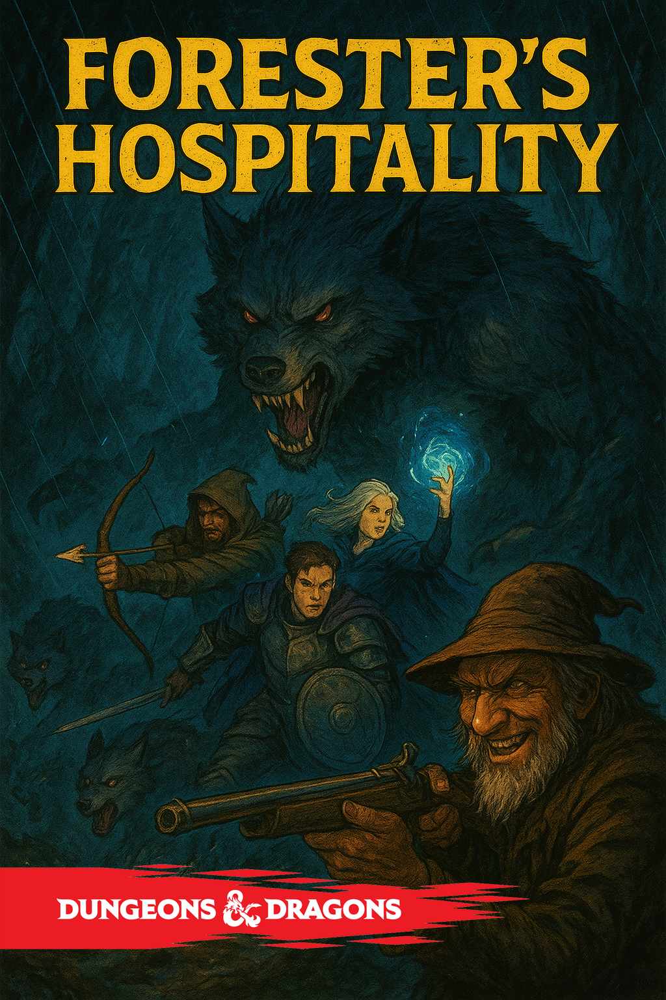

{width=1024px height=1536px}

**Краткий обзор**

**Уровень героев:** 2-4\
**Локация:** Глухой лес на границе Вердании и охотничьих угодий Хаймрока\
**Сложность:** Средняя (опасно для неосторожных групп)\
**Награда:** Опыт, ружьё лесника, ключ к тайнику, моральный выбор

---

## **Завязка**

### **Крючок**

*Герои путешествуют по Старой Лесной дороге - некогда оживлённому торговому пути, теперь заросшему и заброшенному. Начинается осенний ливень, сгущаются сумерки, холодный ветер пробирает до костей.*

**Развитие:**

-  **Приметы:** Герои натыкаются на скрипящую вывеску, прибитую к столетней сосне:\
   *«Путник, ищешь ночлега? Спроси у Старика Гримма»*. Стрелка указывает на едва заметную тропинку, ведущую в чащу.

-  **Проверка Мудрость (Выживание) СЛ 12:** Герои замечают необычно много волчьих следов по краям тропинки - будто здесь постоянно ходят стаей. Следы слишком организованные для диких зверей.

-  **Проверка Природа СЛ 10:** Можно определить, что некоторые растения вокруг тропы ядовиты (белладонна, волчье лыко), но растут они неестественно упорядоченно.

---

## **Локации леса**

### **1\. Заброшенная застава**

*Остатки старого пограничного поста Вердании. Полуразрушенная каменная башня, заросшая плющом.*

**Особенности:**

-  В подвале - скелеты двух стражников с мечами в руках

-  На стене выцарапано: *«Они слушают его... все они...»*

-  **Сокрытый тайник:** За раздвижным камнем можно найти серебряные стрелы (x5) и флакон святой воды

### **2\. Волчий тотем**

*Скрытая поляна с древним резным камнем, изображающим волка. От тотема исходит зловещая энергия.*

**Особенности:**

-  Земля вокруг усеяна костями животных

-  **Проверка Религия СЛ 13:** Тотем посвящён древнему духу-оборотню

-  При приближении слышен тихий волчий вой

### **3\. Логово стаи**

*Система пещер в холме. Вход прикрыт колючим кустарником.*

**Особенности:**

-  Внутри - остатки добычи волков, несколько человеческих костей

-  В глубине - волчата (3 шт.), которых можно пощадить

-  Скрытый проход ведёт к подвалу дома Гримма

---

## **Сцена 1: Дом в чаще**

### **Внешний вид**

*Небольшая, но крепкая бревенчатая изба с каменной трубой. Из трубы идёт густой дым, в единственном оконце светится лучина. Вокруг - ухоженный огород с странными тёмными растениями и дровяной сарай. Неподалёку лежит крупная кость, обглоданная дочиста.*

### **Встреча с лесником**

*Дверь открывает **Старик Гримм**. Он выглядит добродушным: седая борода, морщинистое лицо с тёплой улыбкой, крепкое телосложение лесного жителя. Одет в поношенную кожаную куртку с волчьим мехом на воротнике.*

> **Гримм** (радушно): *«Замучены дорогой, путники? Видать, выбились из сил. В такую погоду только волк дурак на улице ночует. Заходите, грейтесь! Я в чём не откажу гостям! Ужин как раз поспевает».*

### **Поведение Гримма**

-  Чрезвычайно гостеприимен: усаживает за стол, наливает домашнего вина, предлагает похлёбку

-  Рассказывает истории о лесе, жалуется на браконьеров, хвалит местных зверей

-  **Ключевая фраза (с ухмылкой):** *«А волки... мои волки -- самые умные твари в этом лесу. Я их подкармливаю, знаете ли. Нет у меня среди зверей врагов. Они мне как семья».*

-  Если герои насторожены - ведёт себя ещё более мило и безобидно

---

## **Сцена 2: Тревожные признаки**

*Пока герои находятся в доме, они могут найти улики. Гримм периодически выходит «проверить погоду» или «принести дров».*

### **Возможные проверки:**

**В доме:**

-  **Внимательность (СЛ 13):** В углу комнаты стоит ружьё. Оно чистое, ухоженное, но на прикладе видны царапины, похожие на следы от человеческих ногтей

-  **Расследование (СЛ 15):** Под половицей у печки можно найти свёрток с вещами прошлых «гостей»: серебряный кулон, 23 золотые монеты, окровавленный кинжал, обручальное кольцо

-  **Проницательность (СЛ 14):** Гримм слишком настойчиво предлагает еду и питьё. В его улыбке что-то неестественное, глаза слишком часто смотрят на дверь

-  **Природа (СЛ 12):** Растения в горшках на подоконнике - ядовитые травы, используемые для усыпляющих зелий

**В сарае:**

-  **Выживание (СЛ 12):** Среди дров можно найти закопанные окровавленные одежды

-  **Внимательность (СЛ 10):** В углу стоит клетка с доставленными голубями - система связи Гримма

### **Магические обнаружения:**

-  **Обнаружение магии:** Слабая аура очарования на еде, сильная некромантическая аура из подпола

-  **Обнаружение яда и болезней:** Похлёбка содержит слабый усыпляющий яд

### **Развитие событий**

*С наступлением ночи герои слышат протяжный волчий вой прямо под окнами. Не один голос, а целый хор, приближающийся к дому.*

> **Гримм** (заулыбался, вставая): *«А, друзья проголодались... Простите, путники, дело неотложное. Сейчас вернусь.»*

*Он берёт своё ружьё и выходит из избы. Через несколько минут снаружи раздаётся его голос, уже без тени доброты:*

> *«Эй, приятели! Выходите, не стесняйтесь! Лес -- он ведь для всех! Познакомлю со своей семьёй!»*

---

## **Сцена 3: Встреча с «семьёй»**

*Герои оказываются перед избой. Гримм стоит спиной к лесу, с ружьём в руках. Из темноты на опушку выходят волки - они не нападают сразу, а ждут команды лесника.*

### **Диалог перед боем**

> **Гримм** (голос металлический и холодный): *«Что, не понравилось моё гостеприимство? Я же сказал -- ни в чём не откажу. И в качестве ужина для моих деток -- тоже. Они любят... свежатинку. Лес требует жертв, а я лишь его слуга!»*

### **Тактика боя**

**Гримм:**

-  Использует статблок **Ветеран (Veteran)**

-  Не бросается в рукопашную, стреляет из ружья

-  Занимает позицию у сарая для обзора

-  Кричит волкам команды: *«Держите их! Не давайте уйти! Лес всё равно ваш!»*

-  Если ранен наполовину - пытается отступить в дом

**Волки:**

-  Используют **Тактику стаи**

-  Окружают самых слабых членов группы

-  Свирепый волк пытается сбить с ног лидера группы

-  2 волка охраняют подходы к лесу

**Особенности поля боя:**

-  Дождь и грязь дают помеху на проверки Ловкости

-  Сарай можно поджечь (устрашение волков на 1 раунд)

-  Дом можно забаррикадировать изнутри

---

## **Сцена 4: Развязка и награды**

### **После победы**

*На теле Гримма герои находят железный ключ с волчьей головой. Ключ подходит к сундуку в его доме или в дровяном сарае.*

### **Содержимое сундука:**

1. **Богатства:** 150 зм, 5 самоцветов (по 10 зм каждый)

2. **Ружьё Лесника (Гримма):** Одноручное ружьё (1d10 колющего урона, дистанция 40/120 фт., перезарядка). Волки и звери совершают спасброски Мудрости СЛ 13 от страха при виде него.

3. **Дневник Гримма:** Описывает, как он нашёл в лесу древний тотем и заключил сделку с духом-оборотнем. С тех пор он поставляет жертвы в обмен на власть над стаей.

4. **Серебряный амулет:** Амулет с символом духа-оборотня. Даёт преимущество на проверки против эффектов оборотней.

### **Моральный выбор**

-  **Убить прирученных волков?** Они не виноваты, но без хозяина могут стать ещё опаснее

-  **Найти духа-оборотня?** Амулет и дневник указывают на его логово в глубине леса

-  **Сообщить властям?** В дневнике упоминаются подкупленные чиновники в Хаймроке

---

## **Бестиарий**

### **Старик Гримм**

*Средний гуманоид (человек), законоплохой злой*

**Класс Защиты:** 15 (кожаная броня) **Хиты:** 58 (9к8 + 18) **Скорость:** 30 фт.

| СИЛ     | ЛОВ     | ТЕЛ     | ИНТ     | МДР     | ХАР     |
|---------|---------|---------|---------|---------|---------|
| 16 (+3) | 13 (+1) | 14 (+2) | 10 (+0) | 11 (+0) | 10 (+0) |

**Навыки:** Обман +2, Выживание +2 **Чувства:** пассивная Внимательность 10 **Языки:** Общий **Опасность:** 3 (700 опыта)

**Действия:**

-  **Мультиатака:** Две атаки ближнего боя или две дальние атаки

-  **Длинный меч:** +5 к попаданию, 7 (1к8 + 3) рубящего урона

-  **Ружьё:** +3 к попаданию, 10 (1к10 + 1) колющего урона (40/120 фт.)

-  **Команда стае (бонусное действие):** Даёт преимущество следующей атаке волков

### **Свирепый волк (Dire Wolf)**

*Большой зверь, без мировоззрения*

**КЗ:** 14 (естественная броня) **Хиты:** 37 (5к10 + 10) **Скорость:** 50 фт.

| СИЛ     | ЛОВ     | ТЕЛ     | ИНТ    | МДР     | ХАР    |
|---------|---------|---------|--------|---------|--------|
| 17 (+3) | 15 (+2) | 15 (+2) | 3 (-4) | 12 (+1) | 7 (-2) |

**Навыки:** Восприятие +3, Скрытность +4 **Чувства:** пассивное Восприятие 13 **Языки:** -- **Опасность:** 1 (200 опыта)

**Особенности:**

-  **Острый слух и обоняние:** Преимущество на проверки Мудрости (Восприятие), основанные на слухе или обонянии

-  **Тактика стаи:** Преимущество на броски атаки, если в пределах 5 фт. от цели есть хотя бы один союзник волка

**Действия:**

-  **Укус:** +5 к попаданию, 10 (2к6 + 3) колющего урона. Если цель - существо, оно должно преуспеть в спасброске Силы СЛ 13 или быть сбитым с ног.

### **Волк (Wolf)**

*Средний зверь, без мировоззрения*

**КЗ:** 13 (естественная броня) **Хиты:** 11 (2к8 + 2) **Скорость:** 40 фт.

| СИЛ     | ЛОВ     | ТЕЛ     | ИНТ    | МДР     | ХАР    |
|---------|---------|---------|--------|---------|--------|
| 12 (+1) | 15 (+2) | 12 (+1) | 3 (-4) | 12 (+1) | 6 (-2) |

**Навыки:** Восприятие +3, Скрытность +4 **Чувства:** пассивное Восприятие 13 **Языки:** -- **Опасность:** 1/4 (50 опыта)

**Особенности:**

-  **Острый слух и обоняние:** Преимущество на проверки Мудрости (Восприятие), основанные на слухе или обонянии

-  **Тактика стаи:** Преимущество на броски атаки, если в пределах 5 фт. от цели есть хотя бы один союзник волка

**Действия:**

-  **Укус:** +4 к попаданию, 7 (2к4 + 2) колющего урона. Если цель - существо, оно должно преуспеть в спасброске Силы СЛ 11 или быть сбитым с ног.

### **Дух-оборотень (заключительный босс)**

*Средний fiend, хаотично злой*

**КЗ:** 16 (естественная броня) **Хиты:** 78 (12к8 + 24) **Скорость:** 40 фт., лазание 30 фт.

| СИЛ     | ЛОВ     | ТЕЛ     | ИНТ     | МДР     | ХАР     |
|---------|---------|---------|---------|---------|---------|
| 18 (+4) | 16 (+3) | 15 (+2) | 12 (+1) | 14 (+2) | 16 (+3) |

**Сопротивление урону:** дробящий, колющий и рубящий урон от немагических атак **Иммунитет к урону:** яд **Иммунитет к состояниям:** отравление **Чувства:** тёмное зрение 120 фт., пассивное Восприятие 12 **Языки:** Бездны, Общий **Опасность:** 5 (1,800 опыта)

**Действия:**

-  **Мультиатака:** Две атаки когтями

-  **Когти:** +7 к попаданию, 11 (2к6 + 4) рубящего урона

-  **Призыв волков (3/день):** Призывает 2d4 волков

**Легендарные действия (3/раунд):**

-  **Чувство добычи:** Перемещается до половины скорости

-  **Ошеломляющий вой:** Все существа в радиусе 30 фт. делают спасбросок Телосложения СЛ 14 или становятся испуганными на 1 раунд

-  **Превращение (стоит 2 действия):** Превращается в гигантского волка на 1 раунд

---

### **Награды за опыт**

-  **Победа над Гриммом и стаей:** 1,100 опыта

-  **Исследование всех локаций:** 300 опыта

-  **Решение моральной дилеммы:** 200 опыта

-  **Общее за квест:** до 1,600 опыта

*Этот квест создаёт идеальное напряжение: от уютной и безопасной атмосферы до внезапного ужаса и предательства, предлагая игрокам как тактические вызовы, так и глубокие моральные выборы.*

---

# Квест: «Сердце Лесной Тьмы»

### **Обзор**

**Уровень героев:** 4-5\
**Локация:** Заповедная чаща, Логово Духа-оборотня\
**Сложность:** Высокая (требует тактики и подготовки)\
**Награда:** Уникальные магические предметы, расположение духа леса, постоянное преимущество в регионе.

---

## **АКТ 1: СЛЕД ВЕДЁТ В ЧАЩУ**

### **Сцена 1: Решение и проводники**

*После боя с Гриммом, если герои пощадили волков, происходит следующее:*

**Визуальное описание:** *Волки не убегают, а медленно окружают героев. Самый крупный -- седой вожак с шрамом через глаз -- приближается. Его взгляд не агрессивен, а скорее... умоляющ. Он аккуратно кладёт к ногам героев окровавленный серебряный коготь.*

**Диалог через заклинание "Разговор с животными":**

> **Вожак стаи** (голос хриплый, прерывистый): *"Двуногие... не как другие. Лес болен. Тот-Кто-Шепчет-Тьме поработил наших братьев. Мы водили путников к дому двуногого... не по своей воле. Помоги... разбей оковы."*

**Социальное взаимодействие:**

-  **Уход за животными СЛ 15:** Герои могут успокоить волков и получить их доверие

-  **Медицина СЛ 12:** Можно обработать раны вожака, получая его преданность

-  **Убеждение СЛ 14:** Уговорить стаю стать проводниками

**Развитие:**

-  **Успех:** Волки ведут безопасным путём, предупреждая об опасностях

-  **Провал:** Волки указывают направление, но уходят -- герои идут сами

---

### **Сцена 2: Пограничные земли**

**Локация: Камни Скорби** *Три огромных валуна, испещрённых рунами. Между ними -- свежие цветы на забытых могилах.*

**Взаимодействия:**

-  **Расследование СЛ 13:** Найти дневник последней жертвы -- девушки-травницы

-  **Религия СЛ 15:** Руны рассказывают о древнем ритуале заточения

**Диалог с призраком травницы:**

> **Призрак Элины** (появляется как серебристая дымка): *"Бегите... пока не поздно! Он впивается в душу, как клык в горло. Гримм был не первым... и не последним. Найдите Лунный Камень -- только он может разбить тотем!"*

**Ловушка: Голоса предков**

-  **Спасбросок Мудрости СЛ 14** при чтении рун

-  **Провал:** Герой слышит шепот, призывающий вернуться (-2 к морали на 1 час)

---

## **АКТ 2: ТЁМНЫЙ ЛЕС**

### **Сцена 3: Шепчущие болота**

**Визуальное описание:** *Деревья склонились как кающиеся грешники. Вода чёрная, маслянистая. По поверхности плавают странные фиолетовые кувшинки. Шёпот доносится со всех сторон -- то детский смех, то предсмертный стон.*

**Ловушки:**

1. **Болотная трясина**

   -  **Пассивная Внимательность СЛ 16** чтобы заметить

   -  При попадании: **Спасбросок Силы СЛ 15** или скорость 0, утопание 2d6 удушающего урона за раунд

2. **Призрачные миражы**

   -  **Спасбросок Интеллекта СЛ 13** каждый ход

   -  **Провал:** Герой видит союзников как монстров, должен атаковать ближайшее существо

**Социальное взаимодействие с призраками:**

> **Призрак Охотника Альберта** (мужчина в разорванной униформе): *"Я служил лесу... а он поглотил меня! Гримм обещал силу... ЛЖАЛ! Не повторяйте моей ошибки -- серебро и святая вода, только это ему вредит!"*

> **Призрак Девочки-собирательницы** (плачет тихо): *"Я просто хотела ягод... мама ждёт... скажите ей, что я любила её..."*

**Тактика:**

-  Призраки атакуют только если к ним приблизиться

-  Можно успокоить обещанием завершить их дела (**Убеждение СЛ 16**)

---

### **Сцена 4: Поляна засохших деревьев**

**Визуальное описание:** *Идеальный круг из 13 мёртвых дубов. В центре -- обсидиановый алтарь, покрытый высохшей кровью. Воздух вибрирует, как перед грозой. От алтаря тянется трещина в земле, из которой сочится фиолетовый туман.*

**Магические эффекты:**

-  Все заклинания лечения работают на одну кость ниже

-  Некромантия получает +2 к бонусу атаки

-  **Спасбросок Телосложения СЛ 14** каждый час или уровень истощения

**Взаимодействие с алтарём:**

> **Голос из алтаря** (сладкий, убедительный): *"Сила... бесконечная сила ждёт тех, кто осмелится взять её. Я сделал Гримма богом его маленького мирка... Что могу сделать для вас, сильные духом?"*

**Варианты ответов:**

-  **Угроза (-2 к дальнейшим проверкам):** "Мы уничтожим тебя, чудовище!"

-  **Обман (+1 к бонусу):** "Мы ищем силу... может, договоримся?"

-  **Молчаливое изучение (нейтрально):** Проверка Магии для анализа

**Находки:**

-  **Расследование СЛ 17:** Скрытый отсек с *картой пещеры* и *свитком защиты от зла*

---

## **АКТ 3: ПЕЩЕРА ЛУННОГО КЛЫКА**

### **Сцена 5: Входные туннели**

**Визуальное описание:** *Вход в пещеру напоминает оскаленную волчью пасть. Изнутри доносится низкое рычание и пахнет медью и гнилью. Стены покрыты фресками, изображающими кровавые ритуалы.*

**Ловушки:**

1. **Серебряные капканы**

   -  **Пассивная Внимательность СЛ 18**

   -  При срабатывании: 3d6 колющего урона, скорость уменьшена вдвое

   -  Можно обезвредить **Ловушки СЛ 16**

2. **Теневые нити**

   -  Невидимые магические проволоки

   -  **Спасбросок Ловкости СЛ 15** или 2d8 урона силовым полем и оглушение на 1 раунд

**Стражи: Оборотень-отшельник**

> **Морван** (оборванный старик с безумными глазами): *"Стой! Не для вас предназначены дары Ночного Владыки! Я охранял этот вход тридцать зим... не позволю осквернить святыню!"*

**Диалоговые варианты:**

-  **Сострадание СЛ 18:** "Гримм мёртв... ты свободен, старик"

-  **Запугивание СЛ 16:** "Уступи дорогу, или разделишь его судьбу"

-  **Обман СЛ 17:** "Дух прислал нас сменить тебя на посту"

**Бой (если дипломатия провалилась):**

-  Морван использует тактику изматывания

-  Отступает в узкие коридоры, где численное преимущество бесполезно

---

### **Сцена 6: Галерея предков**

**Визуальное описание:** *Просторный зал с высоким потолком. Стены покрыты фресками невероятной детализации. В центре -- 13 каменных тронов, на каждом сидит мумифицированная фигура в охотничьих одеждах.*

**Исторические открытия:**

-  **История СЛ 16:** Фрески показывают 500-летнюю историю культа

-  **Религия СЛ 17:** Можно определить истинное имя духа -- "Ульфгарр"

**Интерактивные элементы:**

**Голос из фрески:**

> *"Ульфгарр был когда-то лесным божеством... пока алчные люди не попытались украсть его силу. Теперь он мстит... вечно голодный, вечно одинокий."*

**Сокрытые секреты:**

-  За троном вождя -- *амулет лунного света* (даёт сопротивление некротическому урону)

-  В потайной комнате -- *дневник первого жреца* с ритуалом изгнания

---

## **АКТ 4: СЕРДЦЕ ТЬМЫ**

### **Сцена 7: Ритуальный грот**

**Визуальное описание:** *Гигантская пещера, купол которой усеян светящимися кристаллами, имитирующими звёзды. В центре -- 10-метровый тотем из чёрного дерева, пульсирующий багровой энергией. У основания -- кости сотен существ.*

**Появление Духа-оборотня:**

*Из тотема вытекает тень, принимая форму гигантского волка с человеческими глазами. Голос звучит одновременно из everywhere и ниоткуда.*

> **Дух-оборотень Ульфгарр** (голос многоголосый, как хор из тысячи существ): *"Наконец-то... достойные. Гримм был послушным псом, но ограниченным. Вы... вы могли бы стать королями этого леса! Примите мою силу -- станьте новыми повелителями охоты!"*

**Диалоговые возможности:**

1. **Прямой отказ:**

   > "Мы пришли положить конец твоему безумию, Ульфгарр!"

   -  **Ответ:** *"Безумие? Я предлагаю БЕССМЕРТИЕ! Посмотрите на моих верных слуг -- они будут жить вечно!"* (призывает призраков)

2. **Тактический обман:**

   > "Мы рассматриваем твоё предложение... что именно ты предлагаешь?"

   -  **Ответ:** *"Власть над жизнью и смертью! Превращение в идеальных хищников! Лес будет вашим телом, а вы -- его душой!"*

   -  **Обман СЛ 19** для получения тактической информации

3. **Сострадательный подход:**

   > "Мы знаем твою историю, Ульфгарр. Люди предали тебя... но мы можем помочь исцелиться!"

   -  **Ответ:** *"Исцелиться? Я ПРЕВЗОШЁЛ свою старую форму! Я стал СИЛЬНЕЕ! Боль... боль сделала меня богом!"*

   -  **Убеждение СЛ 20** для ослабления его на 1d4 раунда

---

### **Сцена 8: Битва с Ульфгарром**

**Тактика Ульфгарра:**

**Фаза 1 (100-70% HP) -- Форма Духа:**

-  Атаки на расстоянии: **Теневые когти** (3d8 некротического)

-  **Легендарные действия:**

   -  **Теневой шаг:** Телепортация на 60 фт.

   -  **Призыв призрачных волков:** 1d4 волка-призрака

   -  **Проклятие страха:** Спасбросок Мудрости СЛ 16

**Фаза 2 (70-40% HP) -- Гибридная форма:**

-  Смесь волка и человека, бои в ближнем бою

-  **Новые способности:**

   -  **Укус разума:** 2d10 + очарование на 1 раунд

   -  **Лунный луч:** Конус 30 фт, 4d6 лучевого урона

**Фаза 3 (40-0% HP) -- Отчаяние:**

-  Попытка сбежать через теневой портал

-  **Отчаянные атаки:** Игнорирует броню, бьёт по самому слабому

-  **Самолечение:** Поглощает призраков для восстановления HP

**Тактика для героев:**

-  Разрушение кристаллов на потолке ослепляет духа на 1 раунд

-  Использование серебра даёт преимущество

-  Ритуальный круг можно активировать для защиты

---

## **РАЗВЯЗКА**

### **Сцена 9: После битвы**

**Если Ульфгарр побеждён:**

*Тёмная энергия рассеивается, тотем трескается с звуком разбитого стекла. Из него вырывается чистый серебристый свет. Багровые кристаллы на потолке становятся небесно-голубыми.*

> **Голос Лесного Духа** (нежный, как шелест листьев): *"Благодарю вас, храбрецы... Наконец-то я свободен. Тысячу лет я был пленником в собственном теле... Теперь лес снова будет расти и цвести."*

**Награды:**

1. **Сердце Лунного Волка:** Амулет, дающий сопротивление некротическому урону и 1 раз в день превращение в волка на 10 минут

2. **Коготь Ульфгарра:** Кинжал +2, наносит дополнительно 2d6 урона духам

3. **Плащ Лесного Стража:** Невидимость в лесу на действие, преимущество на скрытность

4. **Семена Жизни:** 3 семени, вырастающие в целебные травы (лечат 4d8 HP)

### **Эпилог**

**Возвращение в цивилизацию:**

-  Волки становятся защитниками леса

-  Жители близлежащих деревень предлагают награды

-  Лес начинает восстанавливаться -- цветы распускаются даже осенью

**Долгосрочные последствия:**

-  Герои получают титул "Защитников Верданийского леса"

-  Торговые пути восстанавливаются

-  Возможность основать собственный оплот в лесу

---

## **БЕСТИАРИЙ**

### **Дух-оборотень Ульфгарр**

*Большое исчадие (оборотень, дух), хаотично злое*

**КЗ:** 18 (естественная броня) **Хиты:** 225 (30d10 + 60) **Скорость:** 50 фт., полёт 30 фт. (призрачная форма)

| СИЛ     | ЛОВ     | ТЕЛ     | ИНТ     | МДР     | ХАР     |
|---------|---------|---------|---------|---------|---------|
| 22 (+6) | 18 (+4) | 18 (+4) | 16 (+3) | 20 (+5) | 22 (+6) |

**Спасброски:** Лов+8, Мдр+9, Хар+10 **Навыки:** Обман+10, Запугивание+10, Восприятие+9 **Сопротивление урону:** дробящий, колющий, рубящий от немагических атак **Иммунитет к урону:** некротический, яд **Иммунитет к состояниям:** очарованный, испуганный, отравленный **Чувства:** истинное зрение 120 фт., пассивное Восприятие 19 **Языки:** Все

**Легендарное сопротивление (3/день):** При провале спасброска может вместо этого преуспеть

**Действия:**

-  **Мультиатака:** Три атаки Теневыми когтями или одну Укус разума

-  **Теневые когти:** +10 к попаданию, 18 (3d8 + 6) некротического урона

-  **Укус разума:** +10 к попаданию, 21 (3d10 + 6) урона силовым полем, цель очарована на 1 раунд

**Легендарные действия (3/раунд):**

-  **Теневой шаг (1 действие):** Телепортация на 60 фт.

-  **Призыв стаи (2 действия):** Призывает 1d4 волка-призрака

-  **Лунное проклятие (3 действия):** Все существа в радиусе 30 фт. делают спасбросок Телосложения СЛ 18 или получают 21 (6d6) некротического урона

### **Волк-призрак**

*Средный дух, без мировоззрения*

**КЗ:** 14 **Хиты:** 45 (7d8 + 14) **Скорость:** 50 фт., фазовая скорость 30 фт.

**Иммунитет к урону:** холод, некротический **Иммунитет к состояниям:** испуган, отравлен

**Фазовое движение:** Может проходить сквозь существ и объекты

**Действия:**

-  **Фазовый укус:** +6 к попаданию, 10 (2d6 + 3) урона силовым полем, игнорирует немагическую броню

-  **Легендарное действие:** Может перемещаться на 15 фт. в конце хода другого существа

### **Оборотень-отшельник Морван**

*Средный гуманоид (оборотень), нейтрально злой*

**КЗ:** 16 (естественная броня) **Хиты:** 120 (16d8 + 48) **Скорость:** 40 фт.

**Иммунитет к урону:** дробящий, колющий, рубящий от немагических атак

**Действия:**

-  **Мультиатака:** Две атаки когтями или одна атака посохом

-  **Когти:** +8 к попаданию, 12 (2d6 + 5) рубящего урона

-  **Охотничий посох:** +7 к попаданию, 8 (1d8 + 4) дробящего урона

**Тактические способности:**

-  **Знание местности:** Преимущество на инициативу в пещере

-  **Уклонение:** Половина урона при проваленном спасброске Ловкости

---

### **ОПЫТ И НАГРАДЫ**

**Опыт:**

-  Победа над Ульфгарром: 5,000 опыта

-  Разрушение тотема: 1,000 опыта

-  Освобождение призраков: 500 опыта

-  Мирное решение с Морваном: 750 опыта

**Общий опыт за квест:** до 7,250 опыта

**Сокровища:**

-  Золото и драгоценности: 2,500 зм

-  Магические предметы: 4 уникальных артефакта

-  Земельный надел: Право на строительство в лесу