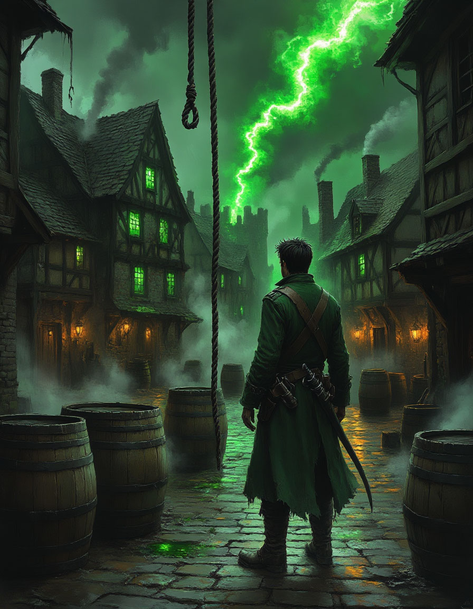

Общая цель: Расследовать деятельность Лиги Бесконечного Змея в Вердании, выяснить её связь с культом и остановить отравление водных источников.

***Крючок***: Больная земля

Детальное описание окружения

Герои подходят к деревне Песчаная Коса с юга, по пыльной проселочной дороге. Первое, что они замечают -- заброшенные поля.

- Поля: Ржавые серпы валяются у края поля. Посевы пшеницы и овощей не убраны, они сгнили на корню, покрылись серой плесенью и неестественно чёрными пятнами. В воздухе стоит сладковато-гнилостный запах, смешанный с привычным ароматом навоза, но и он кажется каким-то «больным».

- Окраина деревни: Первые дома -- это покосившиеся хижины с прогнившей соломенной кровлей. Заборы развалились. Никаких животных. Ни кур, ни собак, ни кошек. Тишину нарушает лишь навязчивое жужжание крупных мух.

- Центр деревни: Небольшая площадь с колодцем -- единственное место, где есть признаки жизни. Но и здесь люди движутся медленно и бесцельно, как сомнамбулы. Они не разговаривают, их движения вялые и заторможенные. Они смотрят на героев пустыми, отсутствующими глазами, без любопытства или страха.

- Колодец: Деревянная конструкция старая, ведро почти развалилось. Если заглянуть внутрь, вода кажется мутной, а на поверхности плавает странная радужная плёнка. Проверка Мудрости (Выживание) СЛ 12 позволяет определить, что вода непригодна для питья -- она горьковата на запах и оставляет на языке металлический привкус.

- Атмосфера: Давят тишина и апатия. Кажется, что сама жизнь покинула это место. Даже ветер не шелестит листьями на немногих уцелевших деревьях.

Социальное взаимодействие и диалоги

Герои могут попытаться поговорить с жителями. Большинство просто игнорируют их или бормочут что-то невнятное.

### 1. Встреча с девочкой:

У колодца сидит девочка лет 8-ми, она качает тряпичную куклу и монотонно напевает:

«Раз, два, Лига пришла... три, четыре, воду залила... пять, шесть, все мы здесь исчезнем...»

Если герои попытаются её расспросить, она просто продолжит напевать, не реагируя. При агрессивном воздействии -- расплачется и убежит.

**2\. Встреча с дедом-рыбаком:**

На крыльце крайней хижины сидит старик и чинит сеть. Его руки дрожат. Это **дед Еремей**. Он один из немногих, кто ещё более-менее в сознании.

Диалог:

Герой: «Что случилось с вашей деревней?» Еремей (не поднимая глаз, хрипло): «Река... река умерла. И мы следом. Месяц назад они были... „добрые люди“ из Лиги. Белые повозки, улыбки как у маски. „Почистим ваш колодец, -- говорят, -- от заразы“. Ну почистили... С тех пор и пошло. Сначала скот сдох. Потом люди... не умирать, а так... уснуть стали. И сны они снятся... не наши сны». Герой: «Кто они? Куда они ушли?» Еремей (кашляет, смотрит на север): «Кто их знает... Говорили, у них склад на севере, в бухте Трёх Скал. Говорят, там и „лекарство“ своё варят. Только нам оно... не поможет».

### 3. Встреча с обезумевшей матерью:

Из одного дома доносятся приглушённые рыдания. Войдя, герои увидят женщину, пытающуюся накормить кашей своего взрослого сына. Он сидит, уставившись в стену, и каша стекает у него по подбородку.

Диалог:

Женщина (истерично, оборачиваясь): «Уйдите! Оставьте нас! Вы тоже от них? Вы принесли новое „лекарство“? Оно не помогает! Оно только усыпляет! Он мой мальчик, а я не могу его дозваться!»

Что, кроме боя, могут сделать герои?

Медицинское обследование:

:::note
- Зельеварение/Медицина (СЛ 14): Герои могут определить симптомы: сильное обезвоживание, мышечная атрофия, признаки воздействия на нервную систему. Яд не смертельный, но вызывающий глубокую апатию и подавление воли.

   - Магия: Заклинание Обнаружение яда и болезней ярко подсветит колодец и всех, кто пил из него воду, ядовитой аурой. Лечение ран не поможет, так как это не рана, а болезнь. Нужно Снять проклятие или Уменьшить болезнь.
:::

Поиск улик:

:::note
- Внимательность (СЛ 12) у колодца: Герои находят несколько отпечатков сапог с необычным узором (не деревенским) и обрывок упаковки с символом Лиги Бесконечного Змея (бесконечный змей, кусающий себя за хвост).

   - Расследование (СЛ 10) на окраине: Обнаруживается брошенный лагерь с пустыми бочками из-под реагентов. На одной бочке есть та же символика Лиги и надпись: «Сонная отрава. Опасно».
:::

**Помощь выжившим:**

Герои могут попытаться **очистить колодец** (например, огнём или магией). Это даст деревне шанс на выживание в долгосрочной перспективе, но не поможет уже отравленным.

Они могут **раздать свои запасы еды и воды** самым слабым жителям (детям, старикам). За это дед Еремей подарит им **вырезанный из кости амулет** (без магических свойств, но как знак благодарности) и подробно опишет дорогу к бухте.

Пути перехода к следующей сцене

1. Прямая дорога: Расспросив деда Еремея или найдя упаковку от яда, герои узнают название места -- Бухта Трёх Скал -- и направление (на север, вдоль побережья).

2. Ночное нападение: Если герои задержатся в деревне до ночи, на них нападут 4 Сахагина и 1 Сахагин-Следопыт. Их послали «очистить» улики и забрать «испорченный товар» (ослабевших жителей для экспериментов). После боя на теле Следопыта можно найти карту с маршрутом к бухте.

3. Неожиданная помощь: Если герои проявят доброту (очистят колодец, раздадут воду), наутро к ним придёт Ариэль, молодая друид-следопыт из Круга Изумрудной Росы. Она скажет: «Леса видели ваши дела. Вы ищете тех, кто отравил это место? Я знаю тропу к их логову. Пойдёмте со мной».