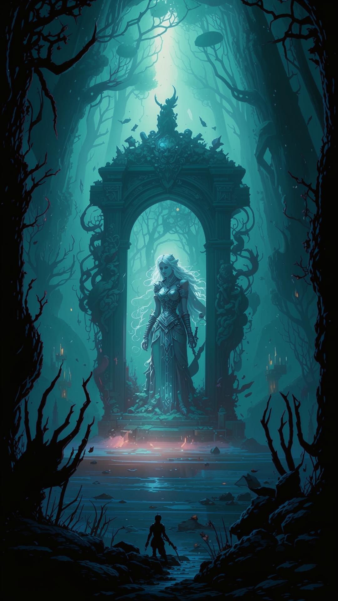

**Антагонист главы:** **Жрец-фанатик Вальтер** (Priest statblock + заклинания некромантии).

**Союзник:**

Общая цель: Не дать культу «Сынов Безмолвного Шепота» создать Клинок Эреба -- артефакт, способный убивать богов, используя останки дочери основателя империи, принцессы Ланы.

***Крючок***: Наследие, отлитое в стали

- Сцена: Герои в Оакхолме. Леди Моргана изучает «Среброжил» -- меч принцессы Ланы, добытый в предыдущей главе.

Диалог:

Леди Моргана (её пальцы осторожно касаются лезвия): «Её душа... она всё ещё кричит от ужаса. Они не просто убили её. Они поймали её душу в момент величайшей боли и отчаяния и вковали в сталь. Этот клинок -- не оружие. Это клетка. И культ хочет использовать её как ключ... ключ к убийству богов.» Моргана (поднимает взгляд): «Второй «Ключ» -- её сердце. Оно должно находиться в её гробнице, здесь, в Вердании. Но мои следопыты сообщают о активности дуэргаров у наших восточных границ. Ярл Ульфрик из Хаймрока... его люди внезапно стали очень активны. Найдите его. Выясните, что ему пообещал Торн. Остановите их. Любой ценой.»
### 1. Аудиенция у Когтя Ворона

А. Окружение и атмосфера

Местоположение: Сердце Оакхолма, Тронный Зал Древа-Города.

- Зал: Зал находится не в здании, а в гигантской, естественной амфитеатром полости древнего дуба, чей возраст исчисляется тысячелетиями. Воздух прохладный и влажный, пахнет старой древесиной, свежей землей и цветущими ночными цветами.

- Стены: Стены -- это живые, пульсирующие волокна дерева. В них вплетены биолюминесцентные грибы и светящиеся мхи, которые мерцают мягким серебристо-зеленым светом, заменяя факелы.

- Трон: Трон Леди Морганы -- не изделие из металла, а живой сплетенный корень, поднятый из самого пола. Он усеян живыми цветами и острыми, похожими на когти, сучками.

- Пол: Пол устлан мягким мхом и лепестками. Сводчатый «потолок» из переплетенных ветвей пропускает лучи Setting солнца, создавая длинные таинственные тени.

- Охрана: Стражники -- не солдаты в латах, а молчаливые друиды в плащах из листьев и следопыты с натянутыми луками, неподвижно стоящие в нишах между корней. Их глаза внимательны и суровы. Где-то наверху, в тенях ветвей, слышен глухой крик ворона.

Б. Социальное взаимодействие и диалоги

Героев проводят в зал. Леди Моргана не сидит на троне. Она стоит к ним спиной, рассматривая сложную карту Вердании, вырезанную прямо на стене дерева.

### 1. Этап: Испытание (Проверка характера)

- Моргана (не оборачиваясь, её голос низкий и властный): «Странники из Солнцеграда. Люциан прислал ко мне щенков на побегушках? Или всё же воинов?»

Она поворачивается. Её взгляд -- холодная сталь. Она изучает героев, не их доспехи, а их души.

- Цель: Произвести первое впечатление. Герои могут:

   - Проявить уважение (Убеждение/Проницательность): «Мы не щенки князя. Мы те, кто сорвал планы «Сынов Безмолвного Шепота» в его собственном городе. Он прислал нас к той, чья мудрость столь же известна, как и её ярость».

   - Проявить дерзость (Запугивание/Обман): «Щенки кусаются больнее старой собаки, леди. И нам сказали, что здесь ищут охотников, а не болтунов».

   - Проявить честность (Честность): «Мы всего лишь пытаемся предотвратить беду, которая грозит всем. Ваше имя использовали впустую, и мы здесь, чтобы выяснить правду».

- Реакция Морганы: Успех заставит её уважать их. Неудача заставит её говорить с ними свысока, как с слугами.

### 2. Этап: Суть дела

Герои излагают суть: культ, чертежи, ритуал на площади, имя «Коготь Ворона».

- Моргана (её глаза вспыхивают яростью, и ветер завывает сильнее в ветвях над головой): «Они посмели... Они посмели использовать мое имя? Имя, данное мне духами этих лесов за защиту их детей? Чтобы сеять раздор и хаос?»

Она сжимает рукоять кинжала. Кажется, тень за её спиной на мгновение обретает форму гигантской птицы с когтями.

- Ключевая фраза: «Эта гадюка Торн... или тот, кто стоит за ним... заплатит. Вы хотите остановить их? Я дам вам всё, что вам нужно. Проводников, припасы. Но я хочу его голову. Понятно? Не пленника. Не извинения. Его голову.»

### 3. Этап: Торг и информация (Необязательно)

Герои могут попытаться выторговать большее вознаграждение или информацию.

- Проверка (Проницательность СЛ 15): Заметив их сомнения, Моргана добавляет: «Вы ищете «Ключи», не так ли? Дочь Аурелиуса была лишь первым. Следующий, говорят, спрятан в Пепельных Землях. Помогите мне -- и я обеспечу вам welcome в этом аду из огня и металла. Откажитесь... и лес станет для вас негостеприимным».

В. Пути перехода к следующей сцене

1. Прямое согласие: Герои принимают условия. Моргана вызывает Ариэль -- молодую, яростную друид-следопыта, которая станет их проводником к месту осквернения в Лесу Теней.

2. Несогласие/Провал: Если герои грубы или отказываются, Моргана холодно указывает на дверь. В этом случае им придётся самим искать путь через враждебный лес, что означает проверки Выживания (СЛ 17) и случайные столкновения.

3. Обман: Герои могут солгать, что согласны, а потом передумать. Но Моргана не глупа. Она может наложить на них «Метку Охоты» (заклинание типа Следующий шаг), чтобы следить за ними через духов леса.

Г. Альтернативы бою

Помимо прямого согласия или отказа, герои могут:

- Предложить альтернативу (Проверка Убеждения/Обмана СЛ 18): «Мёртвый враг не может говорить. Мы возьмём его живым, вы узнаете всё о его покровителях, а затем я лично передам его вам для... правосудия». Это сложный путь, но он может понравиться её стратегическому уму.

- Шантаж/Интрига: Если герои узнали какой-то её секрет (например, нашли доказательства её связей с тёмными духами леса до встречи), они могут осторожно намекнуть на это, чтобы получить больше рычагов влияния. Это ОЧЕНЬ опасный путь.

- Испытание: Моргана может предложить им доказать свою ценность: например, немедленно отправиться и выследить её личного врага -- могучего оборотня-нежить, оскверняющего северные рощи. Это станет отдельным небольшим квестом перед главным.

Эта сцена -- не просто диалог, а тонкая игра на политической арене, где первое впечатление, уважение и демонстрация силы значат больше, чем любое оружие.

### 