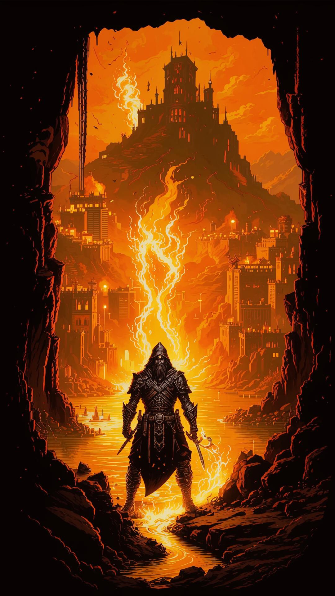

Общая цель: Проникнуть в Пепельные Земли, убедить дуэргаров помочь и остановить Келвина Торна у Сердца Вулкана, прежде чем он перенаправит его энергию для ритуала культа.

***Крючок***: Печать из Прошлого

### 1. Окружение: Заброшенный архив Гильдии Картографов

- Внешний вид: Небольшое, неприметное двухэтажное здание из потемневшего от времени камня в одном из тихих, старых кварталов Солнцеграда. Вывеска с изображением свитка и циркуля едва видна, краска облупилась. Окна первого этажа заколочены досками, на втором -- грязные стёкла, сквозь которые ничего не разглядеть.

- Внутри (1 этаж): Герои проникают внутрь через заднюю дверь с сорванным замком.

   - Основной зал: Полумрак, пропускаемый через щели в досках. Воздух спёртый, пахнет пылью, старой бумагой и плесенью. Высокие стеллажи, заваленные свитками и рулонами пожелтевших карт, многие из которых рассыпаются в прах при прикосновении. На полу -- груды обвалившейся штукатурки и обломков мебели.

   - Кабинет архивариуса: Маленькая комнатка в углу. Стол завален бумагами, чернильница опрокинута, как будто хозяин ушёл в спешке. Ключевая деталь: На столе -- дневник архивариуса с закладкой на последней записи.

- Внутри (2 этаж, Лестница): Деревянная лестница скрипит и прогибается под весом. Весь второй этаж -- это открытое пространство чердака под самой крышей.

   - Чердак: Здесь ещё хуже. Воздух холоднее. В центре на полу нарисован замысловатый магический круг(Проверка Распознавание магии или История СЛ 14 позволяет определить, что это ритуал защиты/сокрытия). Круг старый, но следы мела свежие. По углам -- ящики с никому не нужными архивными документами.

### 2. Социальное взаимодействие и диалоги

Герои не одни в архиве. Здесь уже есть другие «гости».

НПС 1: Старый сторож Барни.

:::note
- Внешность: Дрожащий старик в потрёпанной форме сторожа, с фонарём, который он никак не может зажечь.

   - Местоположение: Сидит на развалившемся стуле у входа, бормочет что-то себе под нос.
:::

**Диалог (испуганно, увидев героев):**

«Вы... вы тоже от *них*? Я ничего не видел, клянусь! Я просто сторож... двадцать лет здесь мету полы... а вчера пришли эти... *тихие*... в плащах с капюшонами. Не сказали ни слова. Просто прошли наверх и начали там шептаться. А потом... потом оттуда пахнуло морем... гнилым морем и чем-то ещё... медным...»

:::note
- Роль: Он может дать ключевую зацепку о «тихих» (культистах) и странном запахе, намекающем на связь с Бездной.
:::

НПС 2: Любопытный уличный мальчишка, Лисёнок.

:::note
- Внешность: Юркий паренёк 10-12 лет в грязной одежде.

   - Местоположение: Прячется среди стеллажей на первом этаже, подсматривает за всем происходящим.
:::

**Диалог (если его найти):**

«Эй, не бейте! Я просто смотрю! Тут странные дядьки ходят, я думал, клад искать... Они тут вчера что-то закапывали под лестницей! Потом наверху рисовали и пели страшные песенки. Я одну монетку от их мешка стырил!» *Достаёт из кармана мелкую монету с вычеканенной спиралью.*

:::note
- Роль: Прямая зацепка на тайник и подтверждение деятельности культа.
:::

### 3. Что могут сделать герои (помимо боя)

- Расследование (Проверка Внимательность СЛ 12): Найти потайной люк под сломанной лестницей. Внутри -- тайник культистов: пустая упаковка от благовоний, обрывок карты с отметкой в портовом районе и глиняная печать с оттиском спирали.

- Разговор: Успокоить сторожа Барни (Харизма (Запугивание или Убеждение) СЛ 10), чтобы он не поднял шум, или (Харизма (Обман) СЛ 13), чтобы убедить его, что они городская стража.

- Магия: Использовать заклинание Обнаружение магии на ритуале на втором этаже. Заклинание покажет школу Ограждения (защита) и следы Некромантии (попытка скрыть «след» души или артефакта).

- Взлом / Поиск: Вскрыть запертый ящик в кабинете архивариуса (Ловкость (Взлом замков) или силой). Внутри -- письмо от Гильдии Магов с приказом о прекращении исследований «аномальных геометрических аномалий» в городской архитектуре и опись изъятых документов.

### 4. Пути перехода к следующей сцене

- Через сторожa: Если герои хорошо обошлись с Барни, он, рыдая, вспомнит: «Они всё спрашивали про старый фонтан на площади Морвана... Говорили, что там «сердце узора»...».

- Через печать/документы: Изучение глиняной печати (Интеллект (История) СЛ 13) позволяет узнать, что это символ гильдии каменщиков, работавших на площади Морвана. Опись документов из ящика будет содержать название конкретного чертежа -- «Проект: Обновление фундамента, площадь Морвана».

- Через мальчишку: Лисёнок, если его задобрить (1-2 зм), с радостью проведёт героев к площади Морвана тайными улочками, указав на back door, через которую ушли «страшные дядьки».

- Прямая конфронтация: Если герои победят культистов и обыщут их, они найдут на одном из них записку с планом: «Фаза 2: Активация узора на площади Морвана. Ждать сигнала в полночь.»

### 