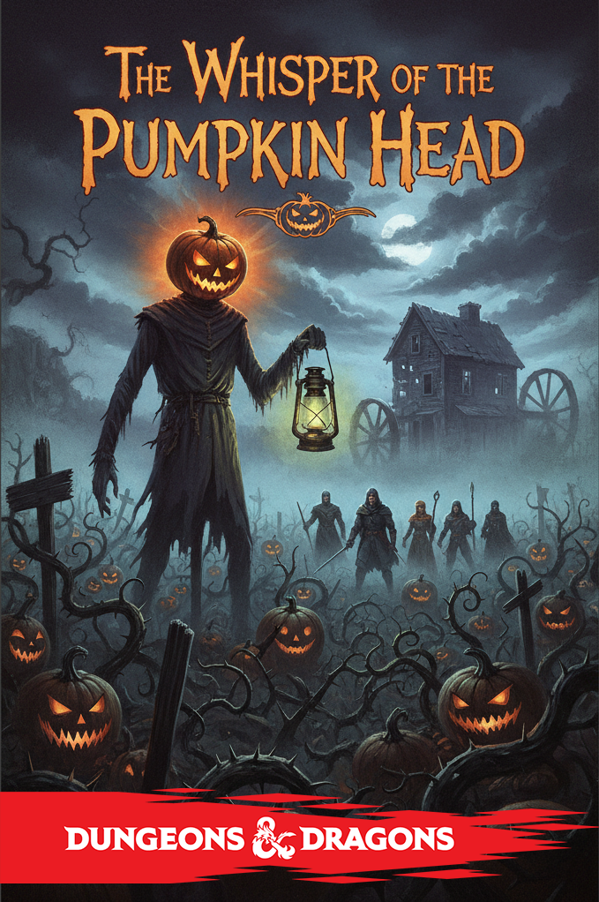
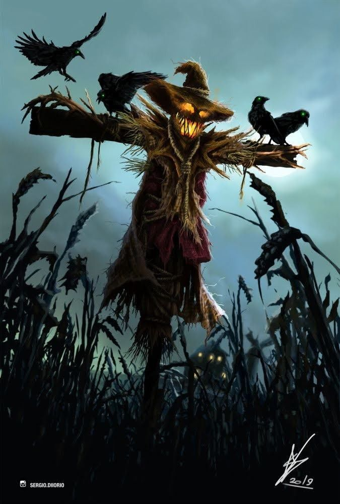
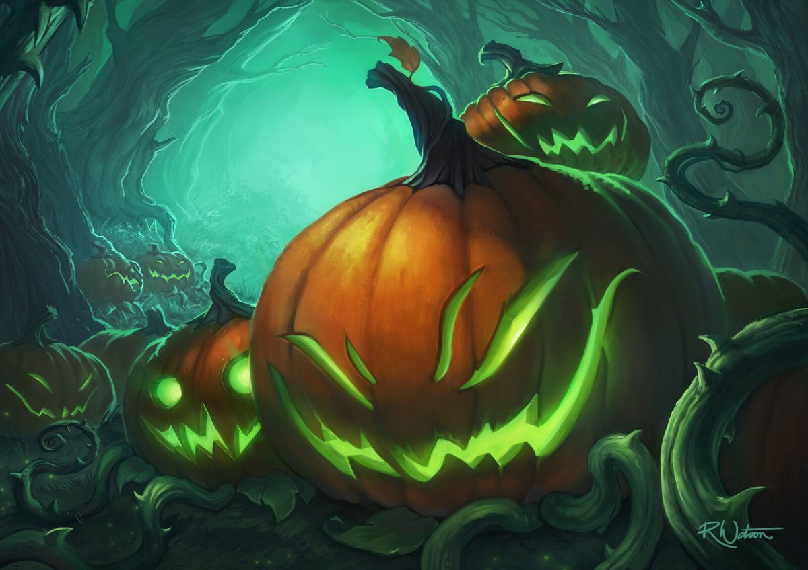
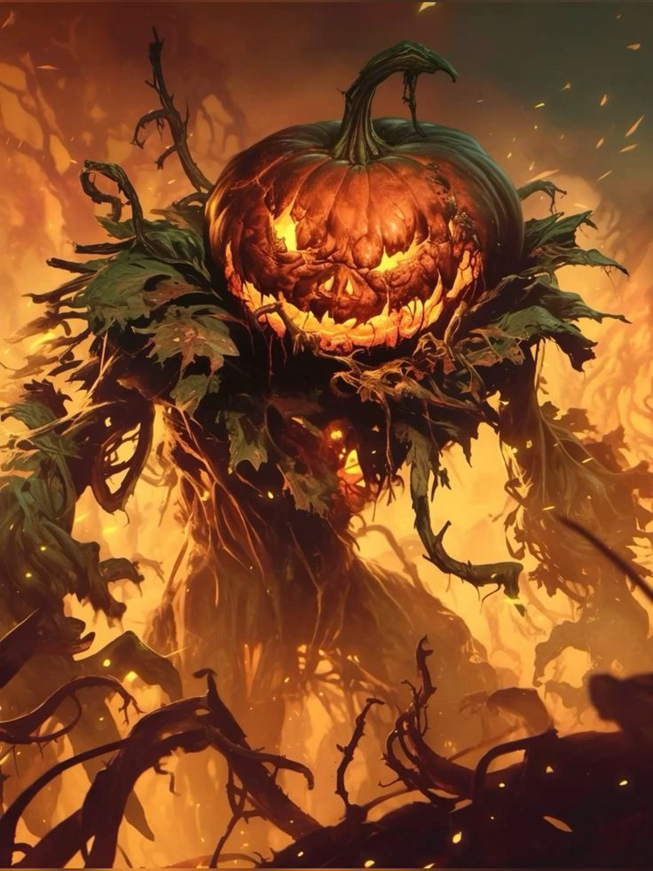

---

**Крючок:** Герои прибывают в деревню **Просека** в Вердании накануне **Пира Урожая** -- праздника, когда дети наряжаются в костюмы и ходят по домам, выпрашивая сладости. Но праздник омрачён: за последнюю ночь пропали трое детей.

---

### **Этап 1: Исследование Деревни**

### Ключевые НПС:

- **Старейшина Элдер Моррик:** Дрожащий старик с посохом.

   > **Диалог:** «Они смеялись над легендами! Говорили, что Тыквенная Голова -- это просто сказка, чтобы дети слушались! А теперь... мой внучок Ларс, девочка Эльза и маленький Финн пропали! Они надели костюмы и убежали в лес... на Забытое поле! Найдите их, умоляю!»

- **Фермер Браам:** Угрюмый, напуганный мужчина.

   > **Диалог:** «Видел я его... высокий, тощий, с светящейся тыквой вместо головы! Шёл на старую мельницу. От него пахло гнилью и... злыми чарами. Будьте осторожны.»

- **Трактирщица Хильда:** Прагматичная, но встревоженная женщина.

   > **Диалог:** «Праздник испорчен. Все боятся. Если вы разберётесь с этой напастью, я не только накормлю вас досыта, но и расскажу, где мой покойный муж прятал бутылку эля «Призрачный урожай».

### Зацепки (требуют проверок):

- **Расследование (СЛ 12) у дома Ларса:** Находится **след** -- не человеческий, а похожий на отпечаток корня, испачканный липким оранжевым соком.

- **Внимательность (СЛ 10) на окраине леса:** Слышен **детский смех**, смешанный с жутким, скрипучим скрежетом.

- **Социальное взаимодействие:** Если герои наденут простые костюмы (есть у Хильды) и раздадут детям сладости, один малыш расскажет: «Мы играли в прятки... и я видел, как большая тыква утащила Эльзу! Она была на ножках!»

---

### **Этап 2: Забытое Поле и Старая Мельница**

**Локация:** Поле, заросшее аномально крупными тыквами с зловеще светящимися «лицами». В центре -- полуразрушенная мельница.

### Бестиарий: Тыквенные Стражи

*Средные конструкции, без мировозрения* **Класс Доспеха** 13 (природная броня) **Хиты** 22 (4к8 + 4) **Скорость** 20 фт. **Тактика:** Действуют парами. Один пытается **опутать** цель лозами (схваченное состояние), второй бьёт дубиной. Слабые к огню. **Действия:**

- **Дубина.** +3 к попаданию, 1к6+1 дробящего урона.

- **Удушающие Лозы (Перезарядка 5-6).** +3 к попаданию, досягаемость 10 фт., цель схвачена (КС 11 Ловкости для побега).

**Внутри мельницы:** Герои находят алхимическую лабораторию. Среди реторт и книг -- **Дневник Алхимика Гримма**.

> **Выдержка из дневника:** «...они смеялись надо мной! Над моими «бесполезными» тыквами! Но я покажу им! Я оживлю легенду... Сок Древней Тыквы, капля страха... и их дети станут частью моего великого сада! Они будут меня уважать!»

---

### **Этап 3: Тыквенный Лабиринт**

За мельницей -- магический лабиринт из живой тыквенной лозы.

### Испытания лабиринта:

1. **Болтливые Тыквы:** Три тыквы с светящимися лицами блокируют путь.

   

   - **Загадка 1:** «Я исчезаю, как только ты называешь моё имя. Что я?» (*Ответ: Тишина*).

   - **Загадка 2:** «Чем больше ты меня берешь, тем больше ты оставляешь позади. Что я?» (*Ответ: Шаги*).

   - **Загадка 3:** «Я всегда голоден, мне нужно пить, чтобы жить. Но стоит мне выпить -- я умираю. Кто я?» (*Ответ: Огонь*).

   - **Неверный ответ:** Тыквы плюются **едкой слизью** (1к4 урона кислотой всем впереди).

2. **Ожившие Тени:** Герои должны пройти по узкому мосту. Их тени оживают и атакуют (**Призраки**, но наносят только психологический урон 1к4, игнорируя броню).

3. **Ловушки:** Проверка **Внимательности (СЛ 13)**, чтобы заметить:

   - **Щупальца лоз:** Вырываются из земли, если наступить на ложную тропу (1к6 урона рубящего, схватка).

   - **Споровые мешочки:** Лопаются, если задеть, ослепляя на 1 раунд (спасбросок Телосложения КС 12).

---

### **Этап 4: Противостояние с Тыквенной Головой**

**Локация:** Сердце лабиринта -- круглая площадка, где стоят загипнотизированные дети, лепящие из глины тыквы. Напротив -- **Гримм в костюме Тыквенной Головы**.

### Социальное взаимодействие (до боя):

> **Гримм** (голос искажён, звучит из тыквы): «Наконец-то гости! Видите? Они учатся... ценить урожай! В отличие от тех невежд в деревне! Я не причиняю им вреда... я делаю их частью чего-то вечного!»

- Герои могут попытаться **уговорить** его (Проверка **Убеждения СЛ 16**). Успех: Гримм снимает маску, его энтузиазм сменяется отчаянием. Он сдаётся.

- **Угрозы** или **насмешки** приведут к немедленному бою.

### Босс: Гримм, Тыквенная Голова

*Средный гуманоид (человек), хаотично-нейтральный* **Класс Доспеха** 14 (костюм из лоз) **Хиты** 60 (11к8 + 11) **Скорость** 30 фт.

**Сопротивление урону:** Дробящий, колющий, рубящий от немагического оружия. **Уязвимость к урону:** Огонь. **Иммунитет к состояниям:** Испуг, очарование.

**Паттерн боя:**

1. **Ход 1:** **Призыв Тыквенных Стражей (2 штуки)**. Они защищают его и атакуют самых опасных бойцов.

2. **Ход 2:** **Семена Безумия (Заклинание, КС 13 Мудрости).** Один герой должен атаковать ближайшее существо (друга или стражника).

3. **Ход 3:** **Удушающие Лозы.** Атакует дальнего бойца или заклинателя.

4. **Цикл повторяется.** Гримм будет призывать новых стражей каждые 3 хода, пока жив.

**Действия:**

- **Посох из лозы:** +4 к попаванию, 1к8+2 дробящего урона.

- **Удушающие Лозы (Бонусное действие):** +4 к попаванию, досягаемость 30 фт., цель схвачена (КС 13 Ловкости).

- **Семена Безумия (1/ход):** Одно существо в пределах 60 фт. должно преуспеть в спасброске Мудрости, иначе будет вынуждено своим действием атаковать ближайшее существо.

**Слабость:** Если герой атакует Гримма **огнём** и наносит хотя бы 10 урона за один удар, Гримм **теряет концентрацию** и не может использовать **Семена Безумия** в свой следующий ход.

---

### **Финал и Награды**

- **Если Гримма убедили:** Он плачет, снимает маску и снимает чары с детей. Он раскаивается и соглашается использовать свои знания для помощи деревне (станет алхимиком-травником).

- **Если Гримма победили в бою:** Дети просыпаются, когда он теряет сознание.

**Награды:**

- **Тыквенный Фонарь Гримма:** Магический фонарь. 1 раз в день можно активировать, чтобы испустить **Огненный всполох** (15-футовый конус, 3к6 урона огнём, спасбросок Ловкости КС 13 для половины урона).

- **Семя Древней Тыквы:** Можно посадить у дома. Через 1 неделю вырастает **Тыква-Хранительница** (предоставляет **Преимущество** на проверки Внимательности ночью в радиусе 30 фт. от неё).

- **Сладости Пира Урожая (5 порций):** Восстанавливают 1к8 ХП при поедании действием.

- **Бесплатное проживание и снаряжение** от жителей Просеки на 1 месяц.

- **Слава и уважение:** В других деревнях Вердании героев будут встречать как избавителей от Тыквенной Головы.