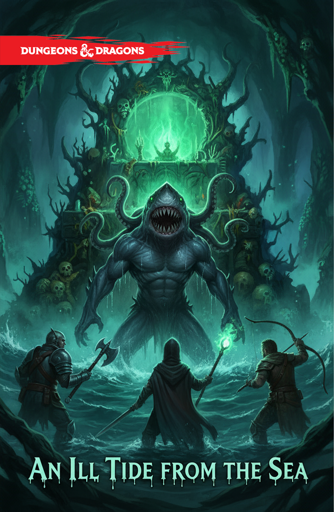

### **Обзор**

**Уровень группы:** 5-7\
**Общая цель:** Расследовать исчезновение жителей прибрежных деревень и остановить влияние «Сына Дагона»\
**Сложность:** Высокая (подводные сражения, ментальное воздействие)\
**Стиль:** Лавкрафтовский хоррор, прибрежная готика

---

## **АКТ 1: ПРИЛИВ СТРАХА**

### **Сцена 1: Крючок в портовом городе**

**Локация: Рыночная площадь «Солёный Бриз»** *Шумный порт, пахнет рыбой, смолой и солёным ветром. Но под обычной суетой чувствуется напряжение.*

**Варианты завязки:**

1. **Рыбацкие слухи:** *Герои слышат обрывки разговоров у причала:*

   > **Старый рыбак** (шепотом): «Туман... зелёный туман... Он забирает тех, кто его слышит...» **Торговка рыбой** (нервно): «Мой муж... ушёл неделю назад. Говорил, что море зовёт красивой песней...»

2. **Находка на берегу:** *После шторма на пляже находят водорослями оплетённый дневник:*

   > **Последняя запись:** «Он снится мне... Великий Дагон... Его голос как тысяча раковин... Сегодня ночью пойду... должен... должен присоединиться...»

3. **Безумец на пирсе:** *Старик в лохмотьях хватает героев за одежду:*

   > «Он шлёт Младшего! Из чёрных глубин! Готовит утробу для новой расы! Бегите, пока не поздно! Все мы станем рабами!»

---

### **Сцена 2: Деревня «Туманная Ветвь»**

**Визуальное описание:** *Деревня будто вымирает. Половина домов с заколоченными ставнями. Воздух влажный, пахнет гниющими водорослями и странной сладковатой озоной. Даже чайки молчат.*

**Ключевые НПС:**

**Старейшина Торбин** (сидит на крыльце, чинит сеть с дрожащими руками):

> «Вы не местные... Уходите, пока можете. Здесь... нездорово. Море больше не кормит, оно забирает.»

**Социальное взаимодействие с Торбином:**

- **Убеждение СЛ 14:** «Мы можем помочь, но нужна правда»

   > *Торбин (опускает голову): «Они уходят сами... по ночам. Слышат зов... как красивую музыку из глубин. Я старый, почти глухой -- меня не трогает...»*

- **Запугивание СЛ 16:** «Следующий можешь быть ты!»

   > *Торбин (испуганно): «Бухта... Бухта «Сломанного Весла». Там они заходят в воду... Не ходите туда!»*

- **Взятка 25 зм:** «На, пропей за свои страхи»

   > *Торбин (быстро прячет монеты): «Ищите девочку Лию... она видела...»*

**Девочка Лия** (сидит на камне у воды, качает головой в такт несуществующей музыке):

> «Мама... папа... они такие счастливые теперь... Там, в глубине... так красиво поёт...»

**Проверки с Лией:**

- **Медицина СЛ 12:** У неё расширенные зрачки, нерегулярный пульс -- ранняя стадия ментального заражения

- **Проницательность СЛ 15:** Она борется с влиянием, в её глазах мелькает страх

- **Магия/Религия СЛ 14:** Аура внешнего ментального воздействия

**Лечение Лии:**

- **Успокоение эмоций:** Она приходит в себя на 1 час

- **Снять проклятие:** Полностью очищает, она становится проводником

- **Неудача:** Её крик привлекает внимание культистов

> **Лия (после лечения):** «Они шли в бухту... как во сне. А тот... тот с щупальцами и когтями ждал их в воде!»

---

## **АКТ 2: ВРАТА В БЕЗДНУ**

### **Сцена 3: Бухта «Сломанного Весла»**

**Визуальное описание:** *Узкая каменистая бухта, окружённая чёрными скалами. Вода неестественно тёмная, почти чёрная. По поверхности плавают маслянистые радужные разводы. Воздух звенит от магии.*

**Исследование бухты:**

1. **Следы к воде:**

   - **Выживание СЛ 13:** Десятки следов разных размеров ведут прямо в воду

   - **Внимательность СЛ 15:** Некоторые следы волочащиеся, будто люди шли в трансе

2. **Магический анализ:**

   - **Магия СЛ 16:** Туман -- не природный, создан ритуалом призыва

   - **Религия СЛ 15:** Энергия исходит от сущности Древнего Бога

   - **Природа СЛ 14:** Водоросли мутировали, пульсируют в такт приливам

**Столкновение со стражей:**

*Из воды выползают 2 **Глубоководных Головореза** и 1 **Глубоководная Жрица**.*

> **Жрица** (шипит на языке сахуагинов): *«Сухопутные черви! Не помешаете рождению Нового Мира!»*

**Тактика стражи:**

- Используют укрытия скал для преимущества

- Жрица накладывает *Сотворение воды* чтобы затопить бухту

- Попытаются стащить героев в воду

**После боя:** На теле жрицы находят **Резной коралловый ключ** для входа в грот.

---

## **АКТ 3: УТРОБА ДАГОНА**

### **Сцена 4: Подводный грот**

**Визуальное описание:** *Туннель уходит под воду, но внутри -- воздушный карман. Стены покрыты пульсирующими биолюминесцентными водорослями, отбрасывающими зелёные тени. Воздух густой, солёный, трудно дышать.*

**Особенности локации:**

- **Шёпот Глубин:** В начале каждого хода спасбросок Мудрости СЛ 14 или помеха

- **Скользкие стены:** Проверка Ловкости СЛ 12 чтобы не упасть

- **Частичное затопление:** Некоторые участки по пояс в воде

**Встреча с заражёнными:**

*10-15 **Заражённых рыбаков** бродят в трансе. Они что-то напевают, рисуют спирали на стенах.*

> **Рыбак Михал** (бормочет): «Скоро... скоро все мы станем частью Великого... Так красиво...»

**Варианты взаимодействия:**

- **Атаковать:** Рыбаки защищаются, но без тактики

- **Обезвредить:** Несмертельные атаки, можно связать

- **Исследование СЛ 16:** На шее у каждого -- коралловый амулет источника контроля

**Столкновения в гроте:**

1. **Падальщики Глубин (2 Гниющие туши):**

   - Питаются отбросами культа

   - Атакуют всех подряд

   - **Слабость:** Уязвимы к огню

2. **Стражи Ритуала (1 Глубинный Змей, 3 Сахагина):**

   - Защищают подход к внутреннему святилищу

   - Используют тактику окружения

---

## **АКТ 4: РОЖДЕНИЕ КОШМАРА**

### **Сцена 5: Сердце Грота**

**Визуальное описание:** *Огромный зал с куполом из чёрного коралла. В центре -- пульсирующий алтарь из костей и перламутра. На стенах -- фрески с изображением Дагона и его ужасного потомства. Воздух вибрирует от энергии ритуала.*

**Финальный босс: Младший Отпрыск Дагона**

*Существо поднимается из тёмной воды у алтаря. 3 метра ростом, гуманоид с чертами акулы и кальмара. Глаза горят зелёным огнём.*

> **Младший Отпрыск** (голос как скрежет камней под водой): *«Опоздали, черви суши! Утроба готова принять новую расу! Вы станете первыми рабами Нового Порядка!»*

**Диалог перед боем:**

- **Угроза:** «Дагон восстанет, и океаны поглотят ваши города!»

- **Обман:** «Присоединяйтесь к нам -- обретёте бессмертие!»

- **Гордость:** «Я -- лишь первый из многих! Нас легион!»

**Тактика Младшего Отпрыска:**

**Фаза 1 (100-70% HP):**

- **Порабощающая Слизь:** Целится в самого сильного бойца

- **Зов Бездны (Легендарное):** Призывает 1к4 заражённых рыбаков

- **Щупальца:** Атакует на средней дистанции

**Фаза 2 (70-40% HP):**

- **Фантомные Галлюцинации:** *Фантомный Коготь* на заклинателя

- **Водяной вихрь:** Все в радиусе 10 фт. проверка Силы СЛ 15

- **Поглощение:** Восстанавливает HP за счёт рыбаков

**Фаза 3 (40-0% HP):**

- **Отчаяние:** Попытка обрушить пещеру

- **Самопожертвование:** Взрыв некротической энергии 6d6

- **Бегство:** Если HP \< 20, пытается скрыться в глубине

**Слабые стороны:**

- Уязвим к огню и излучению

- Магия света ослепляет его на 1 раунд

- Разрушение алтаря ослабляет его на 2d6 урона за раунд

---

## **РАЗВЯЗКА И НАГРАДЫ**

### **После победы**

*С гибелью Отпрыска зелёный свет гаснет. Заражённые рыбаки падают без сознания. Шёпот в головах прекращается.*

**Варианты исхода:**

1. **Полная победа:** Все рыбаки спасены, ритуал предотвращён

2. **Частичная победа:** Некоторые рыбаки погибли, но угроза устранена

3. **Трагедия:** Отпрыск успел завершить часть ритуала

**Возвращение в деревню:**

> **Торбин** (со слезами): «Вы... вы вернули наших! Море снова стало просто морем!»

> **Лия** (обнимает родителей): «Я знала... я знала, что вы вернётесь!»

### **Награды**

**Материальные:**

1. **Око Бездны:** Магический камень (1 раз в день *Говорить с животными* на водных существ)

2. **Трезубец Морвана:** +1 к атаке/урону, 1 раз в день *Сотворение/уничтожение воды*

3. **Сундук культа:** 750 зм, 5 жемчужин (100 зм каждая)

4. **Коралловые амулеты:** Можно продать за 200 зм

**Нематериальные:**

- **Репутация «Избавителей от Глубин»:** Скидки в портовых городах

- **Благодарность деревни:** Бесплатный ночлег и припасы

- **Внимание Владычицы Извивов:** (Сюжетный крючок)

**Опыт:**

- Основная цель: 3,500 опыта

- Спасение рыбаков: +50 опыта за каждого

- Дополнительные цели: до 1,500 опыта

---

## **БЕСТИАРИЙ**

### **Младший Отпрыск Дагона**

*Большое исчадие, законоплохой злой*

**КЗ:** 17 (естественная броня) **Хиты:** 180 (19d10 + 76) **Скорость:** 30 фт., плавание 60 фт.

| СИЛ     | ЛОВ     | ТЕЛ     | ИНТ     | МДР     | ХАР     |
|---------|---------|---------|---------|---------|---------|
| 20 (+5) | 12 (+1) | 18 (+4) | 16 (+3) | 18 (+4) | 20 (+5) |

**Спасброски:** Тел +8, Мдр +8, Хар +9 **Навыки:** Обман +9, Запугивание +9 **Сопротивление урону:** холод, молния **Иммунитет к урону:** яд **Иммунитет к состояниям:** отравленный **Чувства:** тёмное зрение 120 фт., пассивное Восприятие 14 **Языки:** Глубоководный, Общий

**Легендарное сопротивление (3/день):** При провале спасброска может вместо этого преуспеть

**Действия:**

- **Мультиатака:** Три атаки щупальцами или одну Порабощающую Слизь

- **Щупальца:** +9 к попаданию, 14 (2d8 + 5) дробящего урона

- **Порабощающая Слизь:** +9 к попаданию, цель должна преуспеть в спасброске Телосложения СЛ 16 или стать очарованной на 1 час

**Легендарные действия (3/раунд):**

- **Зов Бездны (1 действие):** Призывает 1к4 заражённых рыбаков

- **Шёпот Глубин (2 действия):** Все существа в радиусе 30 фт. делают спасбросок Мудрости СЛ 16 или получают помеху

- **Водяной хлыст (3 действия):** 10 (3d6) урона холодом, отталкивание на 15 фт.

### **Глубоководная Жрица**

*Средный гуманоид (сахуагин), законоплохой злой*

**КЗ:** 15 (естественная броня) **Хиты:** 55 (10d8 + 10) **Скорость:** 30 фт., плавание 40 фт.

**Заклинания:** Заклинатель 5-го уровня, Мудрость +4

- **Заговоры:** Морозный луч, Поток кислоты

- **1-й уровень (4 ячейки):** Волна грома, Опутывание

- **2-й уровень (3 ячейки):** Молниевый удар, Сотворение воды

- **3-й уровень (2 ячейки):** Призыв молний, Ужас

### **Заражённый Рыбак**

*Средный гуманоид (человек), без мировоззрения*

**КЗ:** 11 **Хиты:** 22 (4d8 + 4) **Скорость:** 30 фт.

**Иммунитет к состояниям:** очарованный, испуганный **Сопротивление урону:** психический

**Действия:**

- **Искажённый удар:** +3 к попаданию, 5 (1d6 + 1) дробящего урона

- **Самопожертвование:** При смерти взрывается, 7 (2d6) некротического урона в радиусе 5 фт.

### **Глубинный Змей**

*Большое чудовище, без мировоззрения*

**КЗ:** 14 (естественная броня) **Хиты:** 85 (9d10 + 36) **Скорость:** 30 фт., плавание 50 фт.

**Действия:**

- **Укус:** +6 к попаданию, 11 (2d6 + 4) колющего урона

- **Хвост:** +6 к попаданию, 13 (2d8 + 4) дробящего урона

- **Затягивание под воду:** Спасбросок Силы СЛ 14 или быть утащенным под воду

---

### **СОВЕТЫ ДЛЯ МАСТЕРА**

- **Атмосфера:** Используйте звуки моря и эхо в пещерах

- **Напряжение:** Постепенно усиливайте Шёпот Глубин

- **Моральный выбор:** Заставляйте героев решать судьбу заражённых

- **Последствия:** Действия героев привлекают внимание более могущественных существ